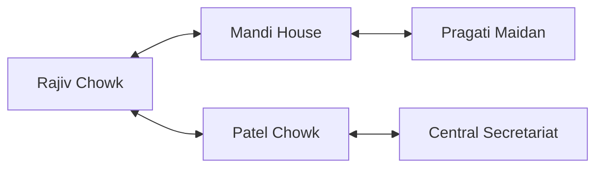
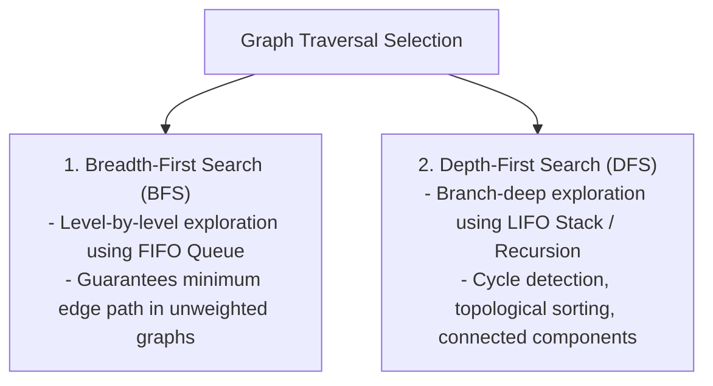

# Module 16: Graph Representations, BFS, DFS, & Connected Components

## Theoretical Overview & Graph Classification

A **Graph** $G = (V, E)$ is a non-linear data structure consisting of a set of **Vertices** (or nodes) $V$ connected by a set of **Edges** (or links) $E$.



### Graph Classifications
1. **Directed vs Undirected**: In a *Directed Graph (Digraph)*, edges have a one-way orientation ($u \to v$). In an *Undirected Graph*, edges travel symmetrically in both directions ($u \leftrightarrow v$).
2. **Weighted vs Unweighted**: Weighted graph edges store numerical values representing distances, costs, or travel times.
3. **Cyclic vs Acyclic**: A graph is cyclic if it contains at least one closed loop path starting and ending at the same node.

---

## 1. Graph Representation Comparison Matrix

Let $V$ be the number of vertices and $E$ be the number of edges.

| Representation | Storage Space | Check Edge $(u, v)$ | Find All Neighbors of $u$ | Primary Use Case |
| :--- | :--- | :--- | :--- | :--- |
| **Adjacency Matrix** | **$\mathcal{O}(V^2)$** | **$\mathcal{O}(1)$** | $\mathcal{O}(V)$ | Dense graphs where $E \approx V^2$. |
| **Adjacency List** | **$\mathcal{O}(V + E)$** | $\mathcal{O}(\text{degree}(u))$ | **$\mathcal{O}(1)$** pointer access | **Sparse graphs** (most real-world systems). |
| **Edge List** | **$\mathcal{O}(E)$** | $\mathcal{O}(E)$ | $\mathcal{O}(E)$ | Kruskal's Minimum Spanning Tree algorithm. |

---

## 2. Object-Oriented Graph Implementation

```javascript
class Graph {
  constructor(isDirected = false) {
    this.adjacencyList = new Map();
    this.isDirected = isDirected;
  }

  addVertex(vertex) {
    if (!this.adjacencyList.has(vertex)) this.adjacencyList.set(vertex, []);
    return this;
  }

  addEdge(v1, v2, weight = 1) {
    this.addVertex(v1); this.addVertex(v2);
    this.adjacencyList.get(v1).push({ node: v2, weight });
    if (!this.isDirected) {
      this.adjacencyList.get(v2).push({ node: v1, weight });
    }
    return this;
  }

  removeEdge(v1, v2) {
    if (this.adjacencyList.has(v1)) {
      this.adjacencyList.set(v1, this.adjacencyList.get(v1).filter(e => e.node !== v2));
    }
    if (!this.isDirected && this.adjacencyList.has(v2)) {
      this.adjacencyList.set(v2, this.adjacencyList.get(v2).filter(e => e.node !== v1));
    }
    return this;
  }

  removeVertex(vertex) {
    if (!this.adjacencyList.has(vertex)) return this;
    for (const [v, edges] of this.adjacencyList) {
      this.adjacencyList.set(v, edges.filter(e => e.node !== vertex));
    }
    this.adjacencyList.delete(vertex);
    return this;
  }

  getNeighbors(vertex) { return this.adjacencyList.get(vertex) || []; }
  hasEdge(v1, v2) { return this.adjacencyList.has(v1) && this.adjacencyList.get(v1).some(e => e.node === v2); }
  getVertices() { return [...this.adjacencyList.keys()]; }
}
```

---

## 3. Graph Traversal Algorithms



### 1. Breadth-First Search (`bfsTraversal` & `bfsShortestPath`)
- **Unweighted Shortest Path Guarantee**: BFS visits nodes in strictly increasing order of distance from the source. The first time target $end$ is popped from the queue, the computed path contains the absolute minimum number of edges.
- **Complexity**: Time $\mathcal{O}(V + E)$, Space $\mathcal{O}(V)$.

```javascript
function bfsTraversal(graph, start) {
  const visited = new Set(), queue = [start], order = [];
  visited.add(start);

  while (queue.length > 0) {
    const current = queue.shift();
    order.push(current);
    for (const edge of graph.getNeighbors(current)) {
      if (!visited.has(edge.node)) {
        visited.add(edge.node);
        queue.push(edge.node);
      }
    }
  }
  return order;
}

function bfsShortestPath(graph, start, end) {
  const visited = new Set(), queue = [start], previous = new Map();
  visited.add(start);
  previous.set(start, null);

  while (queue.length > 0) {
    const current = queue.shift();
    if (current === end) {
      const path = [];
      let node = end;
      while (node !== null) { path.unshift(node); node = previous.get(node); }
      return { path, distance: path.length - 1 };
    }
    for (const edge of graph.getNeighbors(current)) {
      if (!visited.has(edge.node)) {
        visited.add(edge.node);
        previous.set(edge.node, current);
        queue.push(edge.node);
      }
    }
  }
  return { path: [], distance: -1 };
}
```

### 2. Depth-First Search (`dfsRecursive` & `dfsIterative`)
Explores as deep as possible along each branch before backtracking.
- **Complexity**: Time $\mathcal{O}(V + E)$, Space $\mathcal{O}(V)$.

```javascript
// Recursive DFS
function dfsRecursive(graph, start) {
  const visited = new Set(), order = [];
  function dfs(node) {
    visited.add(node); order.push(node);
    for (const edge of graph.getNeighbors(node)) {
      if (!visited.has(edge.node)) dfs(edge.node);
    }
  }
  dfs(start);
  return order;
}

// Iterative DFS using explicit Stack
function dfsIterative(graph, start) {
  const visited = new Set(), stack = [start], order = [];
  while (stack.length > 0) {
    const current = stack.pop();
    if (visited.has(current)) continue;
    visited.add(current); order.push(current);
    const neighbors = graph.getNeighbors(current);
    for (let i = neighbors.length - 1; i >= 0; i--) {
      if (!visited.has(neighbors[i].node)) stack.push(neighbors[i].node);
    }
  }
  return order;
}
```

---

## 4. Connectivity & Path Analytics

### 1. Path Existence (`hasPath`)
Determines if an unweighted path exists between source and destination in $\mathcal{O}(V + E)$ time.

### 2. Connected Components Count (`countConnectedComponents`)
Iterates across all vertices, triggering a new BFS/DFS traversal whenever an unvisited vertex is encountered to discover isolated sub-graph components.

```javascript
function countConnectedComponents(graph) {
  const visited = new Set();
  let count = 0;
  for (const vertex of graph.getVertices()) {
    if (!visited.has(vertex)) {
      count++;
      const queue = [vertex];
      visited.add(vertex);
      while (queue.length > 0) {
        const current = queue.shift();
        for (const edge of graph.getNeighbors(current)) {
          if (!visited.has(edge.node)) {
            visited.add(edge.node);
            queue.push(edge.node);
          }
        }
      }
    }
  }
  return count;
}
```

---

## Key Takeaways

1. **Adjacency List Preference**: Represent real-world sparse graphs using Adjacency Lists to save space ($\mathcal{O}(V + E)$ vs $\mathcal{O}(V^2)$).
2. **Shortest Unweighted Path**: Always use BFS for finding minimum edge count paths.
3. **Visited Tracking**: Mark nodes as visited immediately upon queue insertion to prevent duplicate processing and infinite loops in cyclic graphs.
4. **Structural Analysis**: DFS is ideal for topological ordering, cycle detection, and component counting.
