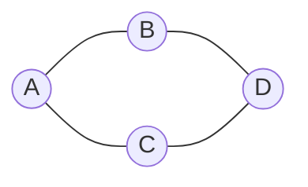

# File 16: Graphs Basics and Adjacency Representations

## Overview
A **Graph** is a non-linear data structure consisting of **Vertices (Nodes)** connected by **Edges**. Graphs can be **Directed / Undirected** and **Weighted / Unweighted**, represented via **Adjacency Lists** or **Adjacency Matrices**.

---

## 1. Graph Representations Architecture



### Adjacency List Representation (Memory Efficient $O(V + E)$)

```javascript
{
  "A": ["B", "C"],
  "B": ["A", "D"],
  "C": ["A", "D"],
  "D": ["B", "C"]
}
```

---

## 2. Graph Adjacency List Implementation

```javascript
class Graph {
    constructor() {
        this.adjacencyList = {};
    }

    addVertex(vertex) {
        if (!this.adjacencyList[vertex]) {
            this.adjacencyList[vertex] = [];
        }
    }

    addEdge(v1, v2) {
        if (!this.adjacencyList[v1]) this.addVertex(v1);
        if (!this.adjacencyList[v2]) this.addVertex(v2);

        this.adjacencyList[v1].push(v2);
        this.adjacencyList[v2].push(v1); // Undirected link
    }

    removeEdge(v1, v2) {
        this.adjacencyList[v1] = this.adjacencyList[v1].filter(v => v !== v2);
        this.adjacencyList[v2] = this.adjacencyList[v2].filter(v => v !== v1);
    }
}

const g = new Graph();
g.addEdge("Delhi", "Mumbai");
g.addEdge("Delhi", "Bengaluru");
console.log(g.adjacencyList);
```

---

## Key Takeaways
1. **Adjacency Lists** take $O(V + E)$ space (ideal for sparse real-world graphs).
2. **Adjacency Matrices** take $O(V^2)$ space (ideal for dense graphs with rapid edge lookup).
3. Used for social networks, road maps, recommendation engines, and dependency trees.
