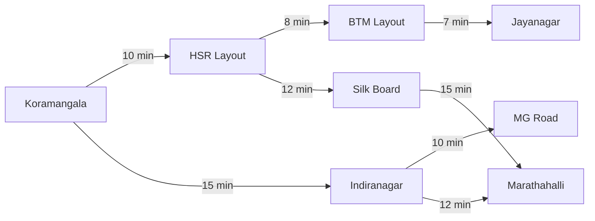
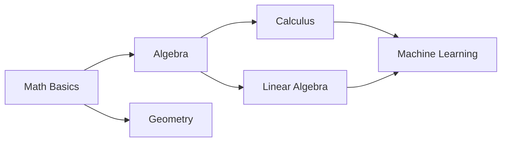

# Module 17: Graph Algorithms — Dijkstra, Topological Sort, & Cycle Detection

## Theoretical Overview & Shortest Path Mechanics

Graph algorithms optimize routing paths, calculate task dependency execution order, and prevent system deadlocks.



---

## 1. Graph Algorithms Matrix

| Algorithm | Graph Type | Edge Weights | Time Complexity | Auxiliary Space | Key Mechanism |
| :--- | :--- | :--- | :--- | :--- | :--- |
| **Dijkstra's Algorithm** | Directed / Undirected | **Non-Negative $(\ge 0)$** | **$\mathcal{O}((V + E) \log V)$** | $\mathcal{O}(V)$ | Greedy relaxation using Min-Heap Priority Queue. |
| **Bellman-Ford Algorithm**| Directed / Undirected | Negative allowed | $\mathcal{O}(V \cdot E)$ | $\mathcal{O}(V)$ | Relaxes all edges $V-1$ times; detects negative cycles. |
| **Kahn's Topological Sort**| **DAG (Directed Acyclic)**| Unweighted / Weighted | **$\mathcal{O}(V + E)$** | $\mathcal{O}(V)$ | In-degree 0 FIFO Queue reduction. |
| **3-Color Cycle Detection**| Directed Graph | Any | **$\mathcal{O}(V + E)$** | $\mathcal{O}(V)$ | State coloring: WHITE (Unvisited), GRAY (Active Stack), BLACK (Done). |
| **Undirected Parent DFS** | Undirected Graph | Any | **$\mathcal{O}(V + E)$** | $\mathcal{O}(V)$ | DFS traversal checking non-parent visited neighbors. |

---

## 2. Dijkstra's Shortest Path Algorithm

Dijkstra's algorithm finds the shortest distance from a single source vertex to all other vertices in a weighted graph with non-negative edge weights.

### Edge Relaxation Invariant
For an edge $(u, v)$ with weight $w$:

$$\text{if } \text{distances}[u] + w < \text{distances}[v] \implies \text{distances}[v] = \text{distances}[u] + w$$

```javascript
function dijkstra(graph, source) {
  const distances = new Map(), previous = new Map(), visited = new Set();
  const pq = new MinPriorityQueue();

  for (const v of graph.getVertices()) {
    distances.set(v, Infinity);
    previous.set(v, null);
  }
  distances.set(source, 0);
  pq.enqueue(source, 0);

  while (!pq.isEmpty()) {
    const { element: current, priority: currentDist } = pq.dequeue();
    if (visited.has(current)) continue;
    visited.add(current);
    if (currentDist > distances.get(current)) continue;

    for (const edge of graph.getNeighbors(current)) {
      if (visited.has(edge.node)) continue;
      const newDist = distances.get(current) + edge.weight;
      if (newDist < distances.get(edge.node)) {
        distances.set(edge.node, newDist);
        previous.set(edge.node, current);
        pq.enqueue(edge.node, newDist);
      }
    }
  }
  return { distances, previous };
}

function getPath(previous, target) {
  const path = [];
  let current = target;
  while (current !== null) { path.unshift(current); current = previous.get(current); }
  return path;
}
```

---

## 3. Topological Sort (Kahn's BFS Algorithm)

A **Topological Ordering** of a Directed Acyclic Graph (DAG) is a linear ordering of vertices such that for every directed edge $u \to v$, vertex $u$ comes before $v$ in the sequence.



```javascript
function topologicalSortKahns(graph) {
  const inDegree = new Map(), result = [];

  for (const v of graph.getVertices()) inDegree.set(v, 0);
  for (const v of graph.getVertices()) {
    for (const edge of graph.getNeighbors(v)) {
      inDegree.set(edge.node, (inDegree.get(edge.node) || 0) + 1);
    }
  }

  const queue = [];
  for (const [v, deg] of inDegree) if (deg === 0) queue.push(v);

  while (queue.length > 0) {
    const current = queue.shift();
    result.push(current);
    for (const edge of graph.getNeighbors(current)) {
      inDegree.set(edge.node, inDegree.get(edge.node) - 1);
      if (inDegree.get(edge.node) === 0) queue.push(edge.node);
    }
  }

  if (result.length !== graph.getVertices().length) return null; // Cycle detected!
  return result;
}
```

---

## 4. Cycle Detection Algorithms

### 1. Undirected Graphs: DFS Parent Tracking (`hasCycleUndirected`)
In an undirected graph, a cycle exists if a neighbor is already visited and is **not** the direct parent of the current node.

```javascript
function hasCycleUndirected(graph) {
  const visited = new Set();
  function dfs(node, parent) {
    visited.add(node);
    for (const edge of graph.getNeighbors(node)) {
      if (!visited.has(edge.node)) { if (dfs(edge.node, node)) return true; }
      else if (edge.node !== parent) return true;
    }
    return false;
  }
  for (const v of graph.getVertices()) {
    if (!visited.has(v) && dfs(v, null)) return true;
  }
  return false;
}
```

### 2. Directed Graphs: 3-Color DFS Algorithm (`hasCycleDirected`)
- `WHITE (0)`: Unvisited vertex.
- `GRAY (1)`: Currently being visited (active on current call stack).
- `BLACK (2)`: Fully explored vertex.

A back-edge encountered pointing to a `GRAY` node indicates a **directed cycle**.

```javascript
function hasCycleDirected(graph) {
  const WHITE = 0, GRAY = 1, BLACK = 2;
  const color = new Map();
  for (const v of graph.getVertices()) color.set(v, WHITE);

  function dfs(node) {
    color.set(node, GRAY);
    for (const edge of graph.getNeighbors(node)) {
      if (color.get(edge.node) === GRAY) return true; // Cycle back-edge detected!
      if (color.get(edge.node) === WHITE && dfs(edge.node)) return true;
    }
    color.set(node, BLACK);
    return false;
  }
  for (const v of graph.getVertices()) {
    if (color.get(v) === WHITE && dfs(v)) return true;
  }
  return false;
}
```

---

## 5. Practical Problem: Course Schedule (`canFinishCourses`)

Validates whether a student can complete `numCourses` given prerequisite constraints using Kahn's topological sorting.

```javascript
function canFinishCourses(numCourses, prerequisites) {
  const graph = new Map(), inDegree = new Map();
  for (let i = 0; i < numCourses; i++) { graph.set(i, []); inDegree.set(i, 0); }

  for (const [course, prereq] of prerequisites) {
    graph.get(prereq).push(course);
    inDegree.set(course, inDegree.get(course) + 1);
  }

  const queue = [];
  for (const [c, deg] of inDegree) if (deg === 0) queue.push(c);

  let processed = 0;
  const order = [];
  while (queue.length > 0) {
    const current = queue.shift();
    order.push(current); processed++;
    for (const next of graph.get(current)) {
      inDegree.set(next, inDegree.get(next) - 1);
      if (inDegree.get(next) === 0) queue.push(next);
    }
  }
  return { canFinish: processed === numCourses, order: processed === numCourses ? order : null };
}
```

---

## Key Takeaways

1. **Dijkstra's Greedy Relaxation**: Always extracts the minimum tentative distance node from a Priority Queue in $\mathcal{O}((V + E) \log V)$ time.
2. **Non-Negative Weight Limitation**: Dijkstra requires all edge weights $w \ge 0$; use Bellman-Ford for negative weights.
3. **Kahn's Topological Sort**: Processes nodes with `inDegree === 0` to calculate valid build/course schedules.
4. **3-Color Directed Cycle Detection**: Encountering a `GRAY` node during DFS proves the presence of a directed cycle.
