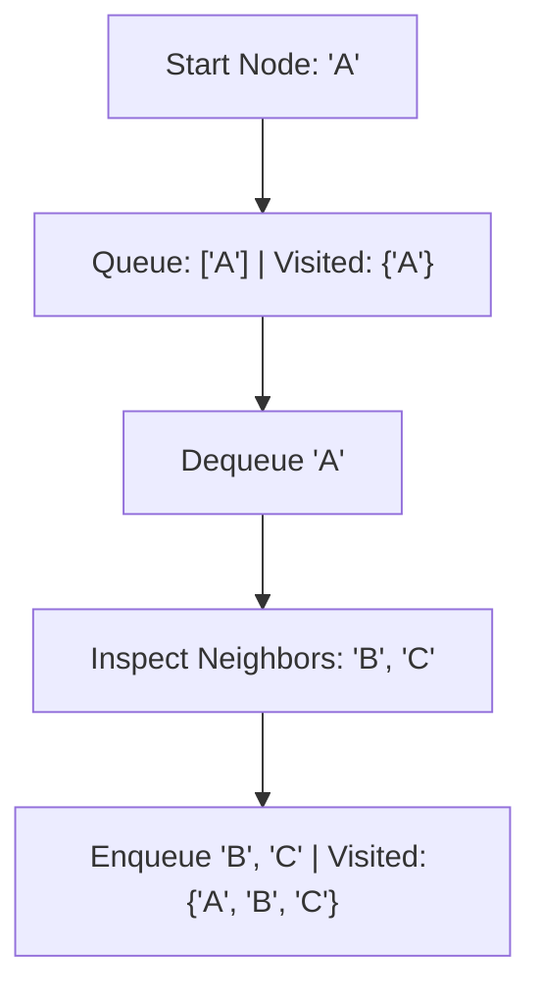

# File 17: Graph Traversal Algorithms (BFS, DFS, Dijkstra)

## Overview
Graph traversal algorithms explore graph vertices:
- **BFS (Breadth-First Search)** explores neighbors level-by-level using a **Queue** (finds shortest unweighted path).
- **DFS (Depth-First Search)** explores deep branches first using a **Stack / Recursion**.
- **Dijkstra's Algorithm** finds the shortest path in weighted graphs with non-negative edge weights using a **Min-Priority Queue**.

---

## 1. Graph Traversal Execution Flow



---

## 2. BFS & DFS Implementation

```javascript
class GraphTraversal {
    constructor(adjacencyList) {
        this.list = adjacencyList;
    }

    // Breadth-First Search (Shortest Path Unweighted)
    bfs(start) {
        const queue = [start];
        const result = [];
        const visited = { [start]: true };

        while (queue.length > 0) {
            const vertex = queue.shift();
            result.push(vertex);

            for (const neighbor of this.list[vertex] || []) {
                if (!visited[neighbor]) {
                    visited[neighbor] = true;
                    queue.push(neighbor);
                }
            }
        }

        return result;
    }

    // Recursive Depth-First Search
    dfsRecursive(start, result = [], visited = {}) {
        if (!start) return result;
        visited[start] = true;
        result.push(start);

        for (const neighbor of this.list[start] || []) {
            if (!visited[neighbor]) {
                this.dfsRecursive(neighbor, result, visited);
            }
        }

        return result;
    }
}

const graphData = {
    "A": ["B", "C"],
    "B": ["A", "D"],
    "C": ["A", "E"],
    "D": ["B"],
    "E": ["C"]
};

const gt = new GraphTraversal(graphData);
console.log("BFS:", gt.bfs("A"));          // ["A", "B", "C", "D", "E"]
console.log("DFS:", gt.dfsRecursive("A")); // ["A", "B", "D", "C", "E"]
```

---

## Key Takeaways
1. Always maintain a **`visited` hash map / Set** to prevent infinite loop cycles in graphs.
2. **BFS** guarantees finding the **shortest unweighted path**.
3. **Dijkstra's Algorithm** finds shortest paths on **weighted graphs**.
