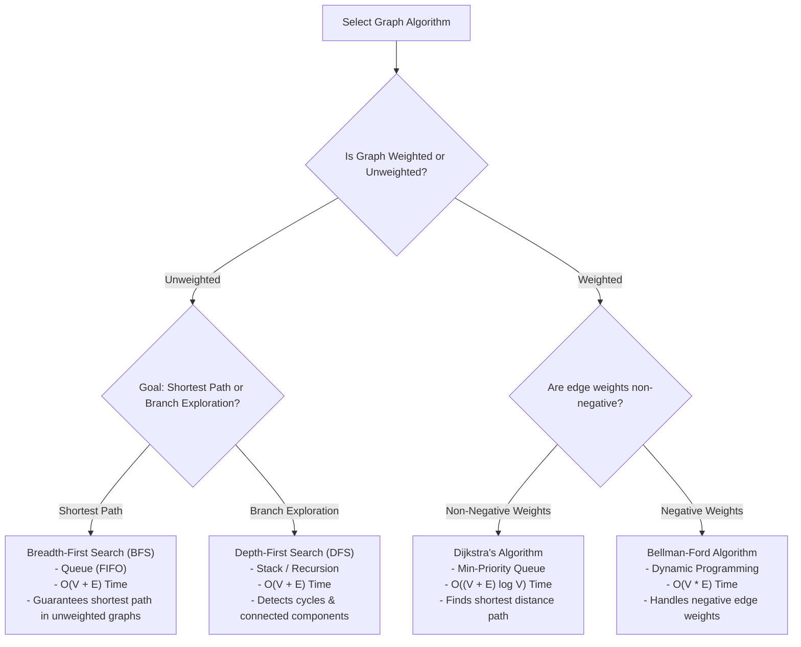
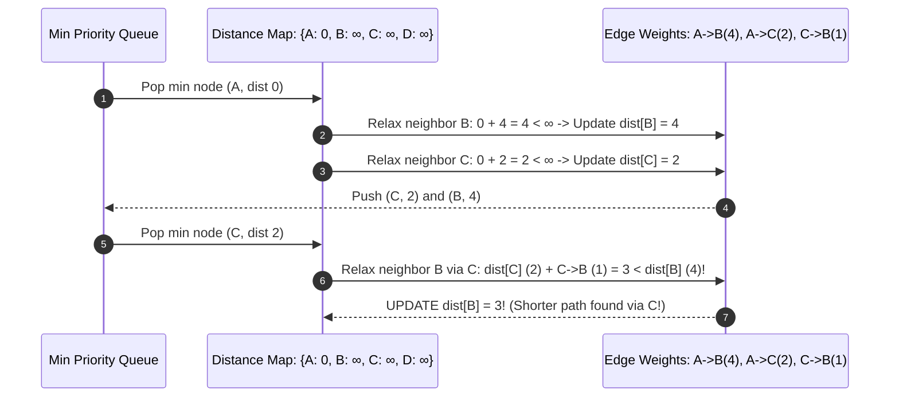

# Module 17: Graph Traversal Algorithms — BFS, DFS, Topological Sort, and Dijkstra's Shortest Path

## Overview

Graph traversal and pathfinding algorithms systematically explore nodes and edges in a graph $G = (V, E)$.

While **Breadth-First Search (BFS)** computes shortest unweighted paths and **Depth-First Search (DFS)** detects cycles and connected components, **Topological Sort** provides build dependencies for Directed Acyclic Graphs (DAGs), and **Dijkstra's Algorithm** calculates shortest paths across non-negatively weighted graphs.

---

## 1. Graph Traversals & Shortest Path Algorithms Comparison



### Graph Algorithms Complexity Matrix

| Algorithm | Graph Requirement | Time Complexity | Auxiliary Space | Key Mechanics |
| :--- | :--- | :--- | :--- | :--- |
| **BFS** | Any Graph | $\mathcal{O}(V + E)$ | $\mathcal{O}(V)$ | Level-by-level Queue exploration. |
| **DFS** | Any Graph | $\mathcal{O}(V + E)$ | $\mathcal{O}(V)$ | Recursive branch deepening with Call Stack. |
| **Topological Sort** | **DAG Only** | $\mathcal{O}(V + E)$ | $\mathcal{O}(V)$ | Kahn's Algorithm (In-degree queue) or DFS. |
| **Dijkstra's** | Non-negative Weights | $\mathcal{O}((V + E) \log V)$ | $\mathcal{O}(V)$ | Min-Priority Queue greedy relaxation. |

---

## 2. Dijkstra's Shortest Path Relaxation Workflow

Dijkstra's algorithm tracks tentative distances from a source node to all other nodes, greedily popping the node with the minimum distance and relaxing its adjacent edge costs:

$$\text{If } \text{dist}[u] + \text{weight}(u, v) < \text{dist}[v] \implies \text{Update } \text{dist}[v] = \text{dist}[u] + \text{weight}(u, v)$$



---

## 3. Production Graph Algorithms Implementation Code

```javascript
class GraphAlgorithms {
  constructor(adjacencyList) {
    this.list = adjacencyList; // Map of vertex -> Array of { node, weight }
  }

  // 1. Breadth-First Search (Shortest Path Unweighted) - O(V + E) Time
  bfs(start) {
    const visited = new Set([start]);
    const queue = [start];
    const result = [];

    while (queue.length > 0) {
      const vertex = queue.shift();
      result.push(vertex);

      for (const neighbor of this.list.get(vertex) || []) {
        const neighborNode = typeof neighbor === "object" ? neighbor.node : neighbor;
        if (!visited.has(neighborNode)) {
          visited.add(neighborNode);
          queue.push(neighborNode);
        }
      }
    }

    return result;
  }

  // 2. Topological Sort (Kahn's In-Degree Algorithm) - O(V + E) Time
  topologicalSort() {
    const inDegree = new Map();
    const zeroInDegreeQueue = [];
    const sortedOrder = [];

    // Initialize in-degree counts for all vertices
    for (const vertex of this.list.keys()) {
      inDegree.set(vertex, 0);
    }

    for (const [u, neighbors] of this.list.entries()) {
      for (const neighbor of neighbors) {
        const v = typeof neighbor === "object" ? neighbor.node : neighbor;
        inDegree.set(v, (inDegree.get(v) || 0) + 1);
      }
    }

    // Push nodes with zero in-degree to queue
    for (const [vertex, count] of inDegree.entries()) {
      if (count === 0) zeroInDegreeQueue.push(vertex);
    }

    // Process zero in-degree nodes
    while (zeroInDegreeQueue.length > 0) {
      const u = zeroInDegreeQueue.shift();
      sortedOrder.push(u);

      for (const neighbor of this.list.get(u) || []) {
        const v = typeof neighbor === "object" ? neighbor.node : neighbor;
        inDegree.set(v, inDegree.get(v) - 1);
        if (inDegree.get(v) === 0) {
          zeroInDegreeQueue.push(v);
        }
      }
    }

    // If topological sort does not include all vertices, graph contains a cycle!
    if (sortedOrder.length !== this.list.size) {
      throw new Error("Cycle Detected: Topological sort only possible on DAGs!");
    }

    return sortedOrder;
  }
}

// Verification of Topological Sort (Dependency Tree)
const buildGraph = new Map();
buildGraph.set("Compile TS", ["Bundle JS"]);
buildGraph.set("Bundle JS", ["Run Tests"]);
buildGraph.set("Run Tests", ["Deploy"]);
buildGraph.set("Deploy", []);

const solver = new GraphAlgorithms(buildGraph);
console.log("Topological Order:", solver.topologicalSort());
// Output: ["Compile TS", "Bundle JS", "Run Tests", "Deploy"]
```

---

## Key Production Takeaways

1. **Always Use a `visited` Set**: Graphs contain cycles. Failing to mark visited nodes in BFS/DFS leads to infinite recursion loops and memory exhaustion.
2. **Use BFS for Unweighted Shortest Paths**: BFS is guaranteed to discover the shortest path in unweighted graphs because it visits nodes in strictly increasing distance order.
3. **Use Kahn's Algorithm for Build Dependency Resolution**: Topological sorting via Kahn's in-degree queue resolves task dependencies and detects circular dependency errors.
4. **Guard Against Negative Edge Weights in Dijkstra**: Dijkstra's algorithm assumes edge weights are non-negative. If edge weights can be negative, use the **Bellman-Ford Algorithm**.

