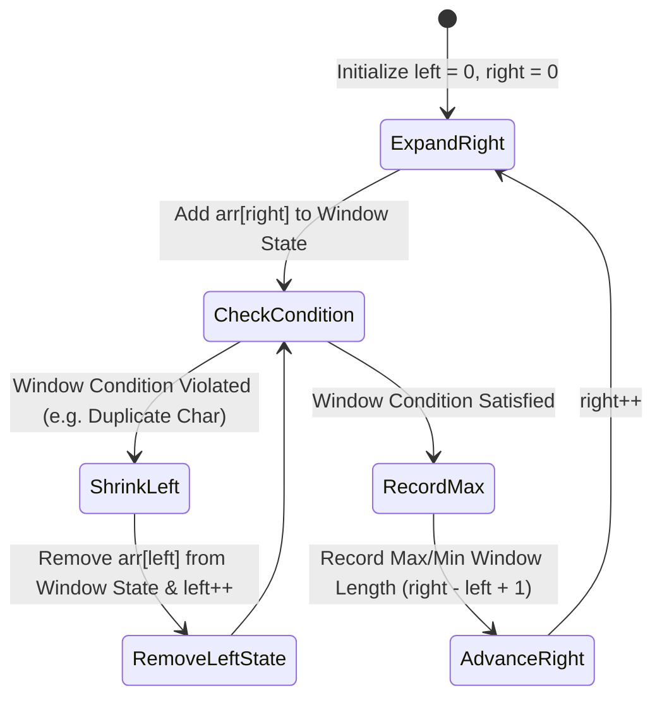

# Module 18: Sliding Window Technique — Fixed vs. Variable Window Patterns

## Overview

The **Sliding Window Pattern** is an algorithmic technique that converts nested $\mathcal{O}(N^2)$ or $\mathcal{O}(N \cdot K)$ subarray/substring searches into single-pass **$\mathcal{O}(N)$ linear time solutions**.

By maintaining two sliding pointers (`left` and `right`) and updating an incremental window state (sum, character frequency map, or set) as elements enter and leave the window boundaries, redundant re-computations are completely eliminated.

---

## 1. Fixed vs. Variable Window Mechanics

```mermaid
flowchart TD
    WindowPattern[Select Sliding Window Variant] --> VariantChoice{Is window size fixed (K) or dynamic based on condition?}

    VariantChoice -- Fixed Size K --> FixedWindow["1. Fixed-Size Window<br/>- Window width stays exactly K<br/>- Slide step: Add arr[right], Subtract arr[right - K]<br/>- O(N) Time, O(1) Space"]

    VariantChoice -- Dynamic Condition --> VariableWindow["2. Variable-Size Window<br/>- Expand right boundary right++ to satisfy condition<br/>- Shrink left boundary left++ when condition is violated<br/>- O(N) Amortized Time"]
```

### Dynamic Window State Machine



---

## 2. Sliding Window Complexity Comparison

| Algorithm Pattern | Problem Type | Naive Complexity | Sliding Window Time | Auxiliary Space |
| :--- | :--- | :--- | :--- | :--- |
| **Fixed Window** | Max Sum Subarray of size $K$ | $\mathcal{O}(N \cdot K)$ | **$\mathcal{O}(N)$** | $\mathcal{O}(1)$ |
| **Variable Window**| Longest Substring Without Repeats | $\mathcal{O}(N^3)$ | **$\mathcal{O}(N)$** | $\mathcal{O}(\min(N, \Sigma))$ |
| **Minimum Window**| Minimum Window Substring | $\mathcal{O}(N^3)$ | **$\mathcal{O}(N)$** | $\mathcal{O}(\Sigma)$ ($\Sigma = \text{Alphabet}$) |

---

## 3. Production Code Implementations

```javascript
// 1. Fixed Window: Max Sum Subarray of Size K - O(N) Time, O(1) Space
function maxSubarraySum(arr, k) {
  if (arr.length < k) return null;

  let windowSum = 0;

  // Compute initial window of size k
  for (let i = 0; i < k; i++) {
    windowSum += arr[i];
  }

  let maxSum = windowSum;

  // Slide window from index k to N-1
  for (let right = k; right < arr.length; right++) {
    windowSum += arr[right] - arr[right - k]; // Add incoming, subtract outgoing
    maxSum = Math.max(maxSum, windowSum);
  }

  return maxSum;
}

// 2. Variable Window: Longest Substring Without Repeating Characters - O(N) Time
function lengthOfLongestSubstring(s) {
  const charMap = new Map(); // Store last seen character index
  let left = 0;
  let maxLength = 0;

  for (let right = 0; right < s.length; right++) {
    const currentChar = s[right];

    // If duplicate character seen within current window, jump left pointer
    if (charMap.has(currentChar) && charMap.get(currentChar) >= left) {
      left = charMap.get(currentChar) + 1;
    }

    charMap.set(currentChar, right); // Update last seen index
    maxLength = Math.max(maxLength, right - left + 1);
  }

  return maxLength;
}

// 3. Advanced Variable Window: Minimum Window Substring - O(N) Time
function minWindow(s, t) {
  if (s.length < t.length) return "";

  const targetMap = new Map();
  for (const char of t) {
    targetMap.set(char, (targetMap.get(char) || 0) + 1);
  }

  let requiredChars = targetMap.size;
  let formedChars = 0;

  const windowCounts = new Map();
  let left = 0;
  let minLen = Infinity;
  let minStart = 0;

  for (let right = 0; right < s.length; right++) {
    const char = s[right];
    windowCounts.set(char, (windowCounts.get(char) || 0) + 1);

    if (targetMap.has(char) && windowCounts.get(char) === targetMap.get(char)) {
      formedChars++;
    }

    // Shrink window from left as long as all required chars are present
    while (left <= right && formedChars === requiredChars) {
      if (right - left + 1 < minLen) {
        minLen = right - left + 1;
        minStart = left;
      }

      const leftChar = s[left];
      windowCounts.set(leftChar, windowCounts.get(leftChar) - 1);
      if (targetMap.has(leftChar) && windowCounts.get(leftChar) < targetMap.get(leftChar)) {
        formedChars--;
      }
      left++;
    }
  }

  return minLen === Infinity ? "" : s.substring(minStart, minStart + minLen);
}

console.log("Max Subarray Sum (K=3) :", maxSubarraySum([2, 1, 5, 1, 3, 2], 3)); // 9
console.log("Longest Unique Substr  :", lengthOfLongestSubstring("abcabcbb"));  // 3 ("abc")
console.log("Min Window Substring   :", minWindow("ADOBECODEBANC", "ABC"));      // "BANC"
```

---

## Key Production Takeaways

1. **Recognize Contiguous Array/String Patterns**: Whenever a problem mentions "contiguous subarray", "substring", or "running window of size $K$", think Sliding Window immediately.
2. **Avoid Re-calculating Window Sums/State**: Instead of re-summing sub-arrays of size $K$ ($\mathcal{O}(N \cdot K)$), update the state incrementally: `newSum = oldSum + arr[right] - arr[right - K]`.
3. **Use Map Index Jump Optimization**: In variable windows, store character indices in a `Map` to jump `left = charMap.get(char) + 1` directly, skipping intermediate decrements.
4. **Amortized $\mathcal{O}(N)$ Analysis**: Even though variable sliding windows contain a nested `while` loop, both `left` and `right` pointers move forward at most $N$ times, guaranteeing overall linear $\mathcal{O}(N)$ runtime.

