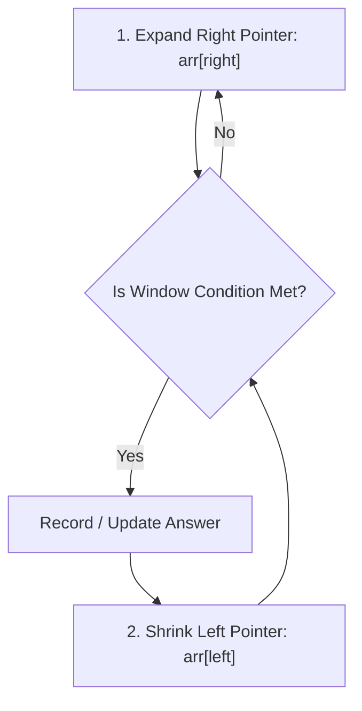

# Module 18: Sliding Window Technique & Monotonic Deque Optimizations

## Theoretical Overview & Window Mechanics

The **Sliding Window Technique** optimizes array and string problems involving contiguous subarrays or substrings, reducing time complexity from brute-force **$\mathcal{O}(n \cdot k)$** or **$\mathcal{O}(n^2)$** down to optimal **$\mathcal{O}(n)$** linear runtime.

```mermaid
flowchart LR
    subgraph Fixed Sliding Window (k = 3)
        Window["[arr[left] ... arr[right]]"] --> Slide["Slide Right: add arr[right+1], remove arr[left]"]
    end
```

### Real-World Engineering Analogy: Hotstar IPL Viewer Telemetry
During an IPL cricket stream with 25,000,000 concurrent viewers:
- **Brute-force approach**: For each second, sum viewer metrics over the past 300 seconds ($300 \times 17,280$ operations), overloading analytics servers.
- **Sliding Window approach**: Update the running sum by adding the new second's metric and subtracting the metric from 300 seconds ago, performing **1 addition and 1 subtraction per second** ($\mathcal{O}(1)$ time per update).

---

## 1. Sliding Window Classification Matrix

| Window Type | Characteristics | Key Condition | Primary Algorithms / Problems |
| :--- | :--- | :--- | :--- |
| **Fixed-Size Window** | Window width $k$ remains constant throughout traversal. | Slide window right by +1: `windowSum += arr[i] - arr[i - k]`. | Max sum subarray of size $k$, Average of subarrays. |
| **Fixed Monotonic Deque** | Window width $k$ remains constant; maintains index deque. | Deque stores indices in decreasing element value order. | **Sliding Window Maximum** (`maxOfSubarrays`). |
| **Dynamic / Variable Window**| Window width expands or shrinks dynamically based on criteria. | Expand `right` to satisfy condition; shrink `left` to optimize bound. | Smallest subarray sum $\ge$ target, Longest unique substring. |
| **Two-Map Variable Window**| Tracks character frequencies against target frequency dictionary.| Window expands until `formed === required`; shrinks `left` to minimize. | **Minimum Window Substring** (`minWindowSubstring`). |

---

## 2. Fixed-Size Window Implementations

### 1. Maximum Sum Subarray of Size K (`maxSumSlidingWindow`)
- **Complexity**: Time $\mathcal{O}(n)$, Space $\mathcal{O}(1)$.

```javascript
function maxSumSlidingWindow(arr, k) {
  if (arr.length < k) return null;

  let windowSum = 0;
  for (let i = 0; i < k; i++) windowSum += arr[i];
  let maxSum = windowSum;

  for (let i = k; i < arr.length; i++) {
    windowSum += arr[i] - arr[i - k]; // Add right, remove left
    maxSum = Math.max(maxSum, windowSum);
  }
  return maxSum;
}
```

### 2. Sliding Window Maximum via Monotonic Deque (`maxOfSubarrays`)
Find the maximum element in every contiguous subarray of size $k$.
- **Monotonic Deque Invariant**: Stores indices of elements in strictly decreasing value order. The front of the deque (`deque[0]`) always points to the maximum element in the active window.
- **Complexity**: Time $\mathcal{O}(n)$ (each index pushed and popped at most once), Space $\mathcal{O}(k)$.

```javascript
function maxOfSubarrays(arr, k) {
  const result = [], deque = [];

  for (let i = 0; i < arr.length; i++) {
    // 1. Remove indices that fall outside the active window boundary
    while (deque.length > 0 && deque[0] < i - k + 1) deque.shift();
    
    // 2. Remove indices of smaller elements that cannot be maximums
    while (deque.length > 0 && arr[deque[deque.length - 1]] <= arr[i]) deque.pop();
    
    deque.push(i);
    if (i >= k - 1) result.push(arr[deque[0]]);
  }
  return result;
}
```

---

## 3. Dynamic / Variable-Size Window Implementations



### 1. Smallest Subarray with Sum $\ge$ Target (`minSubarrayWithSum`)
Find the minimum length of a contiguous subarray whose sum is $\ge target$.
- **Complexity**: Time $\mathcal{O}(n)$, Space $\mathcal{O}(1)$.

```javascript
function minSubarrayWithSum(arr, target) {
  let left = 0, windowSum = 0, minLength = Infinity;

  for (let right = 0; right < arr.length; right++) {
    windowSum += arr[right];

    while (windowSum >= target) {
      minLength = Math.min(minLength, right - left + 1);
      windowSum -= arr[left];
      left++;
    }
  }
  return minLength === Infinity ? 0 : minLength;
}
```

### 2. Longest Substring Without Repeating Characters (`longestSubstringWithoutRepeats`)
Find the length of the longest substring without duplicate characters using a dynamic index map.
- **Complexity**: Time $\mathcal{O}(n)$, Space $\mathcal{O}(\min(n, \text{charset}))$.

```javascript
function longestSubstringWithoutRepeats(s) {
  const charIndex = new Map();
  let left = 0, maxLength = 0, bestStart = 0;

  for (let right = 0; right < s.length; right++) {
    const char = s[right];
    if (charIndex.has(char) && charIndex.get(char) >= left) {
      left = charIndex.get(char) + 1;
    }
    charIndex.set(char, right);
    if (right - left + 1 > maxLength) {
      maxLength = right - left + 1;
      bestStart = left;
    }
  }
  return { length: maxLength, substring: s.slice(bestStart, bestStart + maxLength) };
}
```

### 3. Longest Substring with At Most K Distinct Characters (`longestSubstringKDistinct`)
Maintain a dynamic window containing at most $k$ distinct characters using a frequency Map.

```javascript
function longestSubstringKDistinct(s, k) {
  if (k === 0) return 0;
  const freq = new Map();
  let left = 0, maxLength = 0;

  for (let right = 0; right < s.length; right++) {
    freq.set(s[right], (freq.get(s[right]) || 0) + 1);

    while (freq.size > k) {
      const lc = s[left];
      freq.set(lc, freq.get(lc) - 1);
      if (freq.get(lc) === 0) freq.delete(lc);
      left++;
    }

    maxLength = Math.max(maxLength, right - left + 1);
  }
  return maxLength;
}
```

### 4. Minimum Window Substring (`minWindowSubstring`)
Find the smallest substring in $s$ containing all characters of pattern $t$.
- **Complexity**: Time $\mathcal{O}(n + m)$, Space $\mathcal{O}(m)$.

```javascript
function minWindowSubstring(s, t) {
  if (t.length > s.length) return "";

  const need = new Map();
  for (const c of t) need.set(c, (need.get(c) || 0) + 1);

  const windowFreq = new Map();
  let formed = 0, required = need.size;
  let left = 0, minLen = Infinity, minStart = 0;

  for (let right = 0; right < s.length; right++) {
    const c = s[right];
    windowFreq.set(c, (windowFreq.get(c) || 0) + 1);
    if (need.has(c) && windowFreq.get(c) === need.get(c)) formed++;

    while (formed === required) {
      if (right - left + 1 < minLen) {
        minLen = right - left + 1;
        minStart = left;
      }
      const lc = s[left];
      windowFreq.set(lc, windowFreq.get(lc) - 1);
      if (need.has(lc) && windowFreq.get(lc) < need.get(lc)) formed--;
      left++;
    }
  }

  return minLen === Infinity ? "" : s.slice(minStart, minStart + minLen);
}
```

---

## Key Takeaways

1. **Incremental Updates**: Avoid re-summing or scanning subarrays from scratch; update states incrementally via `+ right - left`.
2. **Fixed vs Variable Windows**: Use fixed windows when $k$ is given; use dynamic `right`/`left` pointers when optimizing length under a condition.
3. **Monotonic Deque**: Solves maximum/minimum window problems in guaranteed $\mathcal{O}(n)$ time.
4. **Pattern Keywords**: Look for "contiguous", "subarray", "substring", "consecutive", or "window".
