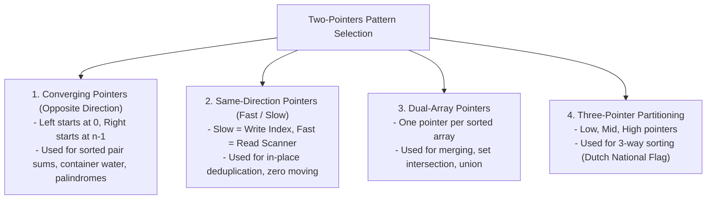

# Module 19: Two-Pointers Technique & Converging Boundary Patterns

## Theoretical Overview & Pattern Classification

The **Two-Pointers Technique** uses two index pointers to traverse a linear dataset (array or string) simultaneously. By replacing naive nested iteration ($\mathcal{O}(n^2)$) with dynamic pointer movements guided by sorted order or state conditions, algorithms achieve **$\mathcal{O}(n)$** linear runtime.



---

## 1. Two-Pointers Complexity & Feature Matrix

| Problem / Algorithm | Pointer Pattern | Time Complexity | Auxiliary Space | Key Mechanics |
| :--- | :--- | :--- | :--- | :--- |
| **Two Sum (Sorted Array)**| Converging (`left`, `right`)| **$\mathcal{O}(n)$** | **$\mathcal{O}(1)$** | Move `left++` if sum $< target$; `right--` if sum $> target$. |
| **Three Sum** | Fix One + Converging | **$\mathcal{O}(n^2)$** | **$\mathcal{O}(1)$** | Sort array, fix index $i$, run two-pointer search on rest; skip dupes. |
| **Container With Most Water**| Converging + Greedy | **$\mathcal{O}(n)$** | **$\mathcal{O}(1)$** | Always shift pointer of shorter height inward. |
| **Remove Duplicates** | Fast / Slow Same Dir | **$\mathcal{O}(n)$** | **$\mathcal{O}(1)$** | Overwrite `arr[slow]` when `arr[fast]` introduces new value. |
| **Move Zeros** | Fast / Slow Same Dir | **$\mathcal{O}(n)$** | **$\mathcal{O}(1)$** | Swap non-zero elements forward to `slow` index. |
| **Sort Colors (Dutch Flag)**| Three Pointers | **$\mathcal{O}(n)$** | **$\mathcal{O}(1)$** | 3-way partition: 0s to `low`, 2s to `high`, 1s in `mid`. |
| **Trapping Rain Water** | Converging + Running Max| **$\mathcal{O}(n)$** | **$\mathcal{O}(1)$** | Process shorter wall side while maintaining `leftMax` / `rightMax`. |

---

## 2. Converging Pointer Implementations

### 1. Two Sum in Sorted Array (`twoSumSorted`)
```javascript
function twoSumSorted(arr, target) {
  let left = 0, right = arr.length - 1;
  while (left < right) {
    const sum = arr[left] + arr[right];
    if (sum === target) return [left, right];
    else if (sum < target) left++;
    else right--;
  }
  return [-1, -1];
}
```

### 2. Three Sum Zero Triplets (`threeSum`)
Find all unique triplets $[a, b, c]$ in an array that sum to $0$.
- **Strategy**: Sort array. Fix `arr[i]`, then search for `target = -arr[i]` using converging pointers. Skip duplicate values at all three pointers to ensure uniqueness.
- **Complexity**: Time $\mathcal{O}(n^2)$, Space $\mathcal{O}(1)$ (excluding output).

```javascript
function threeSum(arr, target) {
  arr.sort((a, b) => a - b);
  const results = [];

  for (let i = 0; i < arr.length - 2; i++) {
    if (i > 0 && arr[i] === arr[i - 1]) continue; // Skip duplicate i

    let left = i + 1, right = arr.length - 1;

    while (left < right) {
      const sum = arr[i] + arr[left] + arr[right];
      if (sum === target) {
        results.push([arr[i], arr[left], arr[right]]);
        while (left < right && arr[left] === arr[left + 1]) left++;
        while (left < right && arr[right] === arr[right - 1]) right--;
        left++; right--;
      } else if (sum < target) left++;
      else right--;
    }
  }
  return results;
}
```

### 3. Container With Most Water (`containerWithMostWater`)
Find two lines that together with the x-axis form a container holding the maximum water.
- **Greedy Invariant**: $\text{Area} = (right - left) \times \min(h[left], h[right])$. Moving the pointer with the larger height can never increase area because the width shrinks and the bottleneck height cannot grow. Thus, always increment/decrement the pointer pointing to the shorter line.

```javascript
function containerWithMostWater(heights) {
  let left = 0, right = heights.length - 1, maxArea = 0;
  while (left < right) {
    const area = (right - left) * Math.min(heights[left], heights[right]);
    maxArea = Math.max(maxArea, area);
    if (heights[left] < heights[right]) left++;
    else right--;
  }
  return maxArea;
}
```

---

## 3. Fast / Slow & Multi-Pointer Implementations

### 1. In-Place Duplicate Removal (`removeDuplicates`)
```javascript
function removeDuplicates(arr) {
  if (arr.length <= 1) return arr.length;
  let slow = 0;
  for (let fast = 1; fast < arr.length; fast++) {
    if (arr[fast] !== arr[slow]) {
      slow++;
      arr[slow] = arr[fast];
    }
  }
  return slow + 1;
}
```

### 2. Move Zeros Forward (`moveZeros`)
```javascript
function moveZeros(arr) {
  let slow = 0;
  for (let fast = 0; fast < arr.length; fast++) {
    if (arr[fast] !== 0) {
      [arr[slow], arr[fast]] = [arr[fast], arr[slow]];
      slow++;
    }
  }
  return arr;
}
```

### 3. Dutch National Flag 3-Way Sort (`sortColors`)
Sort an array containing `0`s, `1`s, and `2`s in a single pass in-place.

```javascript
function sortColors(arr) {
  let low = 0, mid = 0, high = arr.length - 1;
  while (mid <= high) {
    if (arr[mid] === 0) {
      [arr[low], arr[mid]] = [arr[mid], arr[low]];
      low++; mid++;
    } else if (arr[mid] === 1) {
      mid++;
    } else {
      [arr[mid], arr[high]] = [arr[high], arr[mid]];
      high--; // Re-check swapped element at mid
    }
  }
  return arr;
}
```

### 4. Trapping Rain Water (`trapRainWater`)
Calculate total trapped rainwater after raining over elevation heights.
- **Strategy**: Water trapped at index $i$ is determined by $\min(\text{leftMax}, \text{rightMax}) - \text{height}[i]$. Use converging pointers while maintaining running max values `leftMax` and `rightMax`.

```javascript
function trapRainWater(heights) {
  let left = 0, right = heights.length - 1;
  let leftMax = 0, rightMax = 0, total = 0;

  while (left < right) {
    if (heights[left] < heights[right]) {
      if (heights[left] >= leftMax) leftMax = heights[left];
      else total += leftMax - heights[left];
      left++;
    } else {
      if (heights[right] >= rightMax) rightMax = heights[right];
      else total += rightMax - heights[right];
      right--;
    }
  }
  return total;
}
```

---

## Key Takeaways

1. **Space Optimization**: Two pointers solve array sorting, deduplication, and water trapping in **$\mathcal{O}(1)$ auxiliary space**.
2. **Converging Bounds**: Requires sorted data for pair sum searching.
3. **Fast / Slow Read-Write**: Solves in-place array modification tasks (`moveZeros`, `removeDuplicates`) in a single $\mathcal{O}(n)$ pass.
4. **Multi-Pointer Decision Rules**: Shift the pointer controlling the bottleneck condition (e.g., shorter container height or smaller running max elevation).
