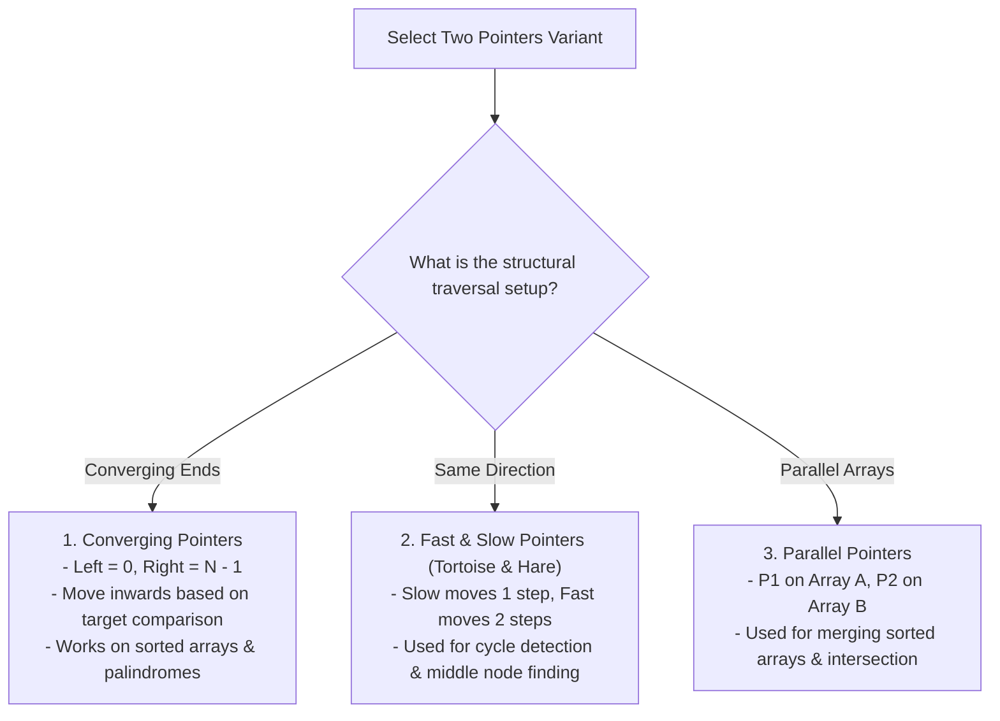
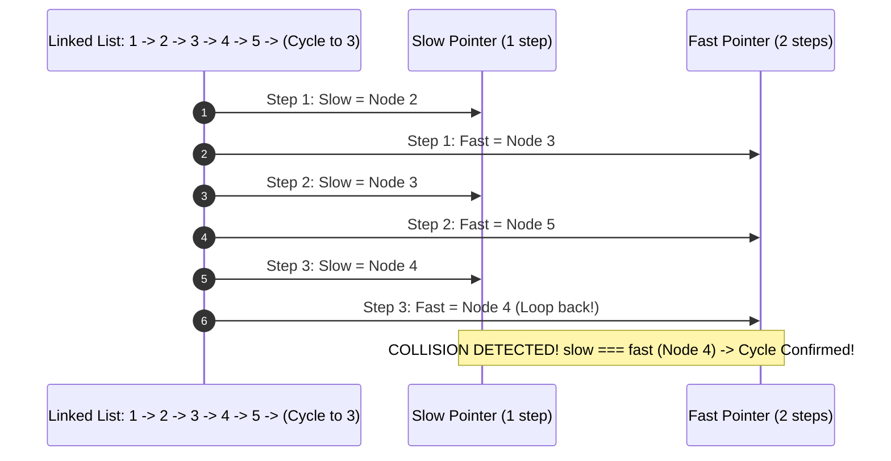

# Module 19: Two Pointers Pattern — Converging, Fast & Slow, and Parallel Strategies

## Overview

The **Two Pointers Pattern** is an algorithmic optimization technique that uses two array indices or memory reference pointers to iterate through data structures concurrently.

By exploiting sorted order properties, structural symmetry, or relative pointer speeds (**Fast and Slow Pointers**), two pointers eliminate nested loops, reducing time complexity from $\mathcal{O}(N^2)$ to **$\mathcal{O}(N)$ linear time** while maintaining **$\mathcal{O}(1)$ auxiliary space**.

---

## 1. Two-Pointer Operational Typologies



### Fast & Slow Pointers Collision Dynamics



---

## 2. Two-Pointer Complexity Comparison Matrix

| Problem Type | Brute-Force Complexity | Two-Pointers Time | Auxiliary Space | Key Mechanics |
| :--- | :--- | :--- | :--- | :--- |
| **Two Sum Sorted** | $\mathcal{O}(N^2)$ | **$\mathcal{O}(N)$** | $\mathcal{O}(1)$ | Move left++ if sum < target; right-- if sum > target. |
| **Container With Most Water**| $\mathcal{O}(N^2)$ | **$\mathcal{O}(N)$** | $\mathcal{O}(1)$ | Move pointer pointing to shorter height inward. |
| **3Sum Problem** | $\mathcal{O}(N^3)$ | **$\mathcal{O}(N^2)$** | $\mathcal{O}(1)$ | Sort array, fix element `i`, run 2-pointers on remainder. |
| **Trapping Rain Water** | $\mathcal{O}(N^2)$ | **$\mathcal{O}(N)$** | $\mathcal{O}(1)$ | Maintain `leftMax` and `rightMax` boundaries. |

---

## 3. Production Code Implementations

```javascript
// 1. Converging Pointers: Two Sum in Sorted Array - O(N) Time, O(1) Space
function twoSumSorted(numbers, target) {
  let left = 0;
  let right = numbers.length - 1;

  while (left < right) {
    const sum = numbers[left] + numbers[right];

    if (sum === target) {
      return [left + 1, right + 1]; // 1-indexed response
    } else if (sum < target) {
      left++; // Sum too small, advance left pointer to larger value
    } else {
      right--; // Sum too large, retreat right pointer to smaller value
    }
  }

  return [];
}

// 2. Converging Pointers: Container With Most Water (LeetCode #11) - O(N) Time
function maxArea(height) {
  let left = 0;
  let right = height.length - 1;
  let maxWater = 0;

  while (left < right) {
    const currentWidth = right - left;
    const currentHeight = Math.min(height[left], height[right]);
    const area = currentWidth * currentHeight;
    maxWater = Math.max(maxWater, area);

    // Greedy choice: Move pointer with shorter height to explore larger capacity
    if (height[left] < height[right]) {
      left++;
    } else {
      right--;
    }
  }

  return maxWater;
}

// 3. Fast & Slow Pointers: Finding Middle Node of Linked List - O(N) Time
function findMiddleNode(head) {
  let slow = head;
  let fast = head;

  while (fast !== null && fast.next !== null) {
    slow = slow.next;       // Advance 1 step
    fast = fast.next.next;  // Advance 2 steps
  }

  return slow; // When fast reaches end, slow is exactly at middle!
}

// 4. Advanced 3Sum Problem - O(N²) Time, O(1) Space
function threeSum(nums) {
  nums.sort((a, b) => a - b); // Step 1: Sort array in O(N log N)
  const results = [];

  for (let i = 0; i < nums.length - 2; i++) {
    if (i > 0 && nums[i] === nums[i - 1]) continue; // Skip duplicates for i

    let left = i + 1;
    let right = nums.length - 1;

    while (left < right) {
      const sum = nums[i] + nums[left] + nums[right];

      if (sum === 0) {
        results.push([nums[i], nums[left], nums[right]]);
        while (left < right && nums[left] === nums[left + 1]) left++;   // Skip duplicate left
        while (left < right && nums[right] === nums[right - 1]) right--; // Skip duplicate right
        left++;
        right--;
      } else if (sum < 0) {
        left++;
      } else {
        right--;
      }
    }
  }

  return results;
}

console.log("Two Sum Sorted :", twoSumSorted([2, 7, 11, 15], 9)); // [1, 2]
console.log("Max Area Water :", maxArea([1, 8, 6, 2, 5, 4, 8, 3, 7])); // 49
console.log("3Sum Triplets  :", threeSum([-1, 0, 1, 2, -1, -4])); // [[-1, -1, 2], [-1, 0, 1]]
```

---

## Key Production Takeaways

1. **Sort First for Target Pair Sum Problems**: If an array is unsorted and space allows $\mathcal{O}(N \log N)$ pre-sorting, apply sorting to enable $\mathcal{O}(N)$ Converging Two-Pointers.
2. **Use Fast & Slow Pointers for Linked List & Cycle Problems**: Tortoise and Hare pointers find middle nodes, detect cycles, and calculate cycle length in $\mathcal{O}(N)$ time without extra set memory.
3. **Skip Duplicate Elements in Multi-Pointer Loops**: In 3Sum or 4Sum, skip duplicate adjacent items (`nums[i] === nums[i-1]`) to prevent generating non-unique solution tuples.
4. **Greedy Decision Invariants**: In container or rain water problems, moving the pointer with the smaller boundary height is mathematically guaranteed not to miss larger container volumes.

