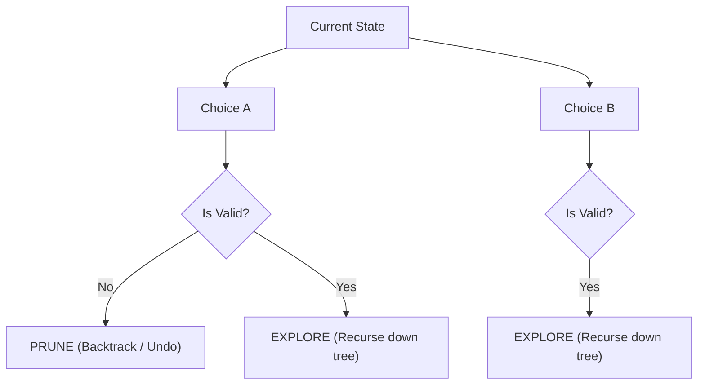

# Module 20: Backtracking, Decision Trees, & Constraint Satisfaction

## Theoretical Overview & The Core Blueprint

**Backtracking** is a systematic algorithmic technique for solving constraint-satisfaction problems by searching through a State-Space Decision Tree.

It builds solution candidates incrementally and **prunes** (abandons) a candidate branch as soon as it determines that the branch cannot lead to a valid solution.



### The Universal Backtracking Template
Every backtracking implementation follows a 3-step state cycle:

$$\text{CHOOSE } \longrightarrow \text{ EXPLORE } \longrightarrow \text{ UNDO (BACKTRACK)}$$

```javascript
function backtrack(state, choices) {
  if (isGoal(state)) { results.push(copy(state)); return; }
  for (const choice of choices) {
    if (!isValid(choice)) continue;   // 1. PRUNE invalid choices early
    makeChoice(state, choice);         // 2. CHOOSE
    backtrack(state, remainingChoices); // 3. EXPLORE recursively
    undoChoice(state, choice);         // 4. UNDO state changes
  }
}
```

---

## 1. Backtracking Problems Complexity Matrix

| Problem | Time Complexity | Auxiliary Space (Stack Depth) | Decision Tree Branching Factor |
| :--- | :--- | :--- | :--- |
| **Subsets / Power Set** | **$\mathcal{O}(2^n \cdot n)$** | $\mathcal{O}(n)$ | Binary choice (Include vs Exclude). |
| **Permutations** | **$\mathcal{O}(n! \cdot n)$** | $\mathcal{O}(n)$ | $n$ choice swaps per level. |
| **Combination Sum** | **$\mathcal{O}(n^{t/\min})$** | $\mathcal{O}(t/\min)$ | $n$ candidates with reuse enabled. |
| **N-Queens Problem** | **$\mathcal{O}(N!)$** | $\mathcal{O}(N)$ | $N$ columns per row placement. |
| **Sudoku Solver** | **$\mathcal{O}(9^m)$** ($m=$ empty cells)| $\mathcal{O}(m)$ | 9 digit choices per cell. |
| **Generate Parentheses** | **$\mathcal{O}\left(\frac{4^n}{\sqrt{n}}\right)$** | $\mathcal{O}(n)$ | Catalan number sequence bound $C_n$. |

---

## 2. Fundamental Combinatorial Generators

### 1. Power Set Subsets (`generateSubsets`)
Generate all $2^n$ subsets of an array using binary include/exclude decisions.

```javascript
function generateSubsets(nums) {
  const results = [];
  function backtrack(index, current) {
    if (index === nums.length) { results.push([...current]); return; }
    backtrack(index + 1, current); // Exclude option
    current.push(nums[index]);     // CHOOSE
    backtrack(index + 1, current); // EXPLORE
    current.pop();                 // UNDO
  }
  backtrack(0, []);
  return results;
}
```

### 2. Element Permutations via In-Place Swaps (`permuteSwap`)
Generate all $n!$ orderings of array elements by swapping candidates into the active index.

```javascript
function permuteSwap(nums) {
  const results = [];
  function backtrack(start) {
    if (start === nums.length) { results.push([...nums]); return; }
    for (let i = start; i < nums.length; i++) {
      [nums[start], nums[i]] = [nums[i], nums[start]]; // CHOOSE (Swap)
      backtrack(start + 1);                            // EXPLORE
      [nums[start], nums[i]] = [nums[i], nums[start]]; // UNDO (Swap back)
    }
  }
  backtrack(0);
  return results;
}
```

### 3. Combination Sum with Branch Pruning (`combinationSum`)
Find unique combinations of candidates that sum to `target` (elements can be reused).
- **Pruning Optimization**: Sort candidates initially; break out of the loop immediately when `candidate > remaining`.

```javascript
function combinationSum(candidates, target) {
  const results = [];
  candidates.sort((a, b) => a - b);

  function backtrack(start, current, remaining) {
    if (remaining === 0) { results.push([...current]); return; }
    for (let i = start; i < candidates.length; i++) {
      if (candidates[i] > remaining) break;              // PRUNE
      current.push(candidates[i]);                        // CHOOSE
      backtrack(i, current, remaining - candidates[i]);   // EXPLORE (reuse i)
      current.pop();                                      // UNDO
    }
  }
  backtrack(0, [], target);
  return results;
}
```

---

## 3. Constraint Satisfaction Solvers

### 1. N-Queens Problem with $\mathcal{O}(1)$ Hash Sets (`solveNQueens`)
Place $N$ non-attacking chess queens on an $N \times N$ chessboard.
- **$\mathcal{O}(1)$ Conflict Checks**: Track attacked paths using three Hash Sets:
  - `cols`: Vertical column check.
  - `diag1`: Major diagonal check ($row - col$).
  - `diag2`: Minor diagonal check ($row + col$).

```javascript
function solveNQueens(n) {
  const results = [];
  const board = Array.from({ length: n }, () => Array(n).fill("."));
  const cols = new Set(), diag1 = new Set(), diag2 = new Set();

  function backtrack(row) {
    if (row === n) { results.push(board.map((r) => r.join(""))); return; }
    for (let col = 0; col < n; col++) {
      if (cols.has(col) || diag1.has(row - col) || diag2.has(row + col)) continue; // PRUNE
      board[row][col] = "Q";
      cols.add(col); diag1.add(row - col); diag2.add(row + col); // CHOOSE
      backtrack(row + 1);                                        // EXPLORE
      board[row][col] = ".";
      cols.delete(col); diag1.delete(row - col); diag2.delete(row + col); // UNDO
    }
  }
  backtrack(0);
  return results;
}
```

### 2. Sudoku Solver Grid Engine (`solveSudoku`)
Solve a $9 \times 9$ Sudoku grid by filling empty `.` cells with digits $1-9$.

```javascript
function solveSudoku(board) {
  function isValid(board, row, col, num) {
    const char = String(num);
    for (let i = 0; i < 9; i++) {
      if (board[row][i] === char) return false;
      if (board[i][col] === char) return false;
      const boxRow = Math.floor(row / 3) * 3 + Math.floor(i / 3);
      const boxCol = Math.floor(col / 3) * 3 + (i % 3);
      if (board[boxRow][boxCol] === char) return false;
    }
    return true;
  }

  function solve(board) {
    for (let r = 0; r < 9; r++) {
      for (let c = 0; c < 9; c++) {
        if (board[r][c] === ".") {
          for (let num = 1; num <= 9; num++) {
            if (isValid(board, r, c, num)) {
              board[r][c] = String(num);    // CHOOSE
              if (solve(board)) return true; // EXPLORE
              board[r][c] = ".";             // UNDO
            }
          }
          return false; // Backtrack on invalid configuration
        }
      }
    }
    return true; // All cells filled
  }
  solve(board);
  return board;
}
```

### 3. Generate Valid Parentheses Combinations (`generateParentheses`)
Generate all valid combinations of $n$ pairs of parentheses.
- **Pruning Rules**:
  1. Add `'('` only if `openCount < n`.
  2. Add `')'` only if `closeCount < openCount`.

```javascript
function generateParentheses(n) {
  const results = [];
  function backtrack(current, openCount, closeCount) {
    if (current.length === 2 * n) { results.push(current); return; }
    if (openCount < n) backtrack(current + "(", openCount + 1, closeCount);
    if (closeCount < openCount) backtrack(current + ")", openCount, closeCount + 1);
  }
  backtrack("", 0, 0);
  return results;
}
```

---

## 4. Backtracking vs Dynamic Programming Decision Tree

```mermaid
flowchart TD
    ProblemType[Algorithmic Problem Goal] --> GoalCheck{What is the required output?}
    GoalCheck -->|Generate / List ALL Solutions| UseBT[Use Backtracking]
    GoalCheck -->|Find Max / Min / Count Total| CheckOverlap{Are subproblems overlapping?}
    
    CheckOverlap -->|Yes| UseDP[Use Dynamic Programming - O(n) / O(n²)]
    CheckOverlap -->|No| UseGreedy[Use Greedy Algorithm / Divide & Conquer]
```

---

## Key Takeaways

1. **State Restoration**: Always restore local component state (`current.pop()`, `board[r][c] = '.'`) after recursive exploration returns.
2. **Aggressive Pruning**: Pruning invalid choices early transforms brute-force searches into high-performance solvers.
3. **$\mathcal{O}(1)$ Diagonal Check Trick**: Identify chessboard diagonals using $row - col$ and $row + col$.
4. **Backtracking vs DP**: Use Backtracking when enumerating all actual configurations; use DP when calculating optimal scalar metrics.
