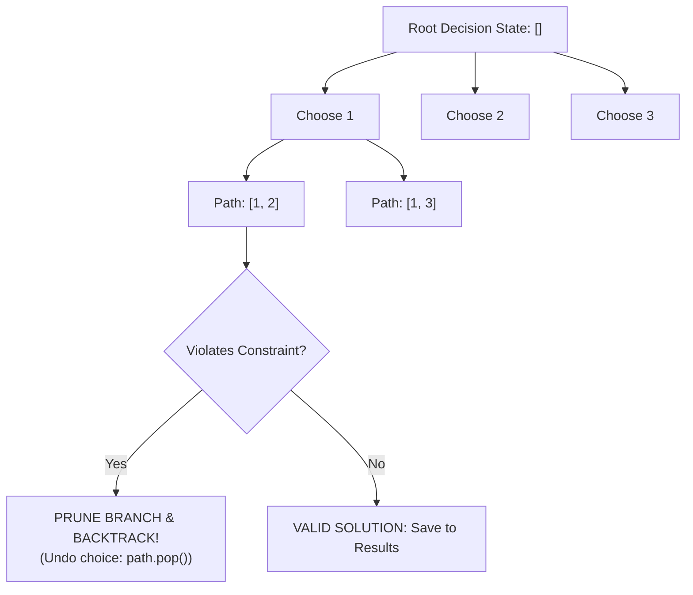
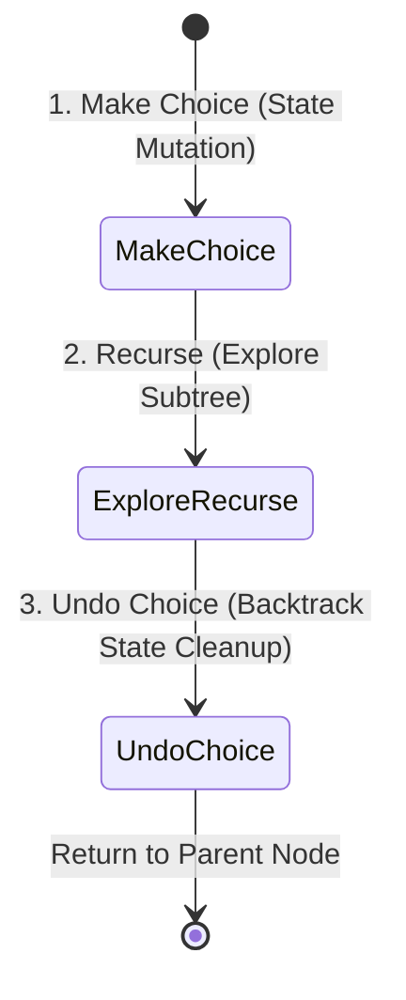

# Module 20: Backtracking Algorithms — State Space Search, Choice Invalidation, and Branch Pruning

## Overview

**Backtracking** is a systematic algorithmic strategy for solving combinatorial optimization and constraint-satisfaction problems (Subsets, Permutations, Sudoku, N-Queens, Word Search).

It incrementally builds candidate solutions along a **State Space Decision Tree** and immediately **prunes (backtracks)** any branch that violates problem constraints, avoiding brute-force evaluation of non-viable solution spaces.

---

## 1. Backtracking Decision Tree & Branch Pruning



### The 3-Step Canonical Backtracking Template

Every backtracking function adheres strictly to this three-step lifecycle inside a decision loop:



---

## 2. Combinatorial Problem Complexity Comparison

| Problem Class | Output Count Formula | Time Complexity | Auxiliary Space | Example Problems |
| :--- | :--- | :--- | :--- | :--- |
| **Subsets / Power Set** | $2^N$ | $\mathcal{O}(N \cdot 2^N)$ | $\mathcal{O}(N)$ recursion depth | Generate all sub-assemblies. |
| **Combinations** | $\binom{N}{K} = \frac{N!}{K!(N-K)!}$ | $\mathcal{O}(K \cdot \binom{N}{K})$ | $\mathcal{O}(K)$ | Combination Sum ($K$ items summing to Target). |
| **Permutations** | $N!$ | $\mathcal{O}(N \cdot N!)$ | $\mathcal{O}(N)$ | Anagram generation, TSP. |
| **Grid Search / N-Queens**| Constraint Bounded | $\mathcal{O}(N!)$ worst-case | $\mathcal{O}(N^2)$ grid memory | Sudoku Solver, N-Queens. |

---

## 3. Production Backtracking Implementations

```javascript
// 1. Array Permutations Pattern (LeetCode #46) - O(N * N!) Time
function permute(nums) {
  const results = [];
  const used = new Array(nums.length).fill(false);

  function backtrack(currentPath) {
    // Goal State Reached
    if (currentPath.length === nums.length) {
      results.push([...currentPath]); // Save snapshot copy of path
      return;
    }

    for (let i = 0; i < nums.length; i++) {
      if (used[i]) continue; // Constraint Check (Prune duplicates)

      // 1. Make Choice
      currentPath.push(nums[i]);
      used[i] = true;

      // 2. Recurse & Explore
      backtrack(currentPath);

      // 3. Undo Choice (Backtrack State Cleanup)
      currentPath.pop();
      used[i] = false;
    }
  }

  backtrack([]);
  return results;
}

// 2. Subsets / Power Set Pattern (LeetCode #78) - O(N * 2^N) Time
function subsets(nums) {
  const results = [];

  function backtrack(startIndex, currentPath) {
    results.push([...currentPath]); // Record subset at every tree node

    for (let i = startIndex; i < nums.length; i++) {
      // 1. Make Choice
      currentPath.push(nums[i]);

      // 2. Recurse with next index
      backtrack(i + 1, currentPath);

      // 3. Undo Choice
      currentPath.pop();
    }
  }

  backtrack(0, []);
  return results;
}

// 3. Combination Sum Pattern (LeetCode #39) - O(2^T) Time
function combinationSum(candidates, target) {
  const results = [];
  candidates.sort((a, b) => a - b); // Pre-sort for early pruning

  function backtrack(startIndex, currentPath, currentSum) {
    if (currentSum === target) {
      results.push([...currentPath]);
      return;
    }

    for (let i = startIndex; i < candidates.length; i++) {
      const val = candidates[i];
      if (currentSum + val > target) break; // EARLY PRUNING: Remaining choices will exceed target!

      // 1. Make Choice
      currentPath.push(val);

      // 2. Recurse (i remains i because candidates can be reused!)
      backtrack(i, currentPath, currentSum + val);

      // 3. Undo Choice
      currentPath.pop();
    }
  }

  backtrack(0, [], 0);
  return results;
}

console.log("Permutations [1,2,3]:", permute([1, 2, 3]).length); // 6 permutations
console.log("Subsets [1,2,3]     :", subsets([1, 2, 3]).length); // 8 subsets
console.log("Combination Sum 7   :", combinationSum([2, 3, 6, 7], 7)); // [[2, 2, 3], [7]]
```

---

## Key Production Takeaways

1. **Always Pass Copy Snapshots of Solution Paths**: Push `[...currentPath]` into results array. If you push `currentPath` directly, future `.pop()` operations will mutate all saved results.
2. **Pre-Sort Arrays to Enable Early Branch Pruning**: Sorting input arrays enables `if (currentSum + val > target) break`, cutting off entire invalid subtrees early.
3. **Use Boolean Arrays for Fast $\mathcal{O}(1)$ Usage Checks**: Replace `currentPath.includes(val)` ($\mathcal{O}(N)$ lookup) with a `used` boolean array ($\mathcal{O}(1)$ check) for permutation algorithms.
4. **Master the `startIndex` Choice Filter**: Use a `startIndex` parameter to enforce increasing choice order for Subsets/Combinations, preventing duplicate permutations like `[1, 2]` and `[2, 1]`.

