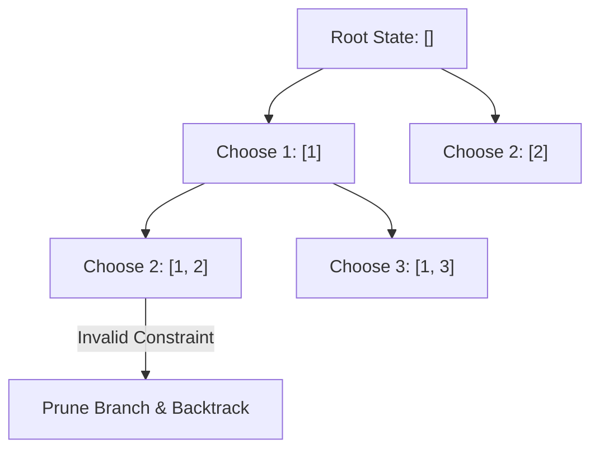

# File 20: Backtracking Algorithms

## Overview
**Backtracking** is an algorithmic technique for solving combinatorial search problems incrementally. It explores candidate solutions recursively and **prunes (backtracks)** branches as soon as a candidate violates problem constraints.

---

## 1. Backtracking Decision State Tree



---

## 2. Permutations & N-Queens Implementation

```javascript
// 1. Array Permutations Backtracking (LeetCode #46)
function permute(nums) {
    const results = [];

    function backtrack(currentPath, remainingNums) {
        if (remainingNums.length === 0) {
            results.push([...currentPath]); // Goal reached!
            return;
        }

        for (let i = 0; i < remainingNums.length; i++) {
            // Make Choice
            currentPath.push(remainingNums[i]);
            const newRemaining = remainingNums.slice(0, i).concat(remainingNums.slice(i + 1));

            // Recurse
            backtrack(currentPath, newRemaining);

            // Undo Choice (Backtrack)
            currentPath.pop();
        }
    }

    backtrack([], nums);
    return results;
}

console.log(permute([1, 2, 3]));
// Outputs 6 unique permutations: [[1,2,3], [1,3,2], [2,1,3], [2,3,1], [3,1,2], [3,2,1]]
```

---

## Key Takeaways
1. Follows the pattern: **Make Choice $\rightarrow$ Recurse $\rightarrow$ Undo Choice (Backtrack)**.
2. Solves **Subsets**, **Permutations**, **Combination Sum**, **N-Queens**, and **Sudoku Solvers**.
3. Prunes non-viable decision paths early to save execution time.
