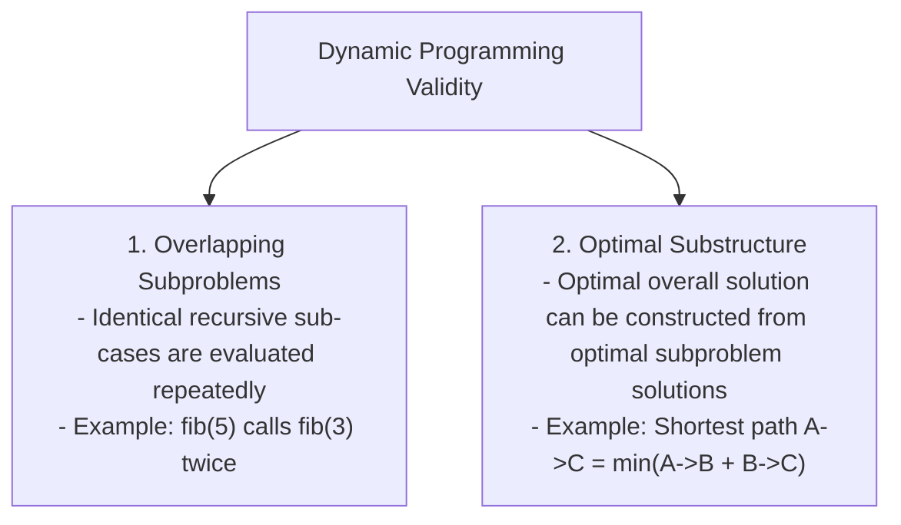

# Module 21: Dynamic Programming (DP), Memoization, & Tabulation

## Theoretical Overview & Core Prerequisites

**Dynamic Programming (DP)** is an optimization technique that converts exponential time brute-force algorithms ($\mathcal{O}(2^n)$) into polynomial time ($\mathcal{O}(n)$ or $\mathcal{O}(n^2)$) by solving each subproblem **once** and storing the result in a lookup table (cache).



### Top-Down (Memoization) vs Bottom-Up (Tabulation)
- **Top-Down (Memoization)**: Begins at target state $N$, recursing downwards while storing computed results in a Hash Map or Array cache. Natural to write from recursive formulations.
- **Bottom-Up (Tabulation)**: Fills a table sequentially starting from base cases ($0, 1$) up to target state $N$. Eliminates recursion stack overhead and enables space optimizations.

---

## 1. Dynamic Programming Problems Complexity Matrix

| Algorithm / Problem | State Transition Recurrence Relation | Time Complexity | Tabulation Auxiliary Space | Space-Optimized Space |
| :--- | :--- | :--- | :--- | :--- |
| **Fibonacci / Stairs**| $DP[i] = DP[i-1] + DP[i-2]$ | **$\mathcal{O}(n)$** | $\mathcal{O}(n)$ | **$\mathcal{O}(1)$** |
| **Coin Change (Min)** | $DP[i] = \min(DP[i], DP[i - c] + 1) \quad \forall c \in \text{coins}$ | **$\mathcal{O}(\text{amount} \cdot k)$** | $\mathcal{O}(\text{amount})$ | $\mathcal{O}(\text{amount})$ |
| **0/1 Knapsack** | $DP[i][w] = \max(DP[i-1][w], DP[i-1][w-w_i] + v_i)$ | **$\mathcal{O}(n \cdot W)$** | $\mathcal{O}(n \cdot W)$ | **$\mathcal{O}(W)$** |
| **Longest Common Subseq**| Match: $DP[i-1][j-1] + 1$, Else: $\max(DP[i-1][j], DP[i][j-1])$ | **$\mathcal{O}(m \cdot n)$** | $\mathcal{O}(m \cdot n)$ | $\mathcal{O}(\min(m, n))$ |
| **Longest Inc Subseq**| $DP[i] = \max_{j < i, A[j] < A[i]} (DP[j] + 1)$ (or Binary Search)| **$\mathcal{O}(n \log n)$** | $\mathcal{O}(n)$ | $\mathcal{O}(n)$ |
| **Edit Distance** | Match: $DP[i-1][j-1]$, Else: $1 + \min(\text{Del}, \text{Ins}, \text{Rep})$ | **$\mathcal{O}(m \cdot n)$** | $\mathcal{O}(m \cdot n)$ | $\mathcal{O}(\min(m, n))$ |

---

## 2. 1D Dynamic Programming Foundations

### 1. Fibonacci Space-Optimized (`fibOptimal`)
```javascript
function fibOptimal(n) {
  if (n <= 1) return n;
  let prev2 = 0, prev1 = 1;
  for (let i = 2; i <= n; i++) {
    const curr = prev1 + prev2;
    prev2 = prev1;
    prev1 = curr;
  }
  return prev1;
}
```

### 2. Climbing Stairs (`climbStairs`)
Count the total ways to climb $n$ steps taking 1 or 2 steps at a time.
- **Recurrence**: $DP[i] = DP[i-1] + DP[i-2]$ with base cases $DP[0] = 1, DP[1] = 1$.

### 3. Minimum Coin Change with Selection Tracking (`coinChange`)
Find the minimum coins needed to make up `amount` for arbitrary coin denominations.

```javascript
function coinChange(coins, amount) {
  const dp = new Array(amount + 1).fill(Infinity);
  const coinUsed = new Array(amount + 1).fill(-1);
  dp[0] = 0;

  for (let i = 1; i <= amount; i++) {
    for (const coin of coins) {
      if (coin <= i && dp[i - coin] + 1 < dp[i]) {
        dp[i] = dp[i - coin] + 1;
        coinUsed[i] = coin;
      }
    }
  }

  const result = { minCoins: dp[amount] === Infinity ? -1 : dp[amount], coins: [] };
  if (result.minCoins !== -1) {
    let remaining = amount;
    while (remaining > 0) {
      result.coins.push(coinUsed[remaining]);
      remaining -= coinUsed[remaining];
    }
  }
  return result;
}
```

---

## 3. 2D Dynamic Programming & Space Optimizations

### 1. 0/1 Knapsack Problem (`knapsack` & `knapsackOptimized`)
Maximize item values inside a knapsack of capacity $W$ where items cannot be divided.

```javascript
// Space-Optimized 1D Array: O(W) Space (Traverse right-to-left to prevent item reuse)
function knapsackOptimized(weights, values, capacity) {
  const dp = new Array(capacity + 1).fill(0);
  for (let i = 0; i < weights.length; i++) {
    for (let w = capacity; w >= weights[i]; w--) {
      dp[w] = Math.max(dp[w], dp[w - weights[i]] + values[i]);
    }
  }
  return dp[capacity];
}
```

### 2. Longest Common Subsequence (`longestCommonSubsequence`)
Find the longest subsequence common to two strings `text1` and `text2`.

```javascript
function longestCommonSubsequence(text1, text2) {
  const m = text1.length, n = text2.length;
  const dp = Array.from({ length: m + 1 }, () => new Array(n + 1).fill(0));

  for (let i = 1; i <= m; i++) {
    for (let j = 1; j <= n; j++) {
      if (text1[i - 1] === text2[j - 1]) dp[i][j] = dp[i - 1][j - 1] + 1;
      else dp[i][j] = Math.max(dp[i - 1][j], dp[i][j - 1]);
    }
  }

  let lcs = "", i = m, j = n;
  while (i > 0 && j > 0) {
    if (text1[i - 1] === text2[j - 1]) { lcs = text1[i - 1] + lcs; i--; j--; }
    else if (dp[i - 1][j] > dp[i][j - 1]) i--;
    else j--;
  }
  return { length: dp[m][n], subsequence: lcs };
}
```

### 3. Longest Increasing Subsequence ($\mathcal{O}(n \log n)$ Binary Search: `lisBinarySearch`)
Improve standard $\mathcal{O}(n^2)$ LIS DP to **$\mathcal{O}(n \log n)$** by maintaining a sorted dynamic `tails` array updated via Binary Search.

```javascript
function lisBinarySearch(nums) {
  if (nums.length === 0) return 0;
  const tails = [];
  for (const num of nums) {
    let lo = 0, hi = tails.length;
    while (lo < hi) {
      const mid = (lo + hi) >> 1;
      if (tails[mid] < num) lo = mid + 1;
      else hi = mid;
    }
    tails[lo] = num;
  }
  return tails.length;
}
```

### 4. Levenshtein Edit Distance (`editDistance`)
Find the minimum edit operations (insertions, deletions, substitutions) required to transform `word1` into `word2`.

```javascript
function editDistance(word1, word2) {
  const m = word1.length, n = word2.length;
  const dp = Array.from({ length: m + 1 }, () => new Array(n + 1).fill(0));
  for (let i = 0; i <= m; i++) dp[i][0] = i;
  for (let j = 0; j <= n; j++) dp[0][j] = j;

  for (let i = 1; i <= m; i++) {
    for (let j = 1; j <= n; j++) {
      if (word1[i - 1] === word2[j - 1]) dp[i][j] = dp[i - 1][j - 1];
      else dp[i][j] = 1 + Math.min(dp[i - 1][j], dp[i][j - 1], dp[i - 1][j - 1]);
    }
  }
  return dp[m][n];
}
```

---

## Key Takeaways

1. **Prerequisite Identification**: DP applies ONLY when a problem exhibits both **Overlapping Subproblems** and **Optimal Substructure**.
2. **0/1 Knapsack Right-to-Left Traversal**: Iterating right-to-left across capacity `w` in 1D array DP prevents reusing the same item multiple times.
3. **Patience Sorting LIS Optimization**: Binary Search on the `tails` array improves LIS runtime from $\mathcal{O}(n^2)$ to $\mathcal{O}(n \log n)$.
4. **State Reconstruction**: Reconstruct optimal sequences (e.g., LCS or selected coins) by backtracking from final state $DP[m][n]$ back to base cases.
