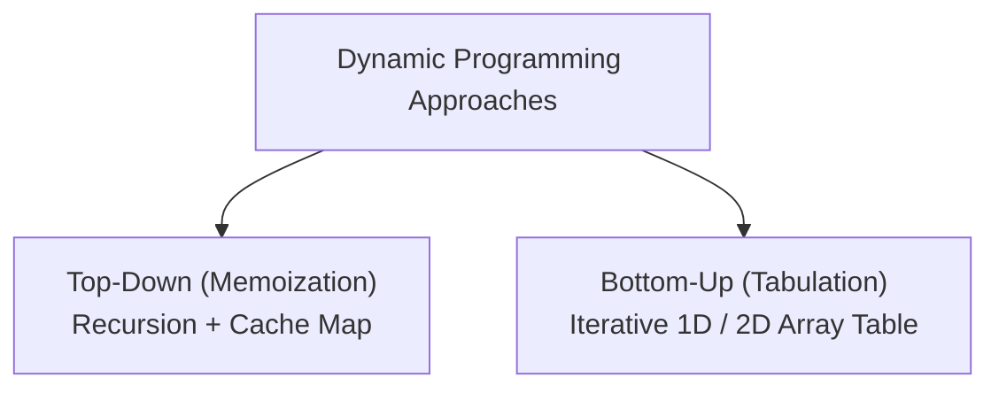

# File 21: Dynamic Programming (DP)

## Overview
**Dynamic Programming (DP)** optimizes complex problems by breaking them down into **overlapping subproblems** exhibiting **optimal substructure**. DP stores subproblem solutions using **Top-Down Memoization** or **Bottom-Up Tabulation**.

---

## 1. Top-Down vs Bottom-Up DP Paradigms



---

## 2. 0/1 Knapsack & Coin Change Implementation

```javascript
// 1. Coin Change Problem (Bottom-Up Tabulation - LeetCode #322)
function coinChange(coins, amount) {
    // dp[i] represents minimum coins needed to make amount i
    const dp = new Array(amount + 1).fill(Infinity);
    dp[0] = 0; // Base case: 0 amount requires 0 coins

    for (let i = 1; i <= amount; i++) {
        for (const coin of coins) {
            if (i - coin >= 0) {
                dp[i] = Math.min(dp[i], dp[i - coin] + 1);
            }
        }
    }

    return dp[amount] === Infinity ? -1 : dp[amount];
}

console.log(coinChange([1, 2, 5], 11)); // 3 (5 + 5 + 1)

// 2. Longest Common Subsequence (LCS - 2D Tabulation)
function longestCommonSubsequence(text1, text2) {
    const m = text1.length;
    const n = text2.length;
    const dp = Array.from({ length: m + 1 }, () => new Array(n + 1).fill(0));

    for (let i = 1; i <= m; i++) {
        for (let j = 1; j <= n; j++) {
            if (text1[i - 1] === text2[j - 1]) {
                dp[i][j] = dp[i - 1][j - 1] + 1;
            } else {
                dp[i][j] = Math.max(dp[i - 1][j], dp[i][j - 1]);
            }
        }
    }

    return dp[m][n];
}

console.log(longestCommonSubsequence("abcde", "ace")); // 3 ("ace")
```

---

## Key Takeaways
1. **Memoization (Top-Down)**: Solves recursively and stores calculated subproblem results in a hash map.
2. **Tabulation (Bottom-Up)**: Solves iteratively from smallest base subproblems using array tables.
3. Converts exponential $O(2^n)$ brute force routines into polynomial $O(n \cdot m)$ time solutions.
