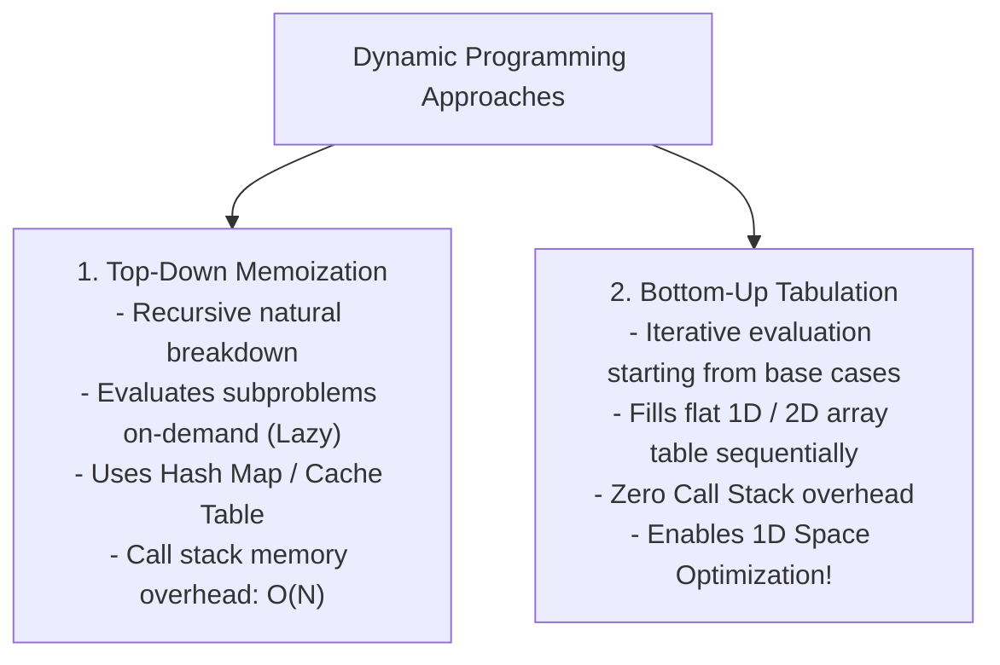

# Module 21: Dynamic Programming (DP) — Subproblem Memoization, Tabulation, and Space Optimization

## Overview

**Dynamic Programming (DP)** is an algorithmic optimization technique that converts exponential $\mathcal{O}(2^N)$ brute-force solutions into polynomial **$\mathcal{O}(N)$ or $\mathcal{O}(N \cdot M)$ time solutions**.

DP applies strictly when a problem satisfies two core mathematical properties:
1. **Overlapping Subproblems**: The recursive search tree evaluates identical subproblems repeatedly.
2. **Optimal Substructure**: The optimal solution to a larger problem can be constructed directly from optimal solutions of its smaller subproblems.

---

## 1. Memoization (Top-Down) vs. Tabulation (Bottom-Up)



### Top-Down vs. Bottom-Up Trade-off Matrix

| Feature | Top-Down Memoization (Recursion + Cache) | Bottom-Up Tabulation (Iterative Table) |
| :--- | :--- | :--- |
| **Execution Flow** | Root $\to$ Base Cases (Unwinding) | Base Cases $\to$ Target State (Winding) |
| **Subproblem Evaluation** | Only computes required subproblems (Lazy) | Computes all table entries systematically |
| **Call Stack Memory** | $\mathcal{O}(N)$ recursion call stack overhead | **Zero** call stack overhead |
| **Space Optimization** | Difficult to optimize space | **Easy** (Compress 2D table to 1D rolling array) |

---

## 2. 2D State Matrix Transition Architecture (LCS Example)

```mermaid
grid
    subgraph 2D DP Table Cell Dependencies
        LeftCell["dp[i][j-1] (Insert)"] --> TargetCell["Target: dp[i][j]"]
        TopCell["dp[i-1][j] (Delete)"] --> TargetCell
        DiagCell["dp[i-1][j-1] (Match + 1)"] --> TargetCell
    end
```

---

## 3. Dynamic Programming Complexity & Pattern Matrix

| DP Pattern Class | Subproblem State Formulation | Time Complexity | Auxiliary Space (Uncompressed) | Space (Compressed) |
| :--- | :--- | :--- | :--- | :--- |
| **1D Linear DP** (Coin Change) | $\text{dp}[i] = \min_{c}(\text{dp}[i - c] + 1)$ | $\mathcal{O}(\text{Amount} \cdot N)$ | $\mathcal{O}(\text{Amount})$ | $\mathcal{O}(\text{Amount})$ |
| **2D Grid DP** (Unique Paths) | $\text{dp}[i][j] = \text{dp}[i-1][j] + \text{dp}[i][j-1]$ | $\mathcal{O}(M \cdot N)$ | $\mathcal{O}(M \cdot N)$ | **$\mathcal{O}(N)$** |
| **2D Sequence DP** (LCS) | $\text{dp}[i][j] = \text{dp}[i-1][j-1] + 1$ | $\mathcal{O}(M \cdot N)$ | $\mathcal{O}(M \cdot N)$ | **$\mathcal{O}(N)$** |
| **0/1 Knapsack** | $\text{dp}[i][w] = \max(\text{dp}[i-1][w], v + \text{dp}[i-1][w-wt])$ | $\mathcal{O}(N \cdot W)$ | $\mathcal{O}(N \cdot W)$ | **$\mathcal{O}(W)$** |

---

## 4. Production Code Implementations

```javascript
// 1. Coin Change Problem (1D Bottom-Up DP) - O(Amount * N) Time, O(Amount) Space
function coinChange(coins, amount) {
  // dp[i] represents minimum coins needed to make amount i
  const dp = new Float64Array(amount + 1).fill(Infinity);
  dp[0] = 0; // Base case: 0 amount requires 0 coins

  for (let i = 1; i <= amount; i++) {
    for (let c = 0; c < coins.length; c++) {
      const coin = coins[c];
      if (i - coin >= 0) {
        dp[i] = Math.min(dp[i], dp[i - coin] + 1);
      }
    }
  }

  return dp[amount] === Infinity ? -1 : dp[amount];
}

// 2. Longest Common Subsequence (2D Tabulation) - O(M * N) Time, O(M * N) Space
function longestCommonSubsequence(text1, text2) {
  const m = text1.length;
  const n = text2.length;
  const dp = Array.from({ length: m + 1 }, () => new Int32Array(n + 1));

  for (let i = 1; i <= m; i++) {
    for (let j = 1; j <= n; j++) {
      if (text1[i - 1] === text2[j - 1]) {
        dp[i][j] = dp[i - 1][j - 1] + 1; // Characters match!
      } else {
        dp[i][j] = Math.max(dp[i - 1][j], dp[i][j - 1]); // Skip char from text1 or text2
      }
    }
  }

  return dp[m][n];
}

// 3. Space-Optimized Longest Common Subsequence - O(M * N) Time, O(N) Space!
function longestCommonSubsequenceSpaceOptimized(text1, text2) {
  const n = text2.length;
  let prevRow = new Int32Array(n + 1);
  let currRow = new Int32Array(n + 1);

  for (let i = 1; i <= text1.length; i++) {
    for (let j = 1; j <= n; j++) {
      if (text1[i - 1] === text2[j - 1]) {
        currRow[j] = prevRow[j - 1] + 1;
      } else {
        currRow[j] = Math.max(prevRow[j], currRow[j - 1]);
      }
    }
    // Swap row buffers for next iteration (Zero memory allocation in loop!)
    [prevRow, currRow] = [currRow, prevRow];
  }

  return prevRow[n];
}

console.log("Coin Change (11)      :", coinChange([1, 2, 5], 11)); // 3 (5 + 5 + 1)
console.log("LCS ('abcde', 'ace')  :", longestCommonSubsequence("abcde", "ace")); // 3 ("ace")
console.log("LCS Space-Optimized   :", longestCommonSubsequenceSpaceOptimized("abcde", "ace")); // 3
```

---

## Key Production Takeaways

1. **Identify the State Parameters First**: Define `dp[i]` or `dp[i][j]` clearly before writing code. State parameters represent the minimum variable set needed to define a subproblem.
2. **Compress 2D Tables to 1D Arrays**: If state transition `dp[i][j]` depends only on the current row `i` and previous row `i - 1`, replace the 2D array with two 1D arrays (`prevRow` and `currRow`) to reduce memory from $\mathcal{O}(M \cdot N)$ to $\mathcal{O}(N)$.
3. **Use TypedArrays for Maximum V8 JIT Optimization**: Replace JS nested generic arrays `[]` with `Int32Array` or `Float64Array` for fast flat memory access without GC overhead.
4. **Prefer Bottom-Up Iteration for Critical Path APIs**: Bottom-up tabulation eliminates recursion stack frame overhead and prevents `RangeError: Maximum call stack size exceeded` on large inputs.

