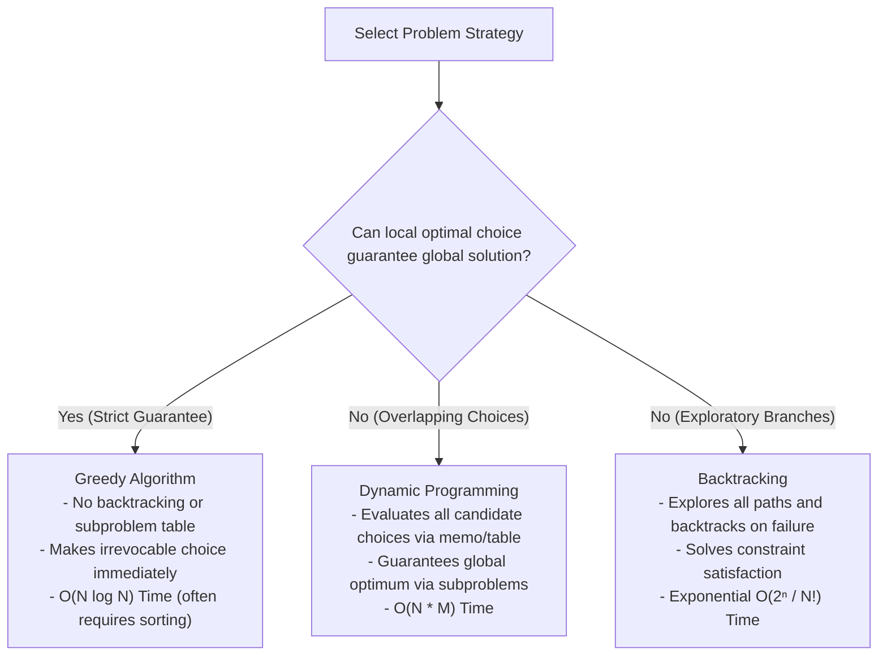
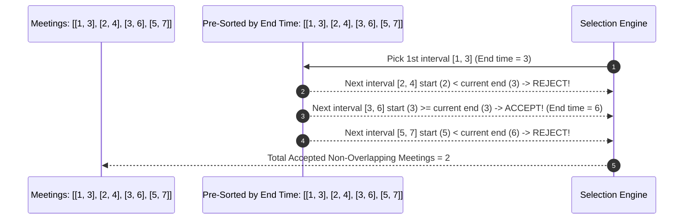

# Module 22: Greedy Algorithms — Local Optimality, Interval Scheduling, and Greedy Choice Invariants

## Overview

A **Greedy Algorithm** constructs a global optimal solution step-by-step by making the **locally optimal choice** at each decision point without ever looking back or backtracking.

Greedy algorithms are exceptionally fast—running in **$\mathcal{O}(N \log N)$ or $\mathcal{O}(N)$ time**—but apply strictly when a problem satisfies the **Greedy Choice Property** (a local optimal decision is mathematically guaranteed to lead to a global optimal solution).

---

## 1. Paradigm Comparison: Greedy vs. Dynamic Programming vs. Backtracking



### Paradigm Feature Matrix

| Characteristic | Greedy Algorithms | Dynamic Programming (DP) | Backtracking |
| :--- | :--- | :--- | :--- |
| **Decision Scope** | Local immediate choice | All overlapping subproblems | All valid candidate permutations |
| **Backtracking?** | **No** (Irrevocable choices) | **No** (Table lookup) | **Yes** (Undos state) |
| **Time Complexity** | **$\mathcal{O}(N \log N)$ or $\mathcal{O}(N)$** | $\mathcal{O}(N^2)$ or $\mathcal{O}(N \cdot W)$ | $\mathcal{O}(2^N)$ or $\mathcal{O}(N!)$ |
| **Correctness Requirement**| Greedy Choice Proof | Optimal Substructure | Complete Tree Search |

---

## 2. Interval Scheduling Strategy (Sorting by End Time)

In **Interval Scheduling**, selecting intervals by **End Time Ascending** leaves maximum remaining time for subsequent non-overlapping tasks ("Greedy Choice Stays Ahead" proof):



---

## 3. Production Code Implementations

```javascript
// 1. Interval Scheduling / Activity Selection - O(N log N) Time, O(1) Space
function maxNonOverlappingIntervals(intervals) {
  if (intervals.length === 0) return 0;

  // GREEDY CHOICE KEY: Sort by END TIME ascending!
  intervals.sort((a, b) => a[1] - b[1]);

  let count = 1;
  let lastEndTime = intervals[0][1];

  for (let i = 1; i < intervals.length; i++) {
    const [start, end] = intervals[i];
    // If current interval starts at or after last selected end time, select it!
    if (start >= lastEndTime) {
      count++;
      lastEndTime = end;
    }
  }

  return count;
}

// 2. Jump Game I (LeetCode #55) - O(N) Time, O(1) Space
function canJump(nums) {
  let maxReachableIndex = 0;

  for (let i = 0; i < nums.length; i++) {
    // If current index is beyond maximum reachable index, failure!
    if (i > maxReachableIndex) return false;

    // Greedy Choice: Extend maximum reachable boundary as far right as possible
    maxReachableIndex = Math.max(maxReachableIndex, i + nums[i]);

    // Early Exit: Goal reached!
    if (maxReachableIndex >= nums.length - 1) return true;
  }

  return true;
}

// 3. Fractional Knapsack Problem - O(N log N) Time, O(1) Space
function fractionalKnapsack(items, capacity) {
  // items = [{ weight, value }]
  // Sort items by Value-to-Weight Ratio descending!
  items.sort((a, b) => b.value / b.weight - a.value / a.weight);

  let totalValue = 0;
  let remainingCapacity = capacity;

  for (const item of items) {
    if (remainingCapacity === 0) break;

    if (item.weight <= remainingCapacity) {
      // Take entire item
      totalValue += item.value;
      remainingCapacity -= item.weight;
    } else {
      // Take fraction of item
      const fraction = remainingCapacity / item.weight;
      totalValue += item.value * fraction;
      remainingCapacity = 0; // Knapsack full!
    }
  }

  return totalValue;
}

console.log("Max Non-Overlapping Meetings:", maxNonOverlappingIntervals([[1, 3], [2, 4], [3, 6], [5, 7]])); // 2
console.log("Can Jump [2,3,1,1,4]         :", canJump([2, 3, 1, 1, 4])); // true
console.log("Can Jump [3,2,1,0,4]         :", canJump([3, 2, 1, 0, 4])); // false
```

---

## Key Production Takeaways

1. **Sort First to Enable Greedy Invariants**: Most greedy problems require pre-sorting inputs by specific properties (e.g. End Time for Interval Scheduling, Value/Weight ratio for Fractional Knapsack).
2. **Beware of 0/1 Knapsack Trap**: Greedy choice by value ratio fails on 0/1 Knapsack (where items cannot be split). Use Dynamic Programming for 0/1 Knapsack.
3. **Use Greedy for Single-Pass Tracking**: Problems like "Jump Game" or "Gas Station" can be tracked in $\mathcal{O}(N)$ linear time by maintaining running extreme boundaries (`maxReachableIndex`).
4. **Greedy Algorithms Deliver Maximum Efficiency**: When mathematically proven valid, greedy algorithms outperform DP and Backtracking by eliminating table allocation and call stack overhead.

