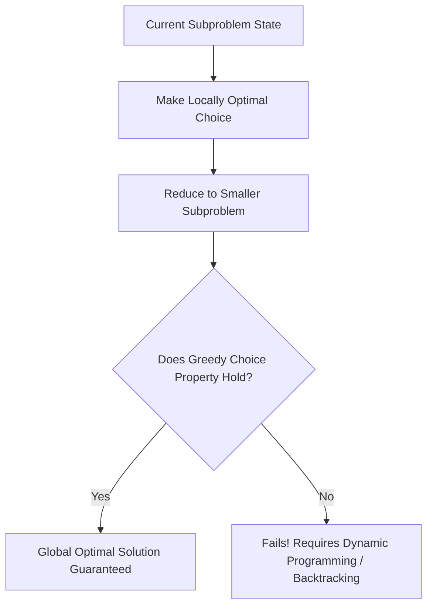

# Module 22: Greedy Algorithms, Activity Selection, & Optimal Choice Properties

## Theoretical Overview & The Greedy Invariant

A **Greedy Algorithm** builds a solution step-by-step by making the **locally optimal choice** at each stage, hoping to arrive at a globally optimal solution.



### Core Requirements for Greedy Correctness
1. **Greedy Choice Property**: A globally optimal solution can be reached by making locally optimal (greedy) choices without ever backtracking or re-evaluating previous decisions.
2. **Optimal Substructure**: An optimal solution to the overall problem contains optimal solutions to its subproblems.

---

## 1. Greedy vs Dynamic Programming Comparison

| Metric | Greedy Algorithms | Dynamic Programming (DP) |
| :--- | :--- | :--- |
| **Decision Choice** | Makes the best local choice at each step immediately. | Evaluates all possible subproblem choices and stores results. |
| **Time Complexity** | Fast (**$\mathcal{O}(n)$ or $\mathcal{O}(n \log n)$**). | Slower (**$\mathcal{O}(n^2)$ or $\mathcal{O}(n \cdot W)$**). |
| **Backtracking** | **Never backtracks** or changes past decisions. | Explores overlapping sub-cases. |
| **Subproblem Dependability**| Subproblems do not need to be solved beforehand. | Subproblems must be solved bottom-up / memoized. |

---

## 2. Core Code Implementations & Walkthroughs

### 1. Activity / Interval Selection (`activitySelection`)
Select the maximum number of non-overlapping activities on a single platform/resource.
- **Greedy Rule**: Sort activities by **end time** ascending, then iteratively select the next activity whose start time is $\ge$ the last selected end time.
- **Complexity**: Time $\mathcal{O}(n \log n)$, Space $\mathcal{O}(n)$.

```javascript
function activitySelection(activities) {
  const sorted = [...activities].sort((a, b) => a.end - b.end);
  const selected = [sorted[0]];
  let lastEnd = sorted[0].end;

  for (let i = 1; i < sorted.length; i++) {
    if (sorted[i].start >= lastEnd) {
      selected.push(sorted[i]);
      lastEnd = sorted[i].end;
    }
  }
  return selected;
}
```

### 2. Fractional Knapsack (`fractionalKnapsack`)
Items can be broken into smaller fractional pieces.
- **Greedy Rule**: Sort items by **Value-to-Weight Ratio** $\frac{\text{value}}{\text{weight}}$ descending. Take as much of the highest-ratio item as possible before moving to the next.
- **Complexity**: Time $\mathcal{O}(n \log n)$, Space $\mathcal{O}(n)$.

```javascript
function fractionalKnapsack(items, capacity) {
  const sorted = [...items]
    .map(item => ({ ...item, ratio: item.value / item.weight }))
    .sort((a, b) => b.ratio - a.ratio);

  let totalValue = 0, remaining = capacity;
  const taken = [];

  for (const item of sorted) {
    if (remaining <= 0) break;
    if (item.weight <= remaining) {
      taken.push({ name: item.name, fraction: 1, value: item.value });
      totalValue += item.value;
      remaining -= item.weight;
    } else {
      const fraction = remaining / item.weight;
      taken.push({ name: item.name, fraction: +fraction.toFixed(2), value: +(item.value * fraction).toFixed(2) });
      totalValue += item.value * fraction;
      remaining = 0;
    }
  }
  return { totalValue: +totalValue.toFixed(2), taken };
}
```

### 3. Coin Change: Greedy vs Dynamic Programming
- **Standard Currency (e.g., INR `[1, 2, 5, 10, 20, 50, 100, 500]`)**: Greedy works correctly because every denomination is a multiple or valid subset combination of smaller denominations.
- **Arbitrary Currency (e.g., `[1, 3, 4]` for amount `6`)**:
  - Greedy picks `4 + 1 + 1` (3 coins) $\implies$ **Suboptimal Failure**.
  - Dynamic Programming picks `3 + 3` (2 coins) $\implies$ **Optimal Solution**.

```javascript
function greedyCoinChange(coins, amount) {
  const sorted = [...coins].sort((a, b) => b - a);
  const result = [];
  let remaining = amount;
  for (const coin of sorted) {
    while (remaining >= coin) { result.push(coin); remaining -= coin; }
  }
  return remaining === 0 ? result : null;
}
```

---

## 3. Advanced Greedy Problem Patterns

### 1. Jump Game (`canJump` & `minJumps`)
Determine if you can reach the last index and compute minimum jumps required.
- **Greedy Strategy**: Maintain a `farthest` reachable index boundary. If loop index $i > \text{farthest}$, return `false`.

```javascript
function canJump(nums) {
  let farthest = 0;
  for (let i = 0; i < nums.length; i++) {
    if (i > farthest) return false;
    farthest = Math.max(farthest, i + nums[i]);
    if (farthest >= nums.length - 1) return true;
  }
  return true;
}

function minJumps(nums) {
  if (nums.length <= 1) return 0;
  let jumps = 0, currentEnd = 0, farthest = 0;
  for (let i = 0; i < nums.length - 1; i++) {
    farthest = Math.max(farthest, i + nums[i]);
    if (i === currentEnd) {
      jumps++;
      currentEnd = farthest;
      if (currentEnd >= nums.length - 1) break;
    }
  }
  return jumps;
}
```

### 2. Huffman Coding Compression (`huffmanEncode`)
Assign variable-length prefix bitcodes to characters based on frequency (frequent characters receive shorter bit sequences).
- **Greedy Rule**: Repeatedly extract the two lowest-frequency nodes from a Priority Queue, merge them into a new parent node with combined frequency, and re-insert into the queue.

```javascript
class HuffmanNode {
  constructor(char, freq) {
    this.char = char; this.freq = freq;
    this.left = null; this.right = null;
  }
}
```

### 3. Merge Overlapping Intervals (`mergeIntervals`)
Sort intervals by start time. Extend `last[1] = Math.max(last[1], sorted[i][1])` if `sorted[i][0] <= last[1]`.
- **Complexity**: Time $\mathcal{O}(n \log n)$, Space $\mathcal{O}(n)$.

```javascript
function mergeIntervals(intervals) {
  if (intervals.length <= 1) return intervals;
  const sorted = [...intervals].sort((a, b) => a[0] - b[0]);
  const merged = [sorted[0]];

  for (let i = 1; i < sorted.length; i++) {
    const last = merged[merged.length - 1];
    if (sorted[i][0] <= last[1]) last[1] = Math.max(last[1], sorted[i][1]);
    else merged.push(sorted[i]);
  }
  return merged;
}
```

### 4. Gas Station Circular Circuit (`canCompleteCircuit`)
Find the starting gas station index that allows traveling around a circular route.
- **Complexity**: Time $\mathcal{O}(n)$, Space $\mathcal{O}(1)$.

```javascript
function canCompleteCircuit(gas, cost) {
  let totalSurplus = 0, currentSurplus = 0, start = 0;
  for (let i = 0; i < gas.length; i++) {
    const net = gas[i] - cost[i];
    totalSurplus += net;
    currentSurplus += net;
    if (currentSurplus < 0) { start = i + 1; currentSurplus = 0; }
  }
  return totalSurplus >= 0 ? start : -1;
}
```

---

## Key Takeaways

1. **Greedy Choice Property**: Makes locally optimal choices without backtracking.
2. **Activity Selection**: Always sort intervals by **end time** ascending.
3. **Fractional vs 0/1 Knapsack**: Use Greedy ($\frac{\text{value}}{\text{weight}}$ ratio) for fractional knapsack; use Dynamic Programming for 0/1 knapsack.
4. **Denomination Proof**: Verify if currency system breaks greedy optimal choices before choosing Greedy over DP.
