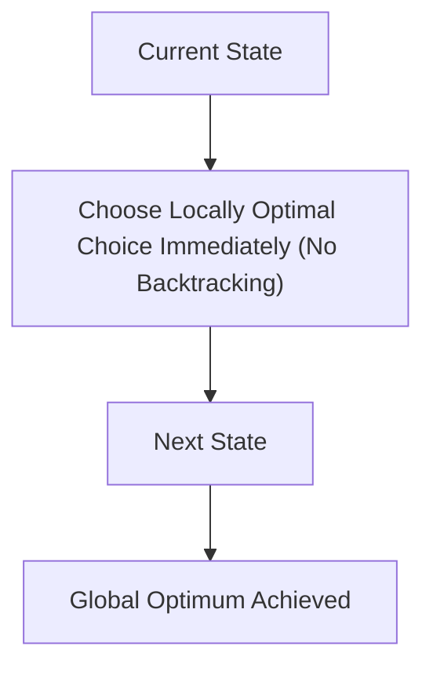

# File 22: Greedy Algorithms

## Overview
A **Greedy Algorithm** builds a solution step-by-step, making the **locally optimal choice** at each stage with the hope of finding a global optimum. Greedy approaches are fast ($O(n \log n)$ or $O(n)$) when local choices guarantee global correctness.

---

## 1. Greedy Choice Paradigm



---

## 2. Fractional Knapsack & Interval Scheduling Implementation

```javascript
// 1. Interval Scheduling / Activity Selection Problem
function maxNonOverlappingIntervals(intervals) {
    if (intervals.length === 0) return 0;

    // Greedy Choice: Sort by END TIME ascending!
    intervals.sort((a, b) => a[1] - b[1]);

    let count = 1;
    let lastEndTime = intervals[0][1];

    for (let i = 1; i < intervals.length; i++) {
        if (intervals[i][0] >= lastEndTime) {
            count++;
            lastEndTime = intervals[i][1];
        }
    }

    return count;
}

const meetings = [[1, 3], [2, 4], [3, 6], [5, 7], [8, 9]];
console.log("Max non-overlapping meetings:", maxNonOverlappingIntervals(meetings)); // 4

// 2. Jump Game (LeetCode #55)
function canJump(nums) {
    let maxReachable = 0;
    for (let i = 0; i < nums.length; i++) {
        if (i > maxReachable) return false; // Cannot reach index i
        maxReachable = Math.max(maxReachable, i + nums[i]);
    }
    return true;
}

console.log(canJump([2, 3, 1, 1, 4])); // true
console.log(canJump([3, 2, 1, 0, 4])); // false
```

---

## Key Takeaways
1. Greedy algorithms make the **locally optimal choice** without backtracking.
2. Often requires **sorting inputs first** ($O(n \log n)$ time).
3. Used in **Dijkstra's Algorithm**, **Huffman Coding**, **Interval Scheduling**, and **Kruskal's MST**.
