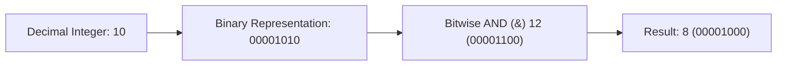

# Module 23: Bit Manipulation, Bitwise Operators, & Bitmasking Patterns

## Theoretical Overview & Binary Representations

**Bit Manipulation** operates directly on the binary representations (bits `0` and `1`) of integers using single-cycle CPU instructions, providing extreme execution speed (**$\mathcal{O}(1)$**) and minimal memory footprint.



### Real-World Engineering Case Study: Zerodha Account Flags
Zerodha stores 8 distinct boolean flags (`is_active`, `has_margin`, `is_verified`, `is_nri`, etc.) for 10,000,000 user accounts.
- **Separate Booleans**: 8 booleans $\times$ 1 byte $\times 10^7$ users = **80 MB** memory.
- **Single Byte Bit Flags**: 1 byte bitmask $\times 10^7$ users = **10 MB** memory (saving 70 MB of RAM).

---

## 1. Bitwise Operators Reference Matrix

In JavaScript, numbers are stored as 64-bit floats but bitwise operations implicitly convert operands to **32-bit signed integers**.

| Operator | Syntax | Description | Example ($a=10 \text{ [1010]}, b=12 \text{ [1100]}$) | Result |
| :--- | :--- | :--- | :--- | :--- |
| **Bitwise AND** | `a & b` | Sets bit to `1` only if both bits are `1`. | `1010 & 1100` | `1000` ($8$) |
| **Bitwise OR** | `a \| b` | Sets bit to `1` if at least one bit is `1`. | `1010 \| 1100` | `1110` ($14$) |
| **Bitwise XOR** | `a ^ b` | Sets bit to `1` if bits differ. | `1010 ^ 1100` | `0110` ($6$) |
| **Bitwise NOT** | `~a` | Inverts all bits (Two's complement: $\sim n = -(n+1)$). | `~10` | $-11$ |
| **Left Shift** | `a << k` | Shifts bits left by $k$ positions (Multiplies by $2^k$). | `10 << 2` | $40$ |
| **Sign-Right Shift**| `a >> k` | Shifts bits right by $k$ positions (Preserves sign bit).| `10 >> 1` | $5$ |
| **Zero-Fill Shift** | `a >>> k`| Shifts bits right by $k$ positions (Zero-fills high bits).| `-10 >>> 1` | $2147483643$ |

---

## 2. Essential Bit Manipulation Tricks

| Trick Goal | Bitwise Expression | Explanation |
| :--- | :--- | :--- |
| **Check Odd / Even** | `(n & 1) === 1` | Least significant bit is `1` for odd numbers, `0` for even. |
| **Power of 2 Check** | `n > 0 && (n & (n - 1)) === 0` | Powers of 2 contain a single set bit; $n-1$ flips all bits below it. |
| **Set Bit at Index $p$**| `n \| (1 << p)` | Bitwise OR with a single bit mask at position $p$. |
| **Clear Bit at Index $p$**| `n & ~(1 << p)` | Bitwise AND with an inverted single bit mask. |
| **Toggle Bit at Index $p$**| `n ^ (1 << p)` | Bitwise XOR flips the target bit at position $p$. |
| **Check Bit at Index $p$**| `(n >> p) & 1` | Shift target bit to index 0 and inspect LSB. |
| **In-Place XOR Swap** | `a ^= b; b ^= a; a ^= b;` | Swaps variables without extra memory ($a \oplus a = 0$). |

---

## 3. Core Bit Manipulation Algorithms

### 1. Single Number via XOR Identity (`singleNumber`)
Find the non-duplicate number in an array where every other element appears twice.
- **XOR Axioms**: $a \oplus a = 0$ and $a \oplus 0 = a$.
- **Complexity**: Time $\mathcal{O}(n)$, Space $\mathcal{O}(1)$.

```javascript
function singleNumber(nums) {
  let result = 0;
  for (const num of nums) result ^= num;
  return result;
}
```

### 2. Count Set Bits via Brian Kernighan's Algorithm (`countBitsKernighan`)
Count total set bits (`1`s) in an integer.
- **Mechanics**: `n & (n - 1)` clears the lowest set bit in $\mathcal{O}(1)$ time. The loop runs exactly $k$ times (where $k$ is the number of set bits).

```javascript
function countBitsKernighan(n) {
  let count = 0;
  while (n) {
    n &= (n - 1);
    count++;
  }
  return count;
}
```

### 3. Bitwise Range Count DP (`countBitsRange`)
Count set bits for all numbers from $0$ to $n$ in **$\mathcal{O}(n)$ time**.
- **Recurrence**: $DP[i] = DP[i \gg 1] + (i \text{ \& } 1)$.

```javascript
function countBitsRange(n) {
  const dp = new Array(n + 1).fill(0);
  for (let i = 1; i <= n; i++) dp[i] = dp[i >> 1] + (i & 1);
  return dp;
}
```

### 4. Bit-Flag Permission System (`PermissionManager`)
Manage system permission flags (Read, Write, Execute, Admin) using bitmasks.

```javascript
const PERMISSIONS = { READ: 1, WRITE: 2, EXECUTE: 4, DELETE: 8, ADMIN: 16 };

class PermissionManager {
  constructor() { this.userPerms = {}; }
  grant(userId, perm) { this.userPerms[userId] = (this.userPerms[userId] || 0) | perm; }
  revoke(userId, perm) { if (this.userPerms[userId] !== undefined) this.userPerms[userId] &= ~perm; }
  has(userId, perm) { return (this.userPerms[userId] & perm) === perm; }
  toggle(userId, perm) { this.userPerms[userId] = (this.userPerms[userId] || 0) ^ perm; }
}
```

### 5. Generate All Subsets via Bitmask (`subsets`)
Iterate from mask $0$ to $2^n - 1$. Each bit in the mask represents whether element $i$ is included in the subset.
- **Complexity**: Time $\mathcal{O}(2^n \cdot n)$, Space $\mathcal{O}(2^n)$.

```javascript
function subsets(items) {
  const n = items.length, total = 1 << n, result = [];
  for (let mask = 0; mask < total; mask++) {
    const subset = [];
    for (let bit = 0; bit < n; bit++) {
      if (mask & (1 << bit)) subset.push(items[bit]);
    }
    result.push(subset);
  }
  return result;
}
```

---

## Key Takeaways

1. **Single-Cycle Operations**: Bitwise operations execute directly in hardware instruction cycles.
2. **Kernighan's Property**: `n & (n - 1)` clears the lowest set bit in $\mathcal{O}(1)$ time.
3. **XOR Self-Cancellation**: $a \oplus a = 0$ isolates unique values without Hash Map memory overhead.
4. **JS 32-Bit Limit**: JavaScript truncates numbers to 32-bit signed integers during bitwise operations; use `BigInt` for bitmasks larger than 32 bits.
