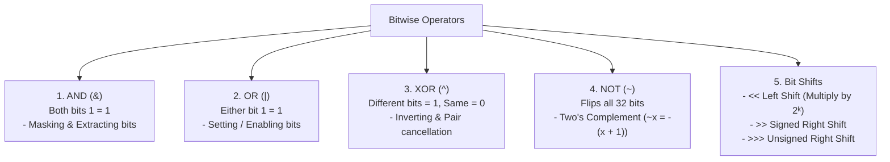
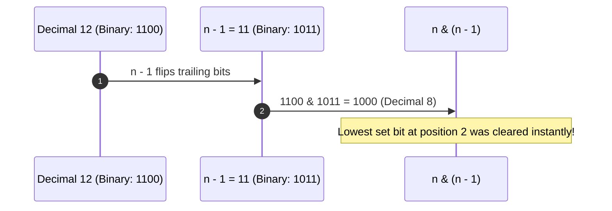

# Module 23: Bit Manipulation Algorithms — Binary Hacks, Bitmasks, and CPU Register Optimization

## Overview

**Bit Manipulation** operates directly on the binary bit level (0s and 1s) of integers using native bitwise hardware instructions (`&`, `|`, `^`, `~`, `<<`, `>>`, `>>>`).

In JavaScript, while numbers are stored as 64-bit IEEE 754 floats, applying bitwise operators implicitly converts operands into **32-bit signed integers**. Bitwise tricks execute directly inside CPU registers, offering **$\mathcal{O}(1)$ space** and unmatched runtime performance.

---

## 1. Bitwise Operators & Hardware Rules



---

## 2. Brian Kernighan's Bit Clearing Algorithm (`n & (n - 1)`)

Subtracting 1 from a binary number flips all trailing zeros up to and including the rightmost set bit (`1`). Performing a bitwise AND between `n` and `n - 1` **clears the lowest set bit** in a single CPU instruction!



---

## 3. Essential Bitwise Hacks & Formulas

| Bitwise Trick / Expression | Result / Purpose | Example |
| :--- | :--- | :--- |
| **`n & (n - 1)`** | Clears the rightmost set bit | `12 (1100) & 11 (1011) = 8 (1000)` |
| **`n & -n`** | Extracts the rightmost set bit | `12 (1100) & -12 (0100) = 4 (0100)` |
| **`(n & (n - 1)) === 0`** | Checks if `n` is a Power of Two | `16 (10000) & 15 (01111) === 0` (True) |
| **`x ^ x = 0`** | Cancels out duplicate numbers | `5 ^ 5 = 0`, `5 ^ 0 = 5` |
| **`x ^ y`** (Swap) | Swaps `x` and `y` without temp variable | `x = x^y; y = x^y; x = x^y` |
| **`1 << k`** | Creates bitmask with 1 at $k$-th position| `1 << 3 = 8 (1000)` |

---

## 4. Production Bit Manipulation Implementations

```javascript
// 1. Single Number (Find element appearing once where all others appear twice) - O(N) Time, O(1) Space
function singleNumber(nums) {
  let result = 0;
  for (let i = 0; i < nums.length; i++) {
    result ^= nums[i]; // XOR cancels out all identical pairs!
  }
  return result;
}

// 2. Power of Two Verification - O(1) Time, O(1) Space
function isPowerOfTwo(n) {
  return n > 0 && (n & (n - 1)) === 0;
}

// 3. Count Set Bits (Hamming Weight - Brian Kernighan's O(SetBits) Algorithm)
function countSetBits(n) {
  let count = 0;
  let num = n >>> 0; // Convert to unsigned 32-bit integer

  while (num > 0) {
    num = num & (num - 1); // Clears rightmost set bit in 1 instruction
    count++;
  }

  return count;
}

// 4. Bitmask Subsets Generator (Power Set via Bitmasking) - O(N * 2^N) Time
function generateSubsetsBitmask(arr) {
  const n = arr.length;
  const totalSubsets = 1 << n; // 2^N total combinations
  const results = [];

  for (let mask = 0; mask < totalSubsets; mask++) {
    const subset = [];
    for (let i = 0; i < n; i++) {
      // Check if i-th bit is set in mask
      if ((mask & (1 << i)) !== 0) {
        subset.push(arr[i]);
      }
    }
    results.push(subset);
  }

  return results;
}

console.log("Single Number ([4,1,2,1,2]) :", singleNumber([4, 1, 2, 1, 2])); // 4
console.log("Is Power of Two (16)       :", isPowerOfTwo(16)); // true
console.log("Count Set Bits (11 = 1011)  :", countSetBits(11)); // 3
console.log("Bitmask Subsets (['a','b']) :", generateSubsetsBitmask(["a", "b"]));
// Output: [[], ["a"], ["b"], ["a", "b"]]
```

---

## Key Production Takeaways

1. **Leverage `x ^ x = 0` for $\mathcal{O}(1)$ Space Pair Cancellation**: Use XOR cancellation to solve duplicate number identification without allocating Hash Sets.
2. **Use `n & (n - 1)` for Fast Bit Counting**: Brian Kernighan's trick loops only as many times as there are `1` bits, making it faster than checking all 32 bits.
3. **Use Unsigned Right Shift (`>>>`) for 32-Bit Unsigned Conversion**: JavaScript bitwise operations produce 32-bit signed integers. Use `n >>> 0` to convert negative bit representations into positive unsigned values.
4. **Use Bitmasks for Fast Feature Flags & Subsets**: Store boolean permission sets (e.g. `READ = 1, WRITE = 2, EXECUTE = 4`) inside a single integer bitmask for ultra-fast bitwise permission checks (`userFlags & PERMISSION`).

