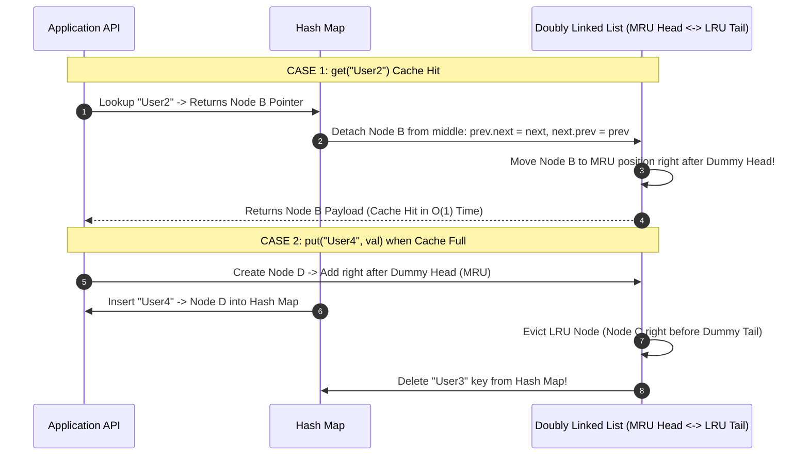

# Module 24: LRU (Least Recently Used) Cache — System Architecture, Sentinel Nodes, and $\mathcal{O}(1)$ Eviction

## Overview

An **LRU (Least Recently Used) Cache** is a fixed-capacity memory cache data structure that evicts the least recently accessed item when full.

Achieving **strict $\mathcal{O}(1)$ time complexity** for both `get(key)` and `put(key, value)` requires combining two complementary data structures:
1. **Hash Map (`Map`)**: Provides $\mathcal{O}(1)$ key-to-node pointer lookup.
2. **Doubly Linked List (`DLinkedList`)**: Provides $\mathcal{O}(1)$ node deletion and relocation to the Most Recently Used (MRU) head position without array re-indexing.

---

## 1. Combined Data Structure Architecture

```mermaid
graph TD
    subgraph Hash Map (O(1) Key-to-Node Memory Lookup)
        Map1["Key: 'User1'"] --> NodePtr1["Pointer -> Node A"]
        Map2["Key: 'User2'"] --> NodePtr2["Pointer -> Node B"]
        Map3["Key: 'User3'"] --> NodePtr3["Pointer -> Node C"]
    end

    subgraph Doubly Linked List (O(1) Recency Ordering)
        DummyHead["Dummy HEAD<br/>(Sentinel Node)"] <--> NodeA["Node A<br/>['User1': Data] (MRU)"]
        NodeA <--> NodeB["Node B<br/>['User2': Data]"]
        NodeB <--> NodeC["Node C<br/>['User3': Data] (LRU)"]
        NodeC <--> DummyTail["Dummy TAIL<br/>(Sentinel Node)"]
    end
```

---

## 2. LRU Node Operations & Recency State Transitions



---

## 3. Operations Complexity & Implementation Comparison

| Implementation Approach | `get(key)` Time | `put(key, val)` Time | Memory Overhead | Practical Suitability |
| :--- | :--- | :--- | :--- | :--- |
| **Array + Hash Map** | $\mathcal{O}(1)$ | **$\mathcal{O}(N)$** (Array shift) | Low | Not recommended due to $\mathcal{O}(N)$ eviction. |
| **Map + Doubly Linked List** | **$\mathcal{O}(1)$** | **$\mathcal{O}(1)$** | Medium (Pointer objects) | **Production Gold Standard** (C++, Java, JS). |
| **Native ES6 `Map` Trick** | **$\mathcal{O}(1)$** | **$\mathcal{O}(1)$** | Low | Compact JS-specific implementation. |

---

## 4. Production Code Implementations

### Implementation 1: Hash Map + Doubly Linked List (Sentinel Node Pattern)

```javascript
class DNode {
  constructor(key = 0, val = 0) {
    this.key = key;
    this.val = val;
    this.prev = null;
    this.next = null;
  }
}

class LRUCache {
  constructor(capacity) {
    this.capacity = capacity;
    this.map = new Map(); // Key -> DNode reference

    // Sentinel Dummy Head & Tail Nodes (Eliminates null checks!)
    this.head = new DNode();
    this.tail = new DNode();
    this.head.next = this.tail;
    this.tail.prev = this.head;
  }

  // Helper 1: Detach node from current position in O(1) time
  _remove(node) {
    node.prev.next = node.next;
    node.next.prev = node.prev;
  }

  // Helper 2: Insert node at MRU position (right after dummy head) in O(1) time
  _add(node) {
    node.next = this.head.next;
    node.next.prev = node;
    this.head.next = node;
    node.prev = this.head;
  }

  // O(1) Time Cache Read
  get(key) {
    if (!this.map.has(key)) return -1;

    const node = this.map.get(key);
    this._remove(node); // Detach from current position
    this._add(node);    // Move to MRU head
    return node.val;
  }

  // O(1) Time Cache Write & Eviction
  put(key, value) {
    if (this.map.has(key)) {
      this._remove(this.map.get(key)); // Remove existing node
    }

    const newNode = new DNode(key, value);
    this._add(newNode);
    this.map.set(key, newNode);

    // Evict Least Recently Used (LRU) node if capacity exceeded
    if (this.map.size > this.capacity) {
      const lruNode = this.tail.prev; // Node right before dummy tail
      this._remove(lruNode);
      this.map.delete(lruNode.key);   // Remove key from hash map
    }
  }
}
```

### Implementation 2: Native ES6 `Map` Shortcut (JS Engine Feature)

Because ES6 `Map` iterates keys in **insertion order**, we can achieve an LRU Cache by deleting and re-setting keys upon access:

```javascript
class CompactLRUCache {
  constructor(capacity) {
    this.capacity = capacity;
    this.map = new Map();
  }

  get(key) {
    if (!this.map.has(key)) return -1;

    const val = this.map.get(key);
    this.map.delete(key);
    this.map.set(key, val); // Re-inserting moves key to end (MRU)
    return val;
  }

  put(key, value) {
    if (this.map.has(key)) {
      this.map.delete(key);
    }

    this.map.set(key, value);

    if (this.map.size > this.capacity) {
      // First key in Map iterator is Least Recently Used (LRU)!
      const lruKey = this.map.keys().next().value;
      this.map.delete(lruKey);
    }
  }
}

// Verification
const cache = new LRUCache(2);
cache.put(1, 100);
cache.put(2, 200);
console.log("Get Key 1 :", cache.get(1)); // 100 (Key 1 becomes MRU)

cache.put(3, 300); // Evicts Key 2 (LRU)!
console.log("Get Key 2 :", cache.get(2)); // -1 (Evicted)
console.log("Get Key 3 :", cache.get(3)); // 300
```

---

## Key Production Takeaways

1. **Use Sentinel Dummy Head & Tail Nodes**: Dummy sentinel nodes eliminate edge-case checks for empty lists or single-element boundary updates in doubly linked lists.
2. **Always Store `key` Inside `DNode`**: Store both `key` and `val` inside the node payload so when evicting `lruNode = tail.prev`, you can retrieve `lruNode.key` to delete it from the Hash Map in $\mathcal{O}(1)$ time.
3. **Exploit ES6 `Map` Insertion Order in JavaScript**: In JS applications, standard ES6 `Map` maintains insertion order natively. Calling `map.delete(key); map.set(key, val);` achieves $\mathcal{O}(1)$ recency updates with zero custom node allocation.
4. **Essential Infrastructure Data Structure**: LRU caching underpins Redis cache eviction policies, database buffer pools, and browser HTTP cache stores.

