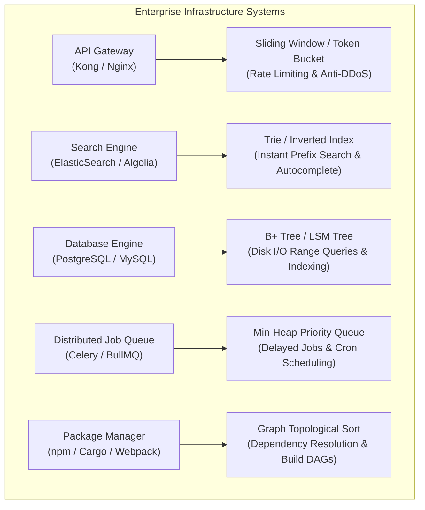
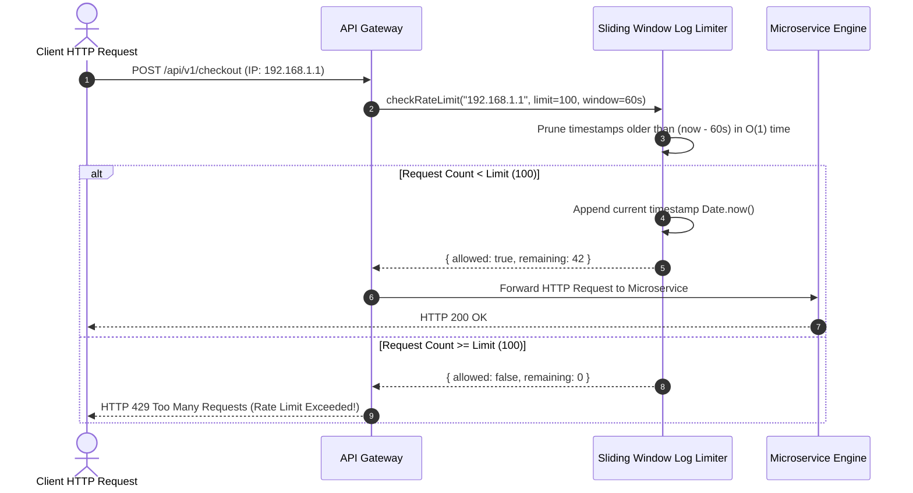

# Module 25: Real-World Systems Engineering — Production System Architecture & DSA Mapping

## Overview

Data Structures and Algorithms are not merely academic concepts; they constitute the **foundational infrastructure of production systems engineering**.

From database storage engines and distributed message brokers to browser layout engines and API gateways, selecting the correct data structure directly dictates system throughput, memory footprints, and fault tolerance.

---

## 1. Production System Architecture & DSA Mapping



---

## 2. API Gateway Sliding Window Rate Limiter Sequence



---

## 3. Comprehensive Production Infrastructure Mapping Matrix

| Production Infrastructure Subsystem | Primary Data Structure / Algorithm | Technical Rationale & Benefit |
| :--- | :--- | :--- |
| **API Gateway Rate Limiter** | Sliding Window Log / Token Bucket | Eliminates burst traffic spike DoS attacks in $\mathcal{O}(1)$ time. |
| **Search Engine Autocomplete** | Trie (Prefix Tree) / Inverted Index | Evaluates prefix query completions in $\mathcal{O}(K)$ time ($K = \text{query length}$). |
| **Database Indexing (SQL)** | B+ Tree | Minimizes physical disk block I/O reads for range queries ($\mathcal{O}(\log_B N)$). |
| **NoSQL Write Engine (RocksDB)**| LSM Tree (Log-Structured Merge) | Converts slow random disk writes into $\mathcal{O}(1)$ sequential log append writes. |
| **Delayed Job Scheduler** | Min-Heap Priority Queue | Retrieves nearest scheduled timer job root in $\mathcal{O}(1)$ time. |
| **Package Dependency Resolution**| Graph Topological Sort (Kahn's) | Computes build execution order and detects circular dependency errors in $\mathcal{O}(V + E)$. |
| **Garbage Collector (V8)** | Mark-and-Sweep Graph DFS | Traces reachable heap objects from root pointers to clean unreferenced memory. |
| **HTTP In-Memory Cache (Redis)** | Hash Map + Doubly Linked List (LRU)| Achieves $\mathcal{O}(1)$ cache lookups and $\mathcal{O}(1)$ least-recently-used entry eviction. |

---

## 4. Production Code Implementation: Sliding Window Rate Limiter

```javascript
class SlidingWindowRateLimiter {
  constructor(limit = 100, windowMs = 60000) {
    this.limit = limit;         // Max requests allowed per window
    this.windowMs = windowMs;   // Time window duration in milliseconds
    this.requests = new Map();  // Client Key (IP / User ID) -> Array of Timestamps
  }

  isAllowed(clientKey) {
    const now = Date.now();
    const windowStart = now - this.windowMs;

    if (!this.requests.has(clientKey)) {
      this.requests.set(clientKey, []);
    }

    const timestamps = this.requests.get(clientKey);

    // Step 1: Sliding Window Pruning — Remove timestamps older than window boundary
    let validStartIndex = 0;
    while (validStartIndex < timestamps.length && timestamps[validStartIndex] <= windowStart) {
      validStartIndex++;
    }

    if (validStartIndex > 0) {
      timestamps.splice(0, validStartIndex); // Prune expired timestamps
    }

    // Step 2: Rate Limit Evaluation
    if (timestamps.length < this.limit) {
      timestamps.push(now); // Record request timestamp
      return {
        allowed: true,
        remaining: this.limit - timestamps.length,
        resetMs: this.windowMs - (now - timestamps[0])
      };
    }

    return {
      allowed: false,
      remaining: 0,
      resetMs: this.windowMs - (now - timestamps[0])
    };
  }

  // Production Maintenance: Garbage collect inactive clients
  cleanupInactiveClients(maxIdleMs = 300000) {
    const now = Date.now();
    for (const [key, timestamps] of this.requests.entries()) {
      if (timestamps.length === 0 || timestamps[timestamps.length - 1] < now - maxIdleMs) {
        this.requests.delete(key);
      }
    }
  }
}

// Verification
const apiLimiter = new SlidingWindowRateLimiter(3, 1000); // 3 requests per 1 second

console.log("Req 1 (IP 192.168.1.1):", apiLimiter.isAllowed("192.168.1.1").allowed); // true
console.log("Req 2 (IP 192.168.1.1):", apiLimiter.isAllowed("192.168.1.1").allowed); // true
console.log("Req 3 (IP 192.168.1.1):", apiLimiter.isAllowed("192.168.1.1").allowed); // true
console.log("Req 4 (IP 192.168.1.1):", apiLimiter.isAllowed("192.168.1.1").allowed); // false (Blocked!)
```

---

## Key Production Takeaways

1. **System Performance Degrades Without Correct DSA**: Choosing an incorrect data structure (e.g. an $\mathcal{O}(N)$ array scan for rate-limiting or job scheduling) causes catastrophic backend CPU spikes under heavy load.
2. **Master the Space-Time Trade-off**: High-scale systems frequently trade auxiliary RAM memory (e.g. Hash Tables, Inverted Indexes) to achieve sub-millisecond $\mathcal{O}(1)$ or $\mathcal{O}(\log N)$ API response times.
3. **Always Plan for Memory Cleanup**: In production applications using `Map` or sliding window state, implement periodic cleanup sweeps (`cleanupInactiveClients()`) to prevent unbounded RAM memory leaks.
4. **Recognize Cross-Domain Algorithmic Patterns**: The same core algorithms (BFS/DFS, Topological Sort, Heaps, Two Pointers) power build tools, databases, operating systems, and network protocols alike.

