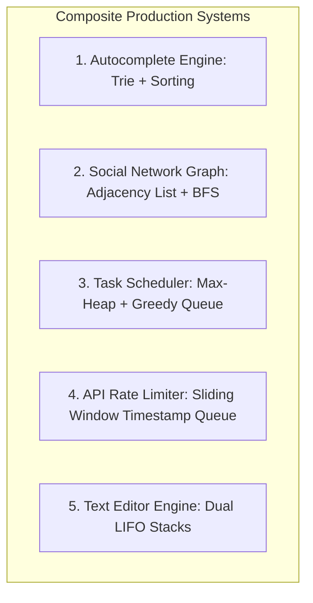
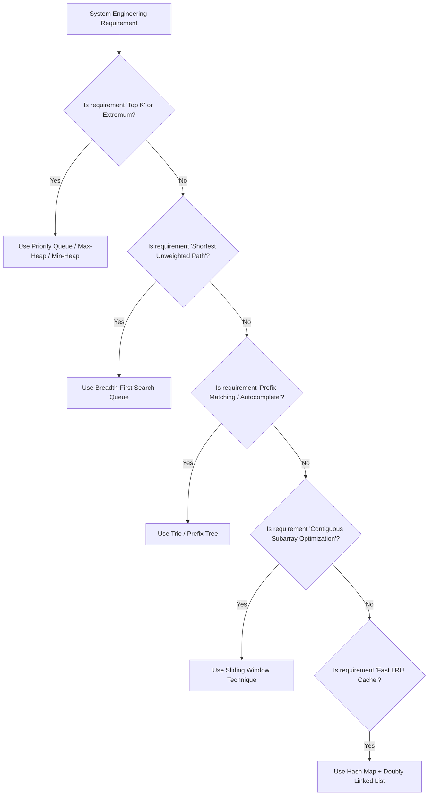

# Module 25: Real-World Engineering Applications & System Design DSA

## Theoretical Overview & Composite Systems

Production systems at engineering scale (Google, Amazon, Flipkart, Swiggy) do not use isolated data structures; they **combine multi-structure primitives** to meet latency and scalability SLAs.



---

## 1. System Engineering Architecture Matrix

| System Component | Core Problem | Data Structure Combination | Time Complexity | Primary Engineering Advantage |
| :--- | :--- | :--- | :--- | :--- |
| **Autocomplete Engine** | Fast prefix matching & rank sorting | **Trie + Frequency Sorting** | $\mathcal{O}(m + k \log k)$ | $\mathcal{O}(m)$ prefix lookup with top $K$ frequency ranking. |
| **Social Network** | Mutual friends & shortest separation | **Graph Adjacency List + BFS** | $\mathcal{O}(V + E)$ | Finds 2nd-degree mutual friends and shortest degrees of separation. |
| **Task Scheduler** | Idle CPU minimization with cooldown | **Max-Heap + Greedy Queue** | $\mathcal{O}(n)$ | Prioritizes highest-frequency tasks while enforcing cooldown slots. |
| **API Rate Limiter** | Sliding window request throttle | **Map + Timestamp Queue** | $\mathcal{O}(1)$ amortized | Purges expired timestamps past sliding window boundary $W$. |
| **Undo / Redo Engine** | Action recording & state recovery | **Dual LIFO Stacks** | $\mathcal{O}(1)$ per action | Immediate state restoration; new edits flush redo stack. |

---

## 2. Complete System Implementations

### 1. Autocomplete Suggestion Engine (`AutocompleteSystem`)
Combines a Trie for prefix lookup with frequency-based sorting to return top $K$ queries.

```javascript
class TrieNode {
  constructor() { this.children = {}; this.isEnd = false; this.frequency = 0; }
}

class AutocompleteSystem {
  constructor() { this.root = new TrieNode(); }

  insert(query, frequency = 1) {
    let node = this.root;
    for (const ch of query.toLowerCase()) {
      if (!node.children[ch]) node.children[ch] = new TrieNode();
      node = node.children[ch];
    }
    node.isEnd = true;
    node.frequency += frequency;
  }

  _findAll(node, prefix) {
    const results = [];
    const dfs = (cur, word) => {
      if (cur.isEnd) results.push({ query: word, frequency: cur.frequency });
      for (const [ch, child] of Object.entries(cur.children)) dfs(child, word + ch);
    };
    dfs(node, prefix);
    return results;
  }

  autocomplete(prefix, k = 3) {
    let node = this.root;
    const lp = prefix.toLowerCase();
    for (const ch of lp) { if (!node.children[ch]) return []; node = node.children[ch]; }
    return this._findAll(node, lp).sort((a, b) => b.frequency - a.frequency).slice(0, k);
  }

  recordSearch(query) { this.insert(query, 1); }
}
```

### 2. Social Network Analytics Engine (`SocialNetwork`)
Calculates mutual friend recommendations (depth-2 traversal) and degrees of separation (unweighted shortest path BFS).

```javascript
class SocialNetwork {
  constructor() { this.adj = new Map(); }

  addUser(u) { if (!this.adj.has(u)) this.adj.set(u, new Set()); }

  addFriendship(u1, u2) {
    this.addUser(u1); this.addUser(u2);
    this.adj.get(u1).add(u2); this.adj.get(u2).add(u1);
  }

  suggestFriends(user) {
    if (!this.adj.has(user)) return [];
    const direct = this.adj.get(user);
    const mutuals = new Map();
    for (const friend of direct) {
      for (const fof of this.adj.get(friend)) {
        if (fof !== user && !direct.has(fof)) {
          mutuals.set(fof, (mutuals.get(fof) || 0) + 1);
        }
      }
    }
    return [...mutuals.entries()]
      .sort((a, b) => b[1] - a[1])
      .map(([name, count]) => ({ user: name, mutualFriends: count }));
  }

  degreesOfSeparation(u1, u2) {
    if (!this.adj.has(u1) || !this.adj.has(u2)) return -1;
    if (u1 === u2) return 0;
    const visited = new Set([u1]);
    const queue = [[u1, 0]];
    while (queue.length > 0) {
      const [cur, dist] = queue.shift();
      for (const friend of this.adj.get(cur)) {
        if (friend === u2) return dist + 1;
        if (!visited.has(friend)) { visited.add(friend); queue.push([friend, dist + 1]); }
      }
    }
    return -1;
  }
}
```

### 3. CPU Task Scheduler with Cooldown (`taskScheduler`)
Schedules tasks using a Max-Heap to prioritize highest-frequency tasks while enforcing mandatory idle cooldown slots $N$.

```javascript
function taskScheduler(tasks, cooldown) {
  const freq = {};
  for (const t of tasks) freq[t] = (freq[t] || 0) + 1;
  const heap = new MaxHeap();
  for (const count of Object.values(freq)) heap.push(count);

  let totalTime = 0;
  while (heap.size() > 0) {
    const cycle = [], temp = [];
    for (let i = 0; i <= cooldown; i++) {
      if (heap.size() > 0) { const c = heap.pop(); cycle.push(c); if (c > 1) temp.push(c - 1); }
    }
    for (const c of temp) heap.push(c);
    totalTime += heap.size() > 0 ? cooldown + 1 : cycle.length;
  }
  return totalTime;
}
```

### 4. Sliding Window API Rate Limiter (`RateLimiter`)
Enforces maximum API request caps within a rolling time window $W$ per client ID.

```javascript
class RateLimiter {
  constructor(maxRequests, windowMs) {
    this.maxRequests = maxRequests;
    this.windowMs = windowMs;
    this.requests = new Map();
  }

  allow(clientId, timestamp = Date.now()) {
    if (!this.requests.has(clientId)) this.requests.set(clientId, []);
    const ts = this.requests.get(clientId);
    const start = timestamp - this.windowMs;
    
    // Purge expired timestamps outside sliding window
    while (ts.length > 0 && ts[0] <= start) ts.shift();
    
    if (ts.length < this.maxRequests) {
      ts.push(timestamp);
      return true;
    }
    return false; // Rate limit exceeded!
  }
}
```

### 5. Dual-Stack Text Editor Undo/Redo Engine (`TextEditor`)
Provides $\mathcal{O}(1)$ typing, deletion, undo, and redo operations using two stacks.

```javascript
class TextEditor {
  constructor() { this.text = ""; this.undoStack = []; this.redoStack = []; }

  type(str) {
    this.undoStack.push({ action: "type", text: str, position: this.text.length });
    this.text += str;
    this.redoStack = []; // Clear redo history on new action
    return this;
  }

  deleteChars(n) {
    const actualN = Math.min(n, this.text.length);
    const deleted = this.text.slice(-actualN);
    this.undoStack.push({ action: "delete", text: deleted, position: this.text.length - actualN });
    this.text = this.text.slice(0, -actualN);
    this.redoStack = [];
    return this;
  }

  undo() {
    if (!this.undoStack.length) return this;
    const a = this.undoStack.pop();
    this.redoStack.push(a);
    if (a.action === "type") this.text = this.text.slice(0, a.position);
    else this.text = this.text.slice(0, a.position) + a.text + this.text.slice(a.position);
    return this;
  }

  redo() {
    if (!this.redoStack.length) return this;
    const a = this.redoStack.pop();
    this.undoStack.push(a);
    if (a.action === "type") this.text = this.text.slice(0, a.position) + a.text + this.text.slice(a.position);
    else this.text = this.text.slice(0, a.position) + this.text.slice(a.position + a.text.length);
    return this;
  }

  getText() { return this.text; }
}
```

---

## 3. Pattern Recognition Decision Matrix



---

## Key Takeaways

1. **Composite Design**: Real-world architectures combine simple data structures (e.g., Trie + Sorting for autocomplete; Hash Map + DLL for LRU cache).
2. **State Restoration**: Text editors and browser history engines rely on paired LIFO stacks (`undoStack` / `redoStack`).
3. **Rolling Telemetry**: Sliding Window Queues enforce API rate limits efficiently in $\mathcal{O}(1)$ amortized time.
4. **Pattern Recognition Mastery**: Match requirement keywords directly to structural primitives (`Top K` $\to$ Heap; `Shortest Path` $\to$ BFS; `Prefix` $\to$ Trie; `Subarray` $\to$ Sliding Window).
