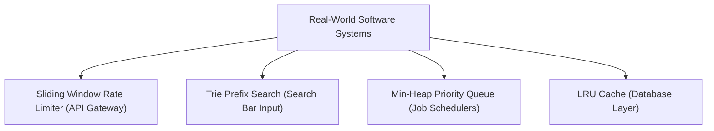

# File 25: Real-World DSA Applications and Systems Design

## Overview
This file explores how fundamental Data Structures and Algorithms are applied inside production engineering systems (e.g. rate limiters, search autocomplete, dependency resolvers, router routing engines).

---

## 1. Production System DSA Mapping



### Real-World DSA Application Matrix

| Production System Feature | Underlying Data Structure / Algorithm | Primary Benefit |
| :--- | :--- | :--- |
| **API Rate Limiter** | Sliding Window Log / Token Bucket | Prevents DDoS attacks ($O(1)$) |
| **Search Autocomplete** | Trie (Prefix Tree) | Fast prefix matches ($O(k)$) |
| **Undo / Redo Buffer** | Stack Pair (Undo / Redo) | LIFO state rollback ($O(1)$) |
| **Build Dependency Resolver** | Graph Topological Sort (Kahn's / DFS) | Detects circular build dependencies |

---

## 2. Sliding Window Rate Limiter System Implementation

```javascript
class SlidingWindowRateLimiter {
    constructor(limit, windowMs) {
        this.limit = limit;         // Max requests allowed
        this.windowMs = windowMs;   // Time window in ms
        this.requests = new Map();  // IP -> Timestamps Array
    }

    isAllowed(ip) {
        const now = Date.now();
        if (!this.requests.has(ip)) {
            this.requests.set(ip, []);
        }

        const timestamps = this.requests.get(ip);
        
        // Remove timestamps older than current window (Sliding Window Log)
        while (timestamps.length > 0 && timestamps[0] <= now - this.windowMs) {
            timestamps.shift();
        }

        if (timestamps.length < this.limit) {
            timestamps.push(now);
            return { allowed: true, remaining: this.limit - timestamps.length };
        }

        return { allowed: false, remaining: 0 };
    }
}

const limiter = new SlidingWindowRateLimiter(3, 1000); // 3 requests per 1 sec

console.log(limiter.isAllowed("192.168.1.1")); // Allowed
console.log(limiter.isAllowed("192.168.1.1")); // Allowed
console.log(limiter.isAllowed("192.168.1.1")); // Allowed
console.log(limiter.isAllowed("192.168.1.1")); // Blocked! (Exceeded 3 requests)
```

---

## Key Takeaways
1. Data structures and algorithms are the building blocks of **high-scale backend engineering**.
2. **Rate Limiters** use Sliding Window logs or Token Buckets.
3. **Task Schedulers** use Priority Queues (Min-Heaps).
4. **Build Systems** use Graph Topological Sorting.
