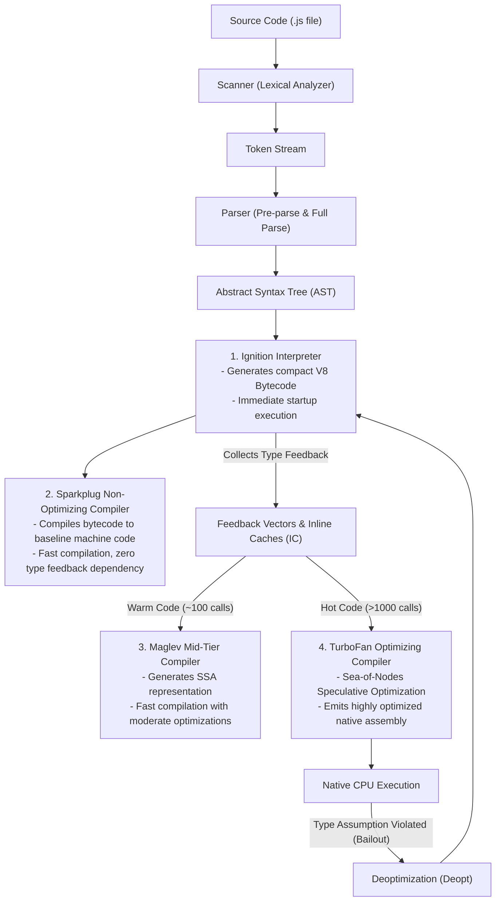
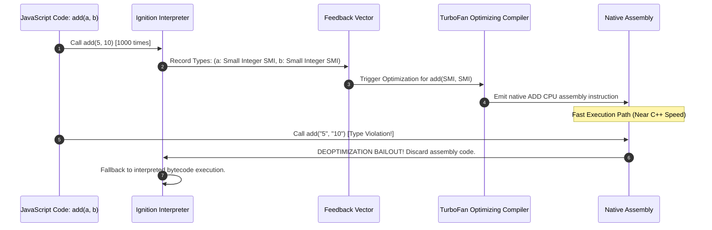

# Module 01: JavaScript Engine Overview & V8 Multi-Tier Compilation Architecture

## Overview

Every line of JavaScript code undergoes a multi-stage compilation and execution pipeline before executing natively on system hardware CPU registers.

Understanding how modern engines (such as Google V8) interpret, profile, compile, optimize, and deoptimize code allows software engineers to write **engine-friendly, monomorphic code** that executes at near-native C++ performance speeds.

---

## 1. What is a JavaScript Engine?

A **JavaScript Engine** is a specialized low-level software application (typically written in C++ or Rust) responsible for taking raw ECMAScript source code strings and converting them into executable CPU machine instructions.

### Core Engine Responsibilities
1. **Lexical Analysis & Parsing**: Converts source code characters into tokens and builds an Abstract Syntax Tree (AST).
2. **Bytecode Generation & Interpretation**: Translates AST nodes into compact bytecode streams for instant execution startup.
3. **Type Profiling & Feedback Collection**: Records runtime execution statistics (hot functions, parameter types, object shapes) inside **Feedback Vectors**.
4. **Multi-Tier JIT Compilation**: Compiles frequently executed ("hot") bytecode paths into native machine code.
5. **Memory Management & Garbage Collection**: Allocates heap space for objects, manages pointers, and reclaims dead memory via Scavenger and Mark-Sweep-Compact garbage collectors.

```mermaid
graph TD
    subgraph Host Environment (Browser / Node.js Runtime)
        subgraph V8 Engine Core
            Parser["Scanner & Parser"]
            AST["Abstract Syntax Tree (AST)"]
            ExecutionStack["Call Stack & Memory Heap"]
            GC["Garbage Collector (Scavenger / Mark-Sweep)"]
        end
        HostAPIs["Host APIs (DOM, fetch, fs, HTTP, timers)"]
        EventLoop["Event Loop & Task Queues"]
    end
    ExecutionStack <--> EventLoop
    HostAPIs --> EventLoop
```

---

## 2. Major JavaScript Engines Comparison

All ECMAScript-compliant engines adhere to the **ECMA-262 Specification**, but differ in compiler architecture, garbage collection algorithms, and host bindings:

| Engine Name | Primary Host Environments | Primary Developer | Compiler Architecture Tiers |
| :--- | :--- | :--- | :--- |
| **V8** | Google Chrome, Node.js, Deno, Chromium Edge | Google | Ignition $\to$ Sparkplug $\to$ Maglev $\to$ TurboFan |
| **SpiderMonkey** | Mozilla Firefox | Mozilla Foundation | C++ Interpreter $\to$ Baseline JIT $\to$ IonMonkey JIT |
| **JavaScriptCore (JSC / Nitro)**| Apple Safari, iOS Browsers, Bun Runtime | Apple | LLInt $\to$ Baseline JIT $\to$ DFG JIT $\to$ FTL JIT |
| **Hermes** | React Native (Mobile Apps) | Meta | AOT Bytecode Compiler (Optimized for low RAM) |

---

## 3. The Modern V8 Multi-Tier Compilation Pipeline

Modern V8 employs a **4-Tiered Compilation Pipeline** designed to balance immediate startup latency against long-term optimization throughput:



### V8 Compiler Tiers Breakdown

1. **Ignition (Bytecode Interpreter)**:
   - Converts AST into register-based **V8 Bytecode**.
   - Reduces V8 memory footprint by eliminating large AST nodes immediately after bytecode generation.
   - Attaches a **Feedback Vector** to every function to track parameter types and object shapes at runtime.
2. **Sparkplug (Baseline Compiler)**:
   - Iterates over Ignition bytecode and directly emits 1-to-1 baseline machine code instructions without executing complex optimizations.
   - Eliminates interpreter dispatch loop overhead without incurring JIT compilation delays.
3. **Maglev (Mid-Tier Optimizing Compiler)**:
   - Introduced in recent V8 releases to bridge the gap between Sparkplug and TurboFan.
   - Builds a Static Single Assignment (SSA) graph and performs fast speculative optimizations in $\sim 10\times$ less time than TurboFan.
4. **TurboFan (Top-Tier Optimizing Compiler)**:
   - Uses a **Sea-of-Nodes** intermediate representation to analyze control flow and data flow simultaneously.
   - Performs aggressive optimizations: Function Inlining, Loop Unrolling, Escape Analysis, Dead Code Elimination, and Vectorization.

---

## 4. Speculative Optimization, Type Feedback, and Deoptimization

JavaScript is **dynamically typed**. The engine cannot statically determine whether `a + b` means integer addition or string concatenation.

TurboFan performs **Speculative Optimization**: it assumes that parameter types observed during execution in the **Feedback Vector** will remain consistent in future calls.



### Monomorphic vs. Polymorphic vs. Megamorphic Call Sites

V8 tracks function call site type diversity using **Inline Caches (ICs)**:

- **Monomorphic (1 Type Seen)**: V8 sees only 1 object shape. Machine code is directly inlined ($1\times$ baseline execution time).
- **Polymorphic (2–4 Types Seen)**: V8 sees 2 to 4 distinct object shapes. Generates conditional check branches ($2-4\times$ overhead).
- **Megamorphic (5+ Types Seen)**: V8 gives up speculative inlining and falls back to a slow dictionary hash lookup table ($10-100\times$ slower).

---

## 5. Type Stability Engineering Examples

```javascript
// 1. Monomorphic Type-Stable Function (Engine Friendly)
function calculateTaxMonomorphic(amount) {
  return amount * 0.15; // Always receives numbers
}

// 2. Megamorphic Type-Unstable Function (Triggers Deoptimizations)
function calculateTaxUnstable(amount) {
  return amount * 0.15;
}

// Benchmark Type Stability Impact
function benchmarkTypeStability() {
  const iterations = 10_000_000;

  // Warmup Monomorphic
  for (let i = 0; i < 5000; i++) calculateTaxMonomorphic(i);

  const startStable = process.hrtime.bigint();
  for (let i = 0; i < iterations; i++) {
    calculateTaxMonomorphic(i);
  }
  const endStable = process.hrtime.bigint();

  // Pollute Unstable Function Feedback Vector with mixed types
  for (let i = 0; i < 5000; i++) calculateTaxUnstable(i);
  calculateTaxUnstable("100"); // Pass string
  calculateTaxUnstable({ value: 100 }); // Pass object
  calculateTaxUnstable([100]); // Pass array

  const startUnstable = process.hrtime.bigint();
  for (let i = 0; i < iterations; i++) {
    calculateTaxUnstable(i);
  }
  const endUnstable = process.hrtime.bigint();

  console.log(`Monomorphic Time : ${Number(endStable - startStable) / 1_000_000} ms`);
  console.log(`Unstable Time    : ${Number(endUnstable - startUnstable) / 1_000_000} ms`);
}

benchmarkTypeStability();
```

---

## 6. Essential V8 Debugging Flags

Developers can inspect V8 internal compiler behavior using Node.js runtime flags:

```bash
# Print functions optimized by TurboFan
node --trace-opt script.js

# Print functions deoptimized by V8 and the exact reason for bailout
node --trace-deopt script.js

# Print generated Ignition bytecode for functions
node --print-bytecode script.js

# Inspect Inline Cache (IC) state transitions
node --trace-ic script.js
```

---

## Key Production Takeaways

1. **Maintain Strict Monomorphic Parameter Types**: Avoid passing mixed data types (`number`, `string`, `object`) to high-frequency hot functions to prevent feedback vector pollution and TurboFan deoptimizations.
2. **Understand V8's Multi-Tier Pipeline**: Ignition provides instant startup, Sparkplug compiles fast baseline code, Maglev handles mid-tier optimization, and TurboFan generates top-tier assembly.
3. **Avoid Dynamic Property Deletions**: Deleting properties from objects (`delete obj.prop`) breaks hidden classes (Shapes), degrading property access from monomorphic Inline Caches to megamorphic dictionary lookups.
4. **Differentiate Engine vs. Host Environment**: ECMAScript specifications define engine primitives (`Object`, `Array`, `Promise`), while host environments (Browser / Node.js) inject external APIs (`DOM`, `fs`, `fetch`, `Event Loop`).

