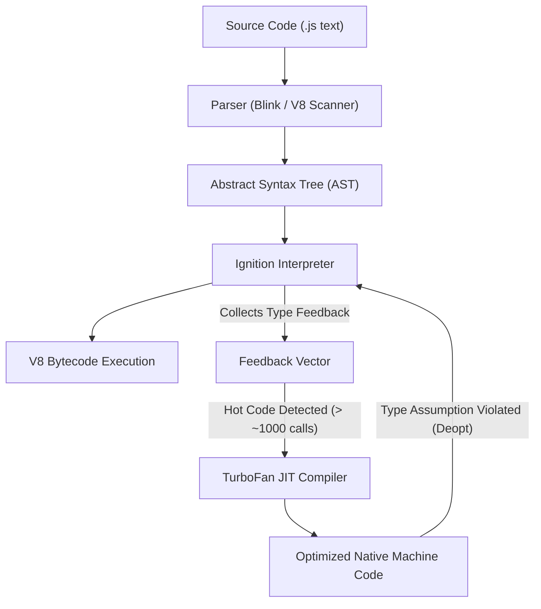
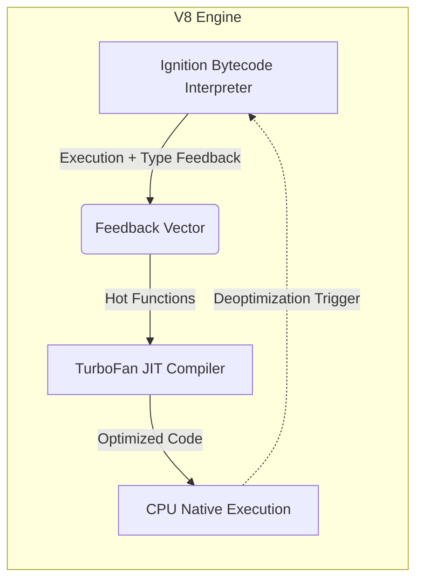

# File 01: JavaScript Engine Overview

## Overview
Every line of JavaScript goes through a complex compilation and execution pipeline before running on hardware. Understanding this pipeline helps developers write engine-friendly, highly optimized code and debug performance bottlenecks effectively.

---

## 1. What is a JavaScript Engine?
A JavaScript engine is a software program (typically written in C++ or Rust) that reads JavaScript source code (text), parses it into structured representations, and executes it by converting it into machine instructions.

### Core Responsibilities
1. **Parsing**: Converts raw source code strings into an Abstract Syntax Tree (AST).
2. **Interpretation**: Translates AST/Bytecode into execution actions immediately.
3. **Profiling & Feedback**: Tracks runtime execution statistics (hot code paths, variable types).
4. **JIT Compilation**: Compiles hot bytecode into optimized machine code.
5. **Memory Allocation & Garbage Collection**: Allocates heap space for objects and reclaims unused memory.

```javascript
// Example: Code executed by a JS engine (V8 in Node.js/Chrome)
console.log("Processed by V8 JavaScript Engine");
```

---

## 2. Major Engines & Architecture
Different host environments embed different JavaScript engines, all adhering to the ECMAScript (ECMA-262) specification:

| Engine | Primary Host Environment | Developed By |
| :--- | :--- | :--- |
| **V8** | Google Chrome, Node.js, Deno, Microsoft Edge | Google |
| **SpiderMonkey** | Mozilla Firefox | Mozilla |
| **JavaScriptCore (Nitro)** | Apple Safari, all iOS browsers | Apple |
| **Hermes** | React Native (Mobile Apps) | Meta |

### The V8 Execution Pipeline Diagram



---

## 3. Interpreter vs Compiler vs JIT Compilation
JavaScript uses a **Hybrid Just-In-Time (JIT)** compilation model:

- **Interpreter**: Fast startup, executes code line-by-line, but slower overall execution speed.
- **Ahead-Of-Time (AOT) Compiler**: Slow startup (compiles everything upfront), produces highly optimized machine code before execution (e.g., C++, Rust).
- **JIT Compiler**: Combines fast startup (initial interpretation) with high-speed execution by compiling "hot code" (frequently executed functions) at runtime.

### Why JIT is Necessary for JavaScript
JavaScript is **dynamically typed**. The engine cannot determine variable types statically at compile time. JIT compilation allows the engine to compile machine code based on **observed runtime type feedback**.

```javascript
function addNumbers(a, b) {
    return a + b;
}

// JIT Benchmark: Hot Code Detection
const startJIT = Date.now();
let jitResult = 0;
for (let i = 0; i < 1_000_000; i++) {
    jitResult = addNumbers(i, i + 1);  // Hot path -> Triggering JIT compilation in V8
}
const endJIT = Date.now();
console.log(`1,000,000 calls to addNumbers executed in: ${endJIT - startJIT}ms`);
```

---

## 4. V8's Two-Tier Architecture: Ignition + TurboFan



1. **Ignition (Interpreter)**:
   - Generates compact V8 bytecode.
   - Starts execution instantly without long compilation pauses.
   - Collects type profile data for every opcode execution.
2. **TurboFan (Optimizing Compiler)**:
   - Reads bytecode along with collected type feedback.
   - Generates native machine code assuming types will stay consistent.
3. **Deoptimization (Deopt)**:
   - If a function receives a type that violates TurboFan's assumptions (e.g., passing a string to a function optimized for numbers), the engine discards the machine code and falls back to Ignition bytecode execution.

```javascript
function calculate(a, b) {
    return a + b;
}

console.log(calculate(5, 3));         // 8 (Numeric addition)
console.log(calculate('5', '3'));     // "53" (String concatenation - triggers deopt if calculate was optimized for numbers)
```

---

## 5. Single-Threaded Runtime & Host Environments
JavaScript is **single-threaded** (one call stack, executing one instruction at a time). However, host environments extend the engine with extra capabilities.

### JS Engine vs Host Environment

```mermaid
graph TD
    subgraph Host Environment (Browser / Node.js)
        subgraph JS Engine (V8 Core)
            Stack[Call Stack]
            Heap[Memory Heap]
            Spec[ECMAScript Language Core]
        end
        APIs[Host APIs: DOM, fetch, fs, setTimeout]
        Loop[Event Loop & Task Queues]
    end
    Stack <--> Loop
    APIs --> Loop
```

- **Engine Features (ECMAScript Spec)**: Variables, Object/Array primitives, Functions, Closures, Promises, Map/Set.
- **Browser Host APIs**: DOM operations, `fetch()`, `setTimeout`, `localStorage`.
- **Node.js Host APIs**: File System (`fs`), HTTP server (`http`), `process`, `Buffer` (via libuv).

```javascript
// Heavy computation blocks the single thread
function heavyComputation() {
    const start = Date.now();
    let count = 0;
    while (Date.now() - start < 50) { count++; }
    return count;
}

const iterations = heavyComputation();
console.log(`Blocked execution for 50ms: ${iterations.toLocaleString()} iterations`);
```

---

## 6. Type Stability Benchmark
Functions with consistent monomorphic types allow TurboFan to produce peak optimization. Type instability leads to deoptimization and performance penalties.

```javascript
function multiply(a, b) { return a * b; }

// Type-stable execution (Always Numbers)
function benchmarkStable(iterations) {
    for (let i = 0; i < 1000; i++) multiply(i, i + 1); // Warmup
    const start = process.hrtime.bigint();
    for (let i = 0; i < iterations; i++) multiply(i, i + 1);
    const end = process.hrtime.bigint();
    return Number(end - start) / 1_000_000;
}

// Type-unstable execution (Mixed Types)
function unstableMultiply(a, b) { return a * b; }
for (let i = 0; i < 5000; i++) unstableMultiply(i, i + 1);
unstableMultiply("hello", 5); // Pollutes type feedback vector

console.log(`Type-stable multiply: ${benchmarkStable(10_000_000).toFixed(2)}ms`);
```

### Useful V8 Debugging Flags
```bash
node --trace-opt script.js        # Log optimized functions
node --trace-deopt script.js      # Log deoptimized functions
node --print-bytecode script.js   # Output generated Ignition bytecode
```

---

## Key Takeaways
1. A JS engine is software (typically written in C++) executing ECMAScript specification logic.
2. The compilation flow is: **Source Code -> Parser -> AST -> Ignition (Bytecode) -> TurboFan (Machine Code)**.
3. JIT compilation offers both **fast startup** (interpretation) and **high speed** (optimization of hot paths).
4. **V8 Ignition** generates bytecode and collects type feedback; **TurboFan** leverages this feedback to emit machine code.
5. JavaScript is **single-threaded**; long sync loops block the main execution stack.
6. APIs like `console.log`, `fetch`, and `setTimeout` are provided by the **host environment**, not the engine itself.
7. Maintain **type stability** in high-frequency functions to keep V8 code fully optimized.
