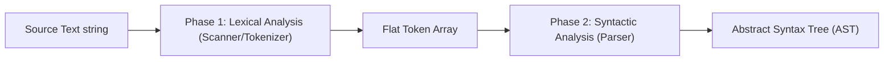
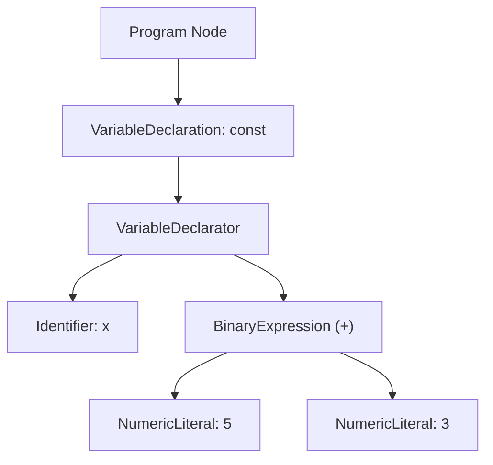
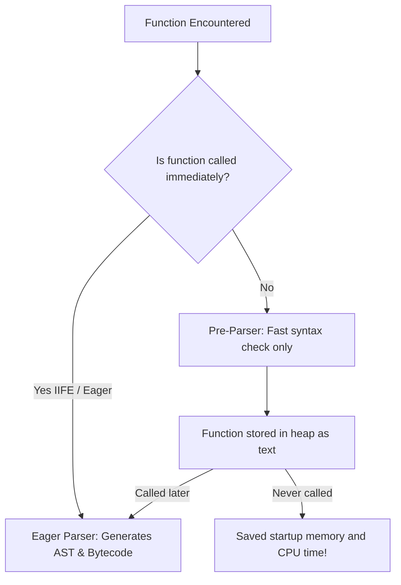

# File 02: Parsing and Abstract Syntax Trees (AST)

## Overview
Before JavaScript can be executed or compiled by an engine like V8, the raw source code text must be parsed into a structured, tree-like data representation called an **Abstract Syntax Tree (AST)**. Understanding parsing performance helps optimize application boot times and reveals how modern JS tooling (Babel, ESLint, Prettier, TypeScript) operates.

---

## 1. The Parsing Pipeline
The parser converts text into an AST in two main phases:



1. **Lexical Analysis (Tokenization)**: Converts raw string characters into meaningful atomic tokens (keywords, variables, operators).
2. **Syntactic Analysis (Parsing)**: Transforms flat token streams into a nested, tree-structured AST based on language grammar rules.

---

## 2. Tokenization (Lexing)
The lexer reads source code character by character, discarding comments and whitespace, and categorizes strings into tokens.

```javascript
// Source string: const totalPrice = basePrice + gst;

const tokenExample = [
    { type: "Keyword",     value: "const" },
    { type: "Identifier",  value: "totalPrice" },
    { type: "Punctuator",  value: "=" },
    { type: "Identifier",  value: "basePrice" },
    { type: "Punctuator",  value: "+" },
    { type: "Identifier",  value: "gst" },
    { type: "Punctuator",  value: ";" },
];
```

### Common Token Categories
- **Keywords**: `const`, `let`, `var`, `function`, `return`, `if`.
- **Identifiers**: User-defined variable or function names (`totalPrice`, `calculate`).
- **Literals**: Numbers (`42`), Strings (`"hello"`), Booleans (`true`).
- **Operators / Punctuators**: `=`, `+`, `===`, `;`, `{`, `}`.

---

## 3. Abstract Syntax Tree (AST) Structure
An AST represents JavaScript code structure hierarchically without syntax trivia (such as optional semicolons, parens, or spaces).

```javascript
// Source: const x = 5 + 3;

const simpleAST = {
    type: "Program",
    body: [{
        type: "VariableDeclaration",
        kind: "const",
        declarations: [{
            type: "VariableDeclarator",
            id: { type: "Identifier", name: "x" },
            init: {
                type: "BinaryExpression",
                operator: "+",
                left:  { type: "NumericLiteral", value: 5 },
                right: { type: "NumericLiteral", value: 3 },
            },
        }],
    }],
};
```

### Mermaid Representation of AST



---

## 4. Eager vs Lazy Parsing in V8
To minimize startup time, V8 uses a **Two-Parser Strategy**:



- **Eager Parser (Full Parse)**: Used for functions that execute immediately (e.g., top-level code or IIFEs). Checks syntax, builds AST, and generates bytecode.
- **Pre-Parser (Lazy Parse)**: Used for functions defined but not yet executed. Only checks for syntax errors without building an AST or allocating scopes, cutting startup parse time by 50%+.

```javascript
function immediatelyUsed() {
    return 42;
}

function definedButNotCalledYet() {
    return "Lazy parsed until invoked";
}

const result = immediatelyUsed(); // Triggers full parse of immediatelyUsed
// definedButNotCalledYet remains pre-parsed only
```

---

## 5. Parse-Time Errors vs Runtime Errors
- **SyntaxError (Parse-Time)**: Occurs during tokenization or AST creation. The file **never executes** any line of code.
- **TypeError / ReferenceError (Runtime)**: Occurs during execution inside the call stack. Code prior to the error executes normally.

```javascript
// SyntaxError: Caught at Parse Time (Nothing runs!)
// function broken( { return 1; } 

// RuntimeError: Caught at Execution Time
try {
    const val = undefined;
    // val.property; // Throws TypeError at runtime
} catch (e) {
    console.log("Runtime error handled:", e.message);
}
```

---

## 6. Parse Cost & `JSON.parse()` Optimization
Parsing JavaScript code incurs a CPU cost (approx. **100ms per 1MB** of JS on mobile devices).

### The `JSON.parse()` Performance Trick
Large inline object literals take longer to parse because JavaScript object syntax grammar is complex. In contrast, `JSON.parse` uses a simple, highly tuned C++ JSON parser.

```javascript
function generateLargeObject(size) {
    const obj = {};
    for (let i = 0; i < size; i++) obj[`key_${i}`] = `value_${i}`;
    return obj;
}

const largeObj = generateLargeObject(10000);
const jsonString = JSON.stringify(largeObj);

// JS Object Literal parsing simulation vs JSON.parse
const start1 = process.hrtime.bigint();
const fromLiteral = generateLargeObject(10000);
const end1 = process.hrtime.bigint();

const start2 = process.hrtime.bigint();
const fromJSON = JSON.parse(jsonString);
const end2 = process.hrtime.bigint();

console.log(`Object literal creation: ${Number(end1 - start1) / 1_000_000}ms`);
console.log(`JSON.parse speed:        ${Number(end2 - start2) / 1_000_000}ms`);
```

---

## 7. AST Applications & Custom Tokenizer Demo

### Tools Powered by ASTs
- **Babel**: Parses modern JS to AST -> Transforms AST nodes to ES5 equivalents -> Emits compiled code.
- **ESLint**: Parses JS to AST -> Traverses AST nodes -> Reports lint rule violations.
- **Prettier**: Parses JS to AST -> Re-formats spacing and layout based on AST rules.
- **TypeScript**: Parses TS to AST -> Checks AST types -> Emits vanilla JS.

### Mini Character-by-Character Lexer Demo

```javascript
function simpleTokenizer(code) {
    const tokens = [];
    let i = 0;
    while (i < code.length) {
        const char = code[i];
        if (/\s/.test(char)) { i++; continue; }
        if (/\d/.test(char)) {
            let num = '';
            while (i < code.length && /[\d.]/.test(code[i])) { num += code[i]; i++; }
            tokens.push({ type: 'Number', value: num }); continue;
        }
        if (/[a-zA-Z_$]/.test(char)) {
            let word = '';
            while (i < code.length && /[a-zA-Z0-9_$]/.test(code[i])) { word += code[i]; i++; }
            const keywords = ['const', 'let', 'var', 'function', 'return'];
            tokens.push({ type: keywords.includes(word) ? 'Keyword' : 'Identifier', value: word });
            continue;
        }
        if ('+-*/=;,(){}'.includes(char)) {
            tokens.push({ type: 'Punctuator', value: char }); i++; continue;
        }
        i++;
    }
    return tokens;
}

console.log(simpleTokenizer("const price = 499 + 100;"));
```

---

## Key Takeaways
1. Parsing has two steps: **Tokenization (Lexing)** and **Syntactic Analysis (Parsing to AST)**.
2. An **AST** is a tree data structure representing code logic consumed by compilers and dev tools.
3. V8 uses **Lazy Parsing (Pre-parser)** for uncalled functions to speed up app boot times.
4. **SyntaxErrors** prevent any execution; **RuntimeErrors** happen mid-execution.
5. Large data payloads parse faster using `JSON.parse('"..."')` than inline JS object literals.
