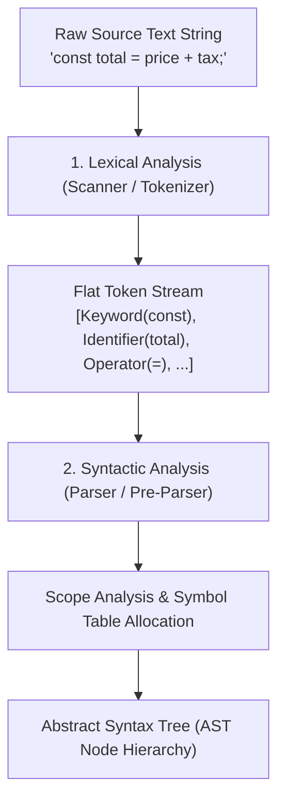
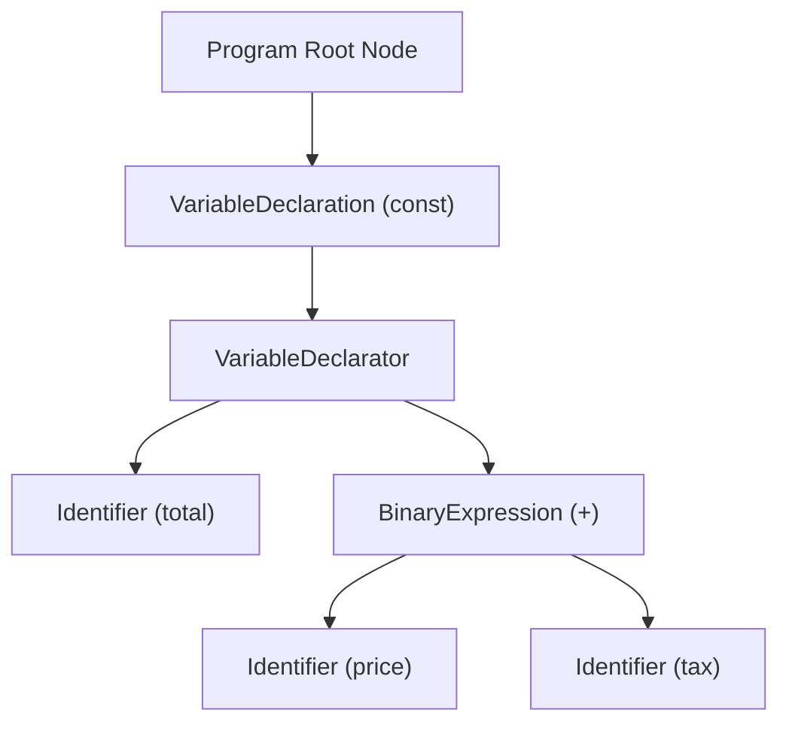

# Module 02: Lexical Analysis, Parsing, and Abstract Syntax Trees (AST)

## Overview

Before JavaScript code can be interpreted or compiled into executable machine instructions by an engine like V8, the raw source text string must be scanned, tokenized, and parsed into a structured hierarchical tree representation called an **Abstract Syntax Tree (AST)**.

Understanding parsing performance, **Eager vs. Lazy (Pre-Parsing)** strategies, and AST node trees unlocks deep insights into engine startup latency, V8 scope analysis, and the mechanics of developer tooling (Babel, ESLint, Prettier, TypeScript).

---

## 1. The Parsing Pipeline Architecture

The V8 parser converts raw source text into an AST through two sequential compiler phases:



1. **Lexical Analysis (Tokenization / Scanning)**:
   - Reads source text character-by-character.
   - Strips whitespace, comments, and line breaks.
   - Groups characters into atomic **Tokens** tagged with token type and source position.
2. **Syntactic Analysis (Parsing)**:
   - Evaluates token streams against formal ECMAScript context-free grammar rules.
   - Constructs nested AST nodes and establishes scope chains (Global, Function, Block scopes).

---

## 2. Tokenization & ESTree AST Node Hierarchy



### Tokens vs. AST Nodes

```javascript
// Source String: const total = price + tax;

// Phase 1 Token Stream (Scanner Output)
const tokenStream = [
  { type: "Keyword",     value: "const" },
  { type: "Identifier",  value: "total" },
  { type: "Punctuator",  value: "=" },
  { type: "Identifier",  value: "price" },
  { type: "Punctuator",  value: "+" },
  { type: "Identifier",  value: "tax" },
  { type: "Punctuator",  value: ";" }
];

// Phase 2 AST Representation (ESTree Compatible Standard)
const astNodeTree = {
  type: "Program",
  sourceType: "script",
  body: [
    {
      type: "VariableDeclaration",
      kind: "const",
      declarations: [
        {
          type: "VariableDeclarator",
          id: { type: "Identifier", name: "total" },
          init: {
            type: "BinaryExpression",
            operator: "+",
            left:  { type: "Identifier", name: "price" },
            right: { type: "Identifier", name: "tax" }
          }
        }
      ]
    }
  ]
};
```

---

## 3. V8 Two-Parser Strategy: Eager Parsing vs. Lazy Pre-Parsing

Parsing raw JavaScript code consumes significant CPU time (approx. **100ms per 1MB** of JS text on mobile devices). To minimize application boot latency, V8 uses a **Two-Parser Strategy**:

```mermaid
flowchart TD
    FunctionEncountered[Function Declaration Encountered] --> ParenCheck{Is function wrapped in parentheses?<br/>(e.g. IIFE: '(function(){...})()')}

    ParenCheck -- Yes (IIFE / Top-Level) --> EagerParse["1. Eager Parser (Full Parse)<br/>- Builds full AST<br/>- Allocates Scopes & Symbol Tables<br/>- Emits Ignition Bytecode immediately"]

    ParenCheck -- No (Nested / Uncalled) --> LazyPreParse["2. Pre-Parser (Lazy Parse)<br/>- Skips AST creation & Bytecode emission<br/>- Checks ONLY basic syntax errors<br/>- 2x to 3x faster than Full Parse!"]

    LazyPreParse --> DeferredExecution["Function text stored in V8 Heap"]
    DeferredExecution -- Function Invoked Later --> DeferredFullParse["Full Parse & Bytecode Compile on-demand"]
```

### Key Differences Between Parsers

- **Eager Parser (Full Parse)**: Parses top-level code and functions expected to execute immediately. Performs full AST construction, scope variable allocation, and bytecode compilation.
- **Pre-Parser (Lazy Parse)**: Skips uncalled function bodies. Validates syntax rules without creating AST nodes or allocating variable context memory, reducing startup parse time by over $60\%$.

> [!TIP]
> **V8 Paren Heuristic**: V8 uses parenthesized function patterns `(function() {})()` to guess IIFEs. Wrapping a function in parentheses forces V8 to eager-parse it upfront, eliminating runtime parse stutter during execution.

---

## 4. Scope Analysis & Symbol Table Allocation During Parsing

During parsing, V8 performs **Scope Analysis**:

1. Identifies variable declarations (`var`, `let`, `const`, `function`).
2. Determines whether variables are allocated on the **Call Stack** or captured inside a heap-allocated **Closure Context**.
3. Detects undeclared variables or invalid redeclarations (`const x = 1; const x = 2;`) at parse time.

```javascript
// Parse-Time SyntaxError: Caught before ANY execution begins!
// const a = 10;
// const a = 20; // Uncaught SyntaxError: Identifier 'a' has already been declared

// Runtime TypeError: Code runs up until the execution error is hit!
console.log("This line executes successfully!");
const obj = null;
// obj.invalidProperty; // Throws TypeError at execution time
```

---

## 5. Performance Optimization: `JSON.parse()` Fast Path

Large inline object literals (`const config = { ... 10,000 items ... }`) are expensive to parse because the V8 parser must evaluate full JavaScript object grammar rules, nested expressions, and computed keys.

In contrast, `JSON.parse('"..."')` uses a lightweight, specialized **C++ JSON Lexer/Parser** that bypasses JavaScript language grammar rules entirely, executing up to **$2\times$ faster**:

```javascript
// 1. Slow: Inline JS Object Literal (Parsed via JS Grammar Parser)
const slowConfig = {
  users: [{ id: 1, name: "Alice" }, { id: 2, name: "Bob" }],
  settings: { theme: "dark", notifications: true }
};

// 2. Fast Path: JSON.parse (Bypasses JS AST Parser using V8's Native C++ JSON Parser)
const fastConfig = JSON.parse(
  '{"users":[{"id":1,"name":"Alice"},{"id":2,"name":"Bob"}],"settings":{"theme":"dark","notifications":true}}'
);

// Benchmark Parsing Cost Simulation
function benchmarkParseCost() {
  const payload = Array.from({ length: 5000 }, (_, i) => ({ id: i, data: `val_${i}` }));
  const jsonStr = JSON.stringify(payload);

  const startJSON = process.hrtime.bigint();
  const parsedObj = JSON.parse(jsonStr);
  const endJSON = process.hrtime.bigint();

  console.log(`JSON.parse execution time: ${Number(endJSON - startJSON) / 1_000_000} ms`);
}

benchmarkParseCost();
```

---

## 6. How Tooling Harnesses ASTs (Babel, ESLint, Prettier)

ASTs form the foundation of modern JavaScript developer tooling:


- **Babel (Transpiler)**: Parses ES6+ code to AST $\to$ Transforms modern AST nodes to ES5 equivalents $\to$ Generates backward-compatible JS string.
- **ESLint (Linter)**: Parses code to AST $\to$ Traverses AST nodes $\to$ Reports rule violations (e.g. `no-unused-vars` checks unreferenced Identifier nodes).
- **Prettier (Formatter)**: Parses code to AST $\to$ Discards original formatting/whitespace $\to$ Pretty-prints brand new code directly from AST structure.

---

## Key Production Takeaways

1. **Leverage Lazy Parsing for Unused Code**: Avoid bundling massive unused libraries. Uncalled code is pre-parsed, but still incurs network download and memory pre-parsing overhead.
2. **Use `JSON.parse()` for Large Initial State Objects**: For server-side rendered (SSR) initial state payloads ($> 10\text{ KB}$), serialize as `JSON.parse('...')` to bypass heavy JS grammar parsing.
3. **Understand IIFE Eager Parsing Rules**: Wrap immediately invoked functions in parentheses `(function(){ ... })()` to signal V8 to eager-parse them upfront.
4. **SyntaxErrors Stop Execution Entirely**: Parse-time SyntaxErrors prevent the file from compiling or executing a single line, unlike runtime TypeErrors.

