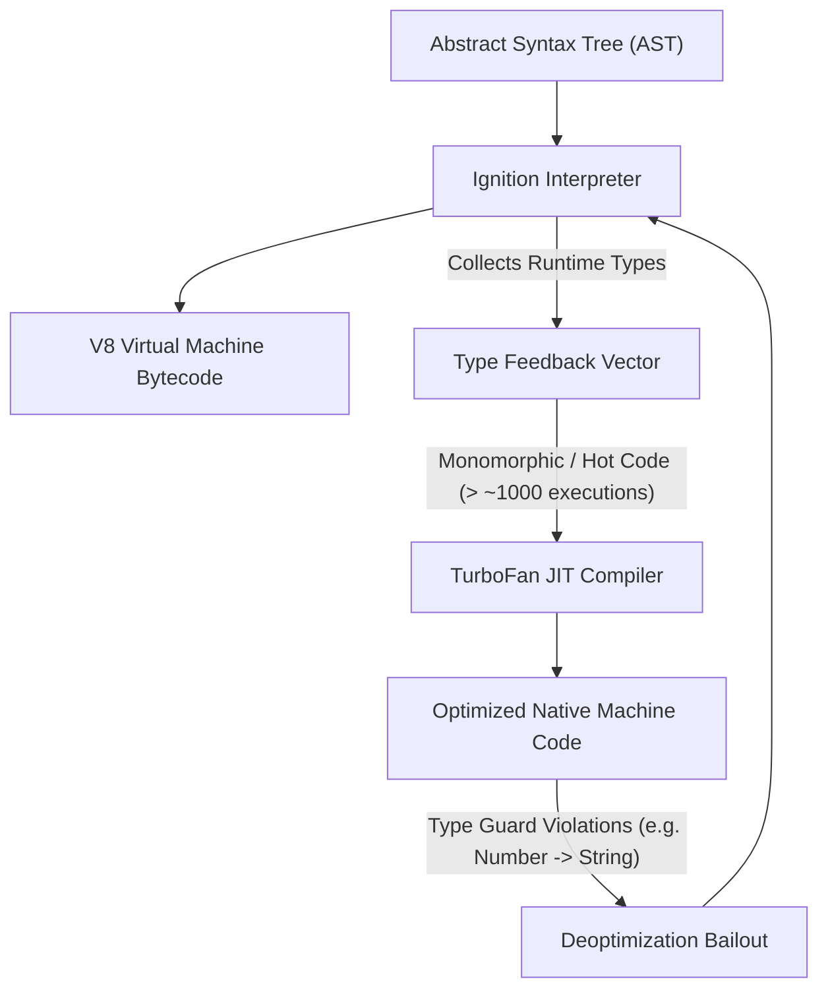
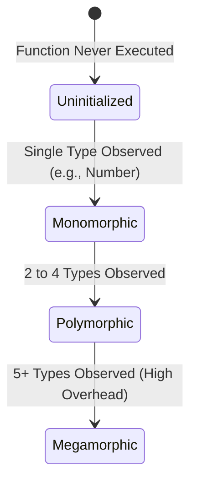
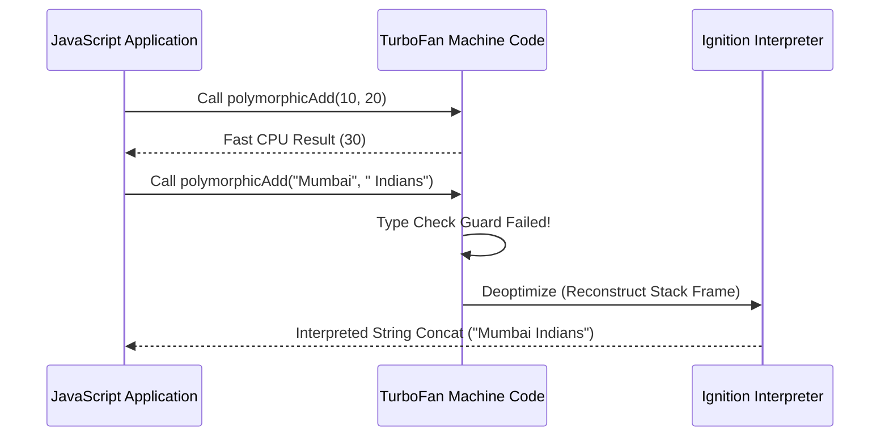

# File 03: The Compilation Pipeline

## Overview
V8 processes JavaScript through a two-tier compilation pipeline: **Ignition** (an interpreter generating bytecode and collecting type profile data) and **TurboFan** (a JIT compiler generating optimized machine code). Writing type-stable, engine-friendly code ensures your application stays on TurboFan's fast path and avoids expensive deoptimizations.

---

## 1. The V8 Pipeline Flow



---

## 2. Ignition: The Bytecode Interpreter
Ignition is a register-based virtual machine interpreter. It reads AST nodes and converts them into compact **V8 Bytecodes** while updating an inline **Feedback Vector** slot for every operation.

```javascript
function add(a, b) {
    return a + b;
}
```

### V8 Ignition Bytecode Assembly (Simulated Output)
```text
Ldar a1       ; Load argument 'a1' (parameter 'a') into the Accumulator register
Add a2, [0]   ; Add argument 'a2' ('b') to Accumulator, storing type feedback in Feedback Vector slot 0
Return        ; Return value currently stored in Accumulator register
```

> **CLI Debug Command**:
> `node --print-bytecode --print-bytecode-filter=add script.js`

---

## 3. Type Feedback and Profiling
As Ignition executes bytecode, it updates feedback slots for each operation:



- **Monomorphic (Best)**: Operation sees only 1 type (e.g., always integers). Highly candidate for TurboFan inline assembly optimization.
- **Polymorphic (Good)**: Operation sees 2-4 types. TurboFan emits conditional check branches.
- **Megamorphic (Slow)**: Operation sees 5+ different types. TurboFan gives up specializing and falls back to generic hash table lookup.

```javascript
function processValue(x) { return x.toString(); }

// Monomorphic Benchmark (Always Number)
const monoStart = process.hrtime.bigint();
for (let i = 0; i < 1_000_000; i++) processValue(42);
const monoEnd = process.hrtime.bigint();

// Megamorphic Benchmark (Mixed Types)
const types = [42, "hello", true, 0, { x: 1 }, [1, 2], 3.14, "world"];
const megaStart = process.hrtime.bigint();
for (let i = 0; i < 1_000_000; i++) processValue(types[i % types.length]);
const megaEnd = process.hrtime.bigint();

console.log(`Monomorphic execution: ${Number(monoEnd - monoStart) / 1_000_000}ms`);
console.log(`Megamorphic execution: ${Number(megaEnd - megaStart) / 1_000_000}ms`);
```

---

## 4. TurboFan: Speculative Optimization
TurboFan takes bytecode + feedback vectors and produces optimized machine code using **Speculative Optimization**.

### TurboFan Pipeline Phases
1. **Graph Building**: Converts bytecode to a Sea-of-Nodes Intermediate Representation (IR).
2. **Inlining**: Embeds small function contents directly into the caller site to remove call stack overhead.
3. **Type Specialization**: Strips away generic type checks, replacing them with direct hardware instructions (e.g., single CPU `ADD` opcode).
4. **Constant Folding & Dead Code Elimination**: Evaluates static calculations at compile time.
5. **Register Allocation**: Maps variables directly to physical CPU registers.

```javascript
// Interpreted Path:
// Checks: typeof a === number? typeof b === number? Handle coercions -> Add
// TurboFan Optimized Path:
// Guard: Are both inputs Numbers? If false -> DEOPT. Otherwise: CPU ADD instruction!
```

---

## 5. Deoptimization (Deopt)
When TurboFan's type assumptions are violated at runtime, execution cannot continue in compiled machine code. The engine triggers a **Deoptimization Bailout**, reconstructing the interpreter frame and returning to Ignition.



```javascript
function polymorphicAdd(a, b) { return a + b; }

// Phase 1: Warm up with numbers (TurboFan optimizes for numbers)
for (let i = 0; i < 100000; i++) polymorphicAdd(i, i + 1);

// Phase 2: Pass strings -> Triggers Deoptimization!
const stringResult = polymorphicAdd("Mumbai", " Indians");

// Phase 3: Function re-compiled with broader, slower polymorphic checks
for (let i = 0; i < 100000; i++) polymorphicAdd(i, i + 1);
```

---

## 6. Type Stability & Inline Caching (IC)
Inline Caching speeds up property accesses by remembering the memory offsets of object properties across executions.

```javascript
function getPrice(product) { return product.price; }

// Monomorphic IC: Every object shares the exact same property shape
const products = [];
for (let i = 0; i < 10000; i++) {
    products.push({ name: `Prod ${i}`, price: i * 10, brand: "Acme" });
}

let total = 0;
for (const p of products) total += getPrice(p); // Monomorphic IC hit!
```

---

## 7. On-Stack Replacement (OSR) & V8-Friendly Rules

### On-Stack Replacement (OSR)
If a long-running loop executes inside an unoptimized function, V8 will compile the loop on the fly and replace the stack frame mid-execution (On-Stack Replacement).

```javascript
function sumLoop(n) {
    let sum = 0;
    for (let i = 0; i < n; i++) sum += i; // OSR optimizes loop mid-execution
    return sum;
}
sumLoop(10_000_000);
```

### Top 5 Rules for Engine-Optimized JS Code
1. **Type Stability**: Always pass identical parameter types to hot functions.
2. **Consistent Object Shapes**: Initialize properties in the same order in constructors.
3. **Avoid `delete`**: Deleting properties degrades objects to slow dictionary mode; set values to `undefined` instead.
4. **Use Rest Parameters**: Use `...args` instead of legacy `arguments` object.
5. **Pre-size Arrays**: Avoid resizing arrays repeatedly inside hot loops.

---

## Key Takeaways
1. V8 uses **Ignition** for instant bytecode execution and **TurboFan** for compiling hot paths to machine code.
2. **Type Feedback Vectors** track monomorphic vs megamorphic usage to guide optimizations.
3. Speculative optimizations rely on type guards; breaking type assumptions causes **Deoptimization**.
4. **Inline Caches (ICs)** store property offsets for identical object shapes.
5. **OSR (On-Stack Replacement)** optimizes long loops while they are actively running.
