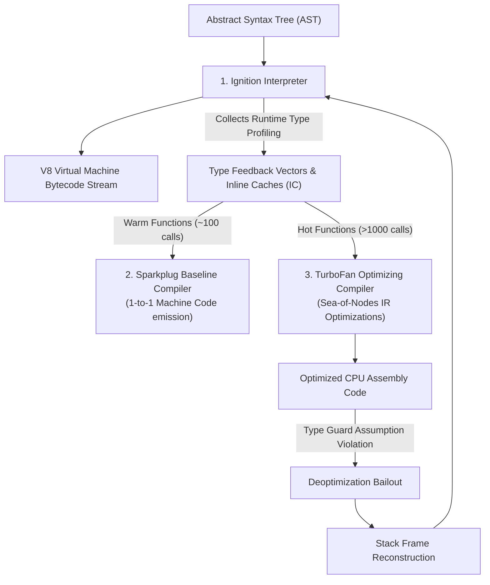
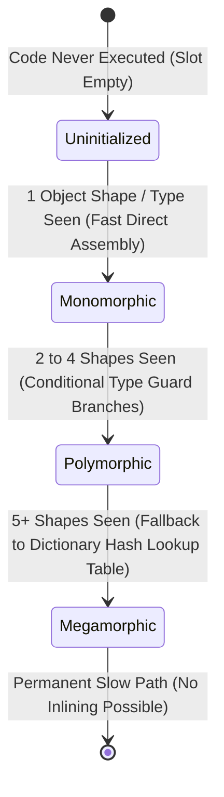
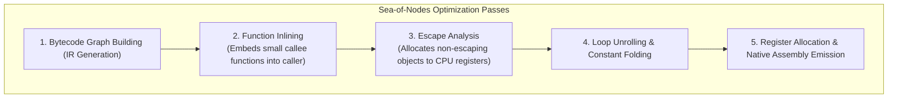
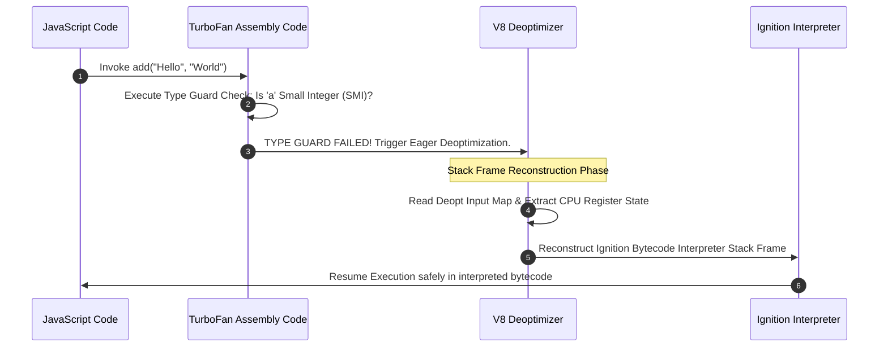

# Module 03: The V8 Compilation Pipeline — Ignition, TurboFan, Sea-of-Nodes IR, and Deoptimization

## Overview

The V8 JavaScript Engine compiles and executes JavaScript code through a **hybrid multi-tier Just-In-Time (JIT)** compilation pipeline.

Understanding how **Ignition** generates register-based bytecode, how **Feedback Vectors** populate **Inline Caches (ICs)**, how **TurboFan** leverages **Sea-of-Nodes Intermediate Representation (IR)** for speculative optimizations, and how **Deoptimization Bailouts** reconstruct stack frames is essential for architecting enterprise-grade, high-performance Node.js and browser applications.

---

## 1. V8 Multi-Tier Compilation Flow



---

## 2. Ignition: Accumulator-Based Virtual Machine Bytecode

Ignition is a register-based virtual machine interpreter that executes compact V8 bytecode instructions.

Unlike stack-based virtual machines, Ignition uses an **Accumulator Register** (`acc`) to hold intermediate operation values, dramatically reducing bytecode size.

```javascript
// Function Source Code
function add(a, b) {
  return a + b;
}
```

### V8 Ignition Bytecode Assembly Disassembly

```text
// Disassembly produced by: node --print-bytecode --print-bytecode-filter=add script.js
[generated bytecode for function: add (0x021b000832a1)]
Bytecode length: 6
Parameter count: 3 (self, a, b)
Register count: 0
Frame size: 0

0x21b000832b2 @ 0 : 0b 03        Ldar a1       ; Load Parameter 1 (a) into Accumulator register
0x21b000832b4 @ 2 : 39 02 00     Add a0, [0]   ; Add Parameter 0 (b) to Accumulator, record feedback in Slot 0
0x21b000832b7 @ 5 : ab           Return        ; Return current Accumulator value to caller
```

- **`Ldar a1`**: Load Register `a1` (Parameter `a`) into the Accumulator.
- **`Add a0, [0]`**: Add Register `a0` (Parameter `b`) to the Accumulator, writing runtime type feedback to Feedback Vector Slot 0.
- **`Return`**: Halt execution and return the Accumulator register contents.

---

## 3. Type Feedback Vectors & Inline Cache (IC) State Machine

Every compiled function in V8 has an associated **Feedback Vector** array storing **Inline Cache (IC)** entries for every property access, binary operation, and function call:



### Inline Cache States Comparison

| IC State | Shapes / Types Observed | V8 Compiler Behavior | Execution Speed Relative to Baseline |
| :--- | :--- | :--- | :--- |
| **Uninitialized** | 0 | Unexecuted bytecode slot. | N/A |
| **Monomorphic** | **1** | Direct machine code inlining; zero lookup branches. | **$1.0\times$ (Near C++ Speed)** |
| **Polymorphic** | **2 – 4** | Generates inline conditional type checks. | $2.0\times – 4.0\times$ overhead |
| **Megamorphic** | **5+** | Gives up inlining; uses slow hash table lookup. | **$10\times – 100\times$ slower** |

---

## 4. TurboFan & Sea-of-Nodes Intermediate Representation (IR)

TurboFan builds a **Sea-of-Nodes** IR graph where nodes represent both **Data Flow** (values, constants, additions) and **Control Flow** (branches, loops, returns) simultaneously.



### Advanced TurboFan Optimizations

1. **Function Inlining**: Replaces function call sites with the target function's body, eliminating call stack frame setup and teardown overhead.
2. **Escape Analysis**: If an object created inside a function does not "escape" (i.e. is not returned or assigned globally), TurboFan decomposes the object and stores its fields directly in **CPU Registers** or stack memory, bypassing Heap Garbage Collection!
3. **Loop Peeling & Unrolling**: Duplicates loop bodies to eliminate loop counter comparisons in hot iterations.

---

## 5. Deoptimization (Deopt) & Stack Frame Reconstruction

When TurboFan compiles native machine code, it inserts **Type Guards**. If a type assumption is violated at runtime (e.g. passing a string to an assembly routine optimized for numbers), V8 triggers a **Deoptimization (Deopt)**:



- **Eager Deoptimization**: Triggered immediately when a type guard condition fails.
- **Lazy Deoptimization**: Triggered when optimized code currently running on the call stack is invalidated by external state changes (e.g., prototype modification).

---

## 6. On-Stack Replacement (OSR)

If a function contains a long-running `for` loop executing millions of iterations, V8 cannot wait for the function to return before compiling it.

**On-Stack Replacement (OSR)** allows V8 to compile hot loops with TurboFan *while the loop is actively executing* and dynamically replace the interpreter stack frame with a compiled native machine frame mid-loop!

---

## 7. Production Code Demonstrating IC & Deopt Impact

```javascript
// 1. Monomorphic Code (V8 Fast Path)
function getX(obj) {
  return obj.x;
}

// 2. Demonstration Benchmark
function benchmarkCompilationPipeline() {
  const iterations = 10_000_000;

  // Create Monomorphic Array (All objects share exact same Shape)
  const monoArray = [];
  for (let i = 0; i < iterations; i++) {
    monoArray.push({ x: i, y: i + 1 });
  }

  // Warmup to trigger TurboFan optimization
  for (let i = 0; i < 10000; i++) getX(monoArray[i]);

  const startMono = process.hrtime.bigint();
  let sumMono = 0;
  for (let i = 0; i < iterations; i++) {
    sumMono += getX(monoArray[i]);
  }
  const endMono = process.hrtime.bigint();

  // Pollute Inline Cache to force Megamorphic transition
  const megamorphicObjects = [
    { x: 1 },
    { a: 1, x: 2 },
    { a: 1, b: 2, x: 3 },
    { a: 1, b: 2, c: 3, x: 4 },
    { a: 1, b: 2, c: 3, d: 4, x: 5 }
  ];

  for (let i = 0; i < iterations; i++) {
    getX(megamorphicObjects[i % megamorphicObjects.length]);
  }

  const startMega = process.hrtime.bigint();
  let sumMega = 0;
  for (let i = 0; i < iterations; i++) {
    sumMega += getX(megamorphicObjects[i % megamorphicObjects.length]);
  }
  const endMega = process.hrtime.bigint();

  console.log(`Monomorphic IC Time : ${Number(endMono - startMono) / 1_000_000} ms`);
  console.log(`Megamorphic IC Time : ${Number(endMega - startMega) / 1_000_000} ms`);
}

benchmarkCompilationPipeline();
```

---

## Key Production Takeaways

1. **Initialize Object Properties in Identical Order**: Always initialize object properties in constructors in the exact same sequence to share Hidden Classes (Shapes) and preserve Monomorphic Inline Caches.
2. **Avoid Deleting Object Properties**: Use `obj.prop = undefined` or `null` instead of `delete obj.prop`. Property deletion forces V8 to discard hidden classes and switch to slow dictionary lookup mode.
3. **Keep Hot Functions Monomorphic**: Do not pass strings or objects to functions designed for numeric computation to avoid triggering expensive TurboFan deoptimization stack rebuilds.
4. **Leverage Modern V8 Flags for Profiling**: Run `node --trace-opt --trace-deopt script.js` during performance tuning to identify deoptimization bottlenecks.

