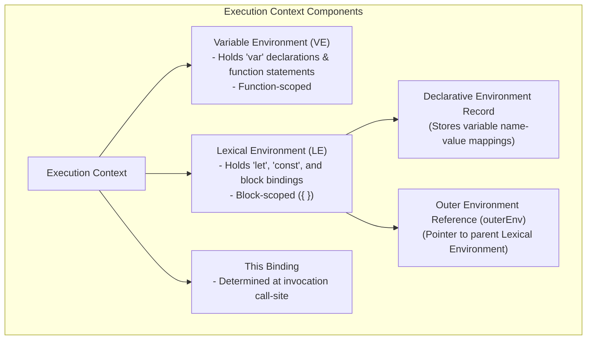
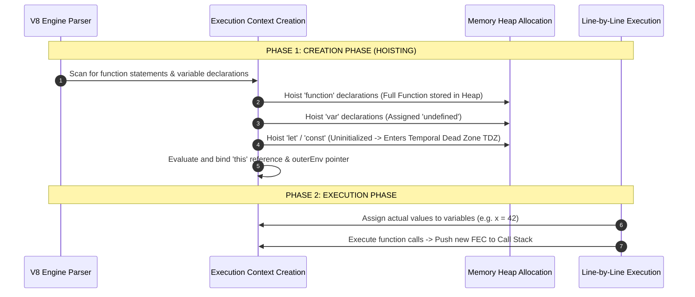
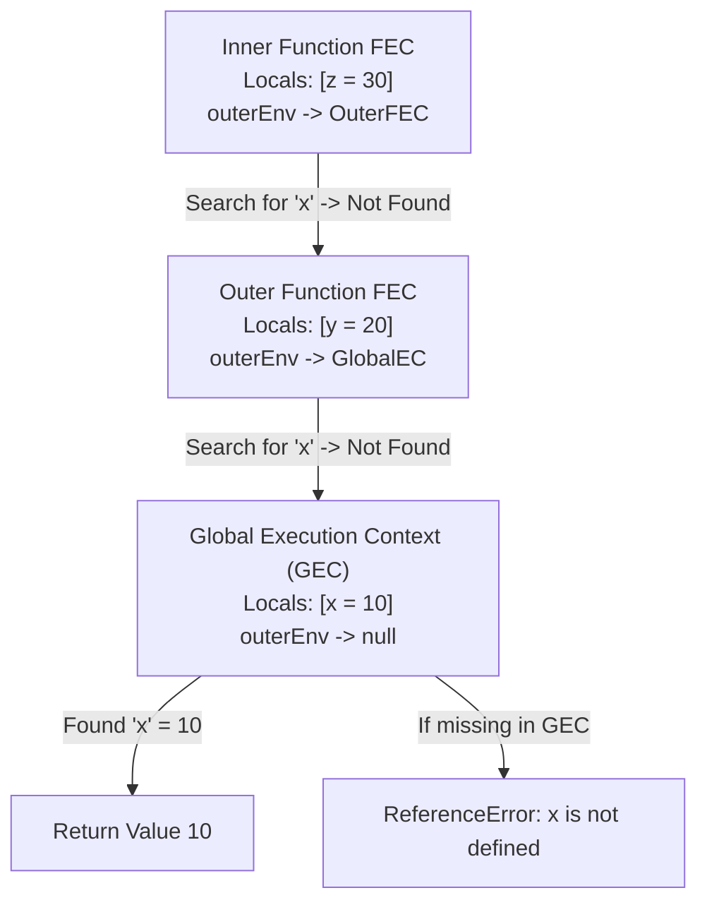

# Module 04: Execution Context, Environment Records, and Scope Chain Resolution

## Overview

An **Execution Context (EC)** is an abstract specification wrapper instantiated by the JavaScript engine whenever code is evaluated or executed.

Every active execution context manages local variable bindings, scope chain references (`outerEnv`), and `this` binding rules. Understanding how the engine creates, pushes, evaluates, and pops execution contexts is essential for mastering **Hoisting**, the **Temporal Dead Zone (TDZ)**, **Closures**, and dynamic **`this` Binding**.

---

## 1. Execution Context Architecture & Specification Components

According to the ECMA-262 specification, every Execution Context consists of three primary internal components:



### The Three Execution Context Types

1. **Global Execution Context (GEC)**: Instantiated automatically when the runtime starts. Exactly **one** GEC exists per worker/tab. Creates the global object (`window` in browsers, `global` in Node.js, `globalThis` in modern JS).
2. **Function Execution Context (FEC)**: Instantiated every time a function is **invoked** (not defined). Creates an `arguments` object and maps parameters to local variable slots.
3. **Eval Execution Context**: Instantiated when code is executed dynamically inside `eval()` strings (discouraged due to security vulnerabilities and V8 optimization bailouts).

---

## 2. Execution Context Lifecycle: Creation Phase vs. Execution Phase



### Creation Phase (Hoisting & TDZ) Rules
- **Function Declarations**: Fully hoisted into memory. Can be called anywhere within their scope before definition.
- **`var` Variables**: Hoisted and initialized to `undefined`. Accessing them before declaration returns `undefined`.
- **`let` / `const` Variables**: Hoisted into the Environment Record, but **left uninitialized**. Accessing them before line of declaration throws a `ReferenceError` due to the **Temporal Dead Zone (TDZ)**.

---

## 3. Scope Chain Traversal Architecture

When a variable is referenced, V8 searches the current Execution Context's Lexical Environment. If the key is missing, it follows the `outerEnv` link up the **Scope Chain** until reaching the Global Execution Context:



---

## 4. The `this` Binding Call-Site Evaluation Matrix

Except for **Arrow Functions**, the value of `this` is evaluated dynamically at runtime based on **how the function was invoked** (call-site):

```mermaid
flowchart TD
    CallSite[Function Invocation Call-Site] --> IsNew{Called with 'new'?}
    IsNew -- Yes --> NewBinding["this = Newly constructed Object instance"]
    IsNew -- No --> IsExplicit{Called with call(), apply(), or bind()?}
    IsExplicit -- Yes --> ExplicitBinding["this = Object passed as explicit argument"]
    IsExplicit -- No --> IsMethod{Called as obj.method()?}
    IsMethod -- Yes --> MethodBinding["this = Object before the dot"]
    IsMethod -- No --> IsArrow{Is Arrow Function?}
    IsArrow -- Yes --> ArrowBinding["this = Lexically inherited from outer parent scope"]
    IsArrow -- No --> DefaultBinding["this = globalThis (or undefined in Strict Mode)"]
```

---

## 5. Production Code Demonstrating Execution Contexts & TDZ

```javascript
// 1. Hoisting & Temporal Dead Zone (TDZ) Demonstration
function testHoistingAndTDZ() {
  console.log("Hoisted var value:", hoistedVar); // Output: undefined (var hoisted!)
  // console.log("TDZ let value:", tdzLet);      // Uncaught ReferenceError: Cannot access 'tdzLet' before initialization

  var hoistedVar = "I am a var!";
  let tdzLet = "I am a let inside TDZ!";
}

testHoistingAndTDZ();

// 2. Block Scoping in Loops (Per-Iteration Lexical Environment Creation)
function loopScopeDifference() {
  const varCallbacks = [];
  const letCallbacks = [];

  // Bug with var: All closures capture SAME single variable in Function Environment Record
  for (var i = 0; i < 3; i++) {
    varCallbacks.push(() => i);
  }

  // Fix with let: Engine instantiates a NEW Lexical Environment for each iteration!
  for (let j = 0; j < 3; j++) {
    letCallbacks.push(() => j);
  }

  console.log("var loop results:", varCallbacks.map(fn => fn())); // [3, 3, 3]
  console.log("let loop results:", letCallbacks.map(fn => fn())); // [0, 1, 2]
}

loopScopeDifference();

// 3. Dynamic 'this' Binding Matrix
const userProfile = {
  name: "Amit",
  getRegularName: function() {
    return this.name;
  },
  getArrowName: () => {
    return this ? this.name : undefined; // Inherits lexical outer scope 'this'
  }
};

console.log("Method Invocation  :", userProfile.getRegularName()); // "Amit"
const detachedGet = userProfile.getRegularName;
console.log("Detached Invocation:", detachedGet());               // undefined (Strict Mode)
console.log("Explicit Binding   :", detachedGet.call(userProfile)); // "Amit"
```

---

## Key Production Takeaways

1. **Avoid `var` Declarations**: Use `let` and `const` exclusively. Block scoping creates safer Lexical Environments and eliminates variable pollution bugs across loops.
2. **Respect the Temporal Dead Zone (TDZ)**: Declare all variables at the top of their enclosing scope block before referencing them to avoid runtime `ReferenceError` crashes.
3. **Use Arrow Functions for Lexical `this` Preservation**: Arrow functions do not instantiate their own `this` binding slot; they lexically capture `this` from their outer parent scope, making them ideal for callbacks.
4. **Use Explicit Binding (`bind`/`call`/`apply`) for Callbacks**: When passing class methods as async callbacks, bind `this` explicitly to avoid detached invocation errors where `this` becomes `undefined`.

