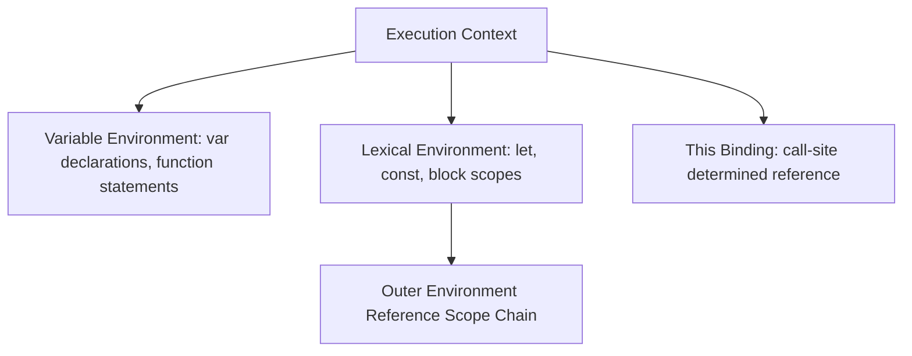
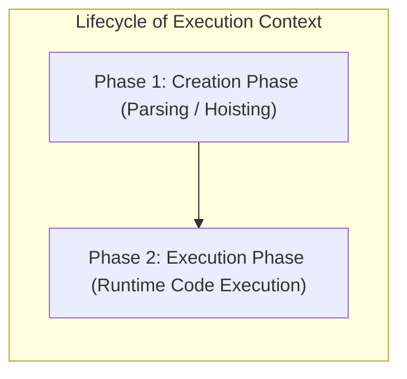
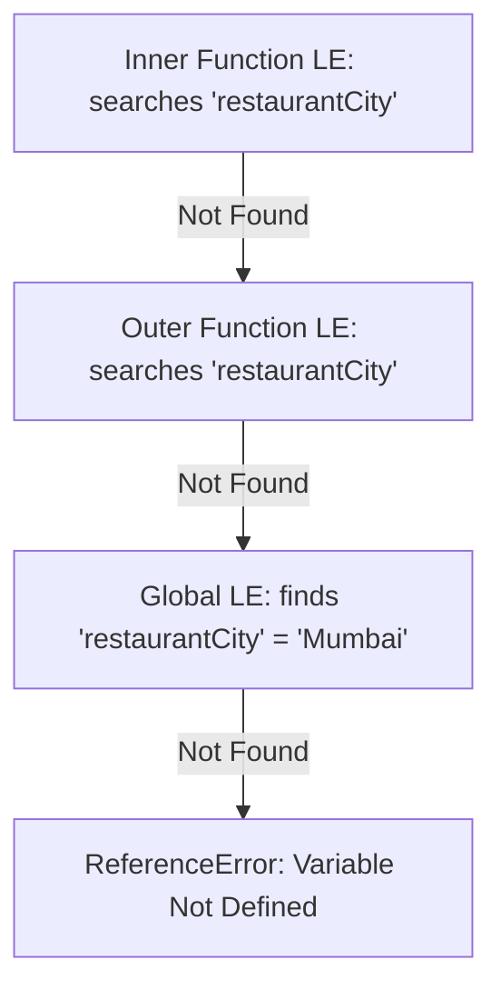

# File 04: Execution Context

## Overview
An **Execution Context (EC)** is an abstract environment created by the JavaScript engine to evaluate and execute code. Every piece of running JavaScript code executes inside an execution context that manages local variables, scope resolution chains, and `this` binding.

---

## 1. Execution Context Structure & Types

### Structure of an Execution Context



### The Three Types of Execution Contexts
1. **Global Execution Context (GEC)**: Created when the script initially loads. Exactly **one** GEC exists per runtime process.
2. **Function Execution Context (FEC)**: Created every time a function is **invoked** (not defined).
3. **Eval Execution Context**: Created when code is executed inside an `eval()` string (discouraged in modern JS).

```javascript
var globalVar = "Global Scope";

function outerFunction() {
    var outerVar = "Outer Function Scope";
    function innerFunction() {
        var innerVar = "Inner Function Scope";
        console.log(innerVar);
        console.log(outerVar);  // Resolved via Scope Chain
        console.log(globalVar); // Resolved via Scope Chain
    }
    innerFunction();
}
outerFunction();
```

---

## 2. Creation Phase vs Execution Phase
Every Execution Context goes through two distinct lifecycle phases:



### Phase 1: Creation Phase
- The engine scans for variable and function declarations.
- `var` variables are allocated and assigned `undefined` (**Hoisting**).
- `function` declarations are stored in memory with their complete implementation (**Full Hoisting**).
- `let` and `const` variables are allocated but uninitialized, entering the **Temporal Dead Zone (TDZ)**.

### Phase 2: Execution Phase
- Source code executes line by line.
- Variables are assigned real values.
- Functions are called, instantiating new Function Execution Contexts.

```javascript
console.log(greet("Priya")); // "Hello, Priya!" (Function declaration fully hoisted)
console.log(userName);       // undefined (var hoisted, not assigned yet)
// console.log(userCity);   // ReferenceError: Cannot access 'userCity' before initialization (TDZ!)

var userName = "Rajesh";
let userCity = "Bengaluru";
function greet(name) { return `Hello, ${name}!`; }
```

---

## 3. Variable Environment (VE) vs Lexical Environment (LE)
- **Variable Environment (VE)**: Stores `var` declarations and function statements. Inherently **function-scoped**.
- **Lexical Environment (LE)**: Stores `let` and `const` bindings. Supports **block scoping** (`{}`).

```javascript
function scopeDemo() {
    var funcScoped = "Stored in VE";
    let blockScoped = "Stored in LE";

    if (true) {
        var leakedVar = "var leaks through block boundaries!"; // VE (Function-scoped)
        let scopedLet = "Stays trapped inside if block";        // Block LE
    }

    console.log(leakedVar);  // Accessible!
    // console.log(scopedLet); // ReferenceError!
}
scopeDemo();
```

---

## 4. Scope Chain Resolution

When a variable is accessed, the engine searches the local Lexical Environment. If not found, it traverses the outer environment reference up the **Scope Chain** until reaching the Global Environment.



```javascript
const restaurantCity = "Mumbai";

function processOrder(orderId) {
    const orderType = "delivery";
    function calculateFee(distance) {
        const baseFee = 30;
        console.log(`Order #${orderId}, Type: ${orderType}, City: ${restaurantCity}`);
        console.log(`Calculated Fee: Rs ${baseFee + distance * 5}`);
    }
    calculateFee(3);
}
processOrder(1001);
```

---

## 5. The `this` Binding Rules
The value of `this` inside an execution context is evaluated during the **Creation Phase** based on how the function was **invoked (call-site)**:

```mermaid
flowchart TD
    CallSite[Function Call Site] --> IsNew{Called with 'new'?}
    IsNew -- Yes --> NewThis["this = Newly created object instance"]
    IsNew -- No --> IsExplicit{Called with call/apply/bind?}
    IsExplicit -- Yes --> ExplicitThis["this = Argument passed to call/bind"]
    IsExplicit -- No --> IsMethod{Called as obj.method()?}
    IsMethod -- Yes --> MethodThis["this = Object before the dot"]
    IsMethod -- No --> IsArrow{Is Arrow Function?}
    IsArrow -- Yes --> ArrowThis["this = Inherited from parent lexical scope"]
    IsArrow -- No --> DefaultThis["this = globalThis (undefined in strict mode)"]
```

```javascript
const ride = {
    id: "RIDE-5001",
    driver: "Amit",
    getInfo: function() { return `${this.driver} is driving ${this.id}`; },
    getInfoArrow: () => { return `Arrow this inherits outer scope!`; }
};

console.log(ride.getInfo());      // Method invocation -> this = ride
console.log(ride.getInfoArrow()); // Arrow function -> lexical parent this
const boundFn = ride.getInfo.bind(ride);
console.log(boundFn());           // Explicit binding -> this = ride
```

---

## 6. Block Scoping in Loops
Using `var` in loops shares **one global/function variable** across iterations. Using `let` creates a **new Lexical Environment per iteration**, solving closure-in-loop bugs.

```javascript
// Bug with var (single shared variable)
var varFunctions = [];
for (var i = 0; i < 3; i++) {
    varFunctions.push(function() { return i; });
}
console.log(varFunctions.map(f => f())); // [3, 3, 3]

// Fix with let (new Lexical Environment created each loop turn)
let letFunctions = [];
for (let j = 0; j < 3; j++) {
    letFunctions.push(function() { return j; });
}
console.log(letFunctions.map(f => f())); // [0, 1, 2]
```

---

## 7. Temporal Dead Zone (TDZ) & Closures
- **TDZ**: The region between variable allocation (Creation Phase) and actual initialization (Execution Phase).
- **Closures**: Functions retain references to their parent Execution Context's Lexical Environment even after the parent function has finished executing and popped off the Call Stack.

```javascript
function createCounter(initial) {
    let count = initial; // Captured in Closure Lexical Environment
    return {
        increment: () => ++count,
        decrement: () => --count,
        getCount: () => count,
    };
}

const counter = createCounter(0);
console.log(counter.increment()); // 1
console.log(counter.increment()); // 2
console.log(counter.getCount());   // 2
```

---

## Key Takeaways
1. Execution Contexts contain a **Variable Environment**, **Lexical Environment**, and **`this` Binding**.
2. Lifecycles consist of a **Creation Phase** (hoisting & scope creation) and **Execution Phase** (line-by-line runtime).
3. `var` is function-scoped (VE); `let`/`const` are block-scoped (LE).
4. `this` binding depends strictly on **call-site syntax** (except for arrow functions, which are lexical).
5. Closures keep outer Lexical Environments alive in heap memory long after their Execution Contexts pop off the Call Stack.
