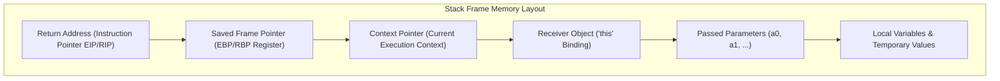
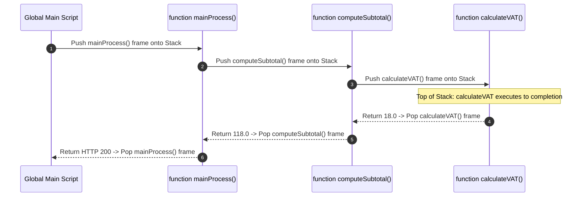

# Module 05: Call Stack Deep Dive — Frame Anatomy, Stack Overflows, and Asynchronous Stack Isolation

## Overview

The **Call Stack** is a core **LIFO (Last-In, First-Out)** data structure allocated by the operating system and managed by the JavaScript engine to track active function invocations, local variables, and return addresses.

Because JavaScript single-threaded execution is strictly bound to the call stack, understanding **Stack Frame Layout**, **Maximum Stack Depths**, **Stack Unwinding**, **Trampolining**, and **Async Stack Isolation** is essential for building resilient, crash-free applications.

---

## 1. Call Stack Frame Anatomy & Execution Lifecycle

Whenever a function is invoked, V8 pushes a new **Stack Frame** onto the top of the Call Stack:

```mermaid
graph BT
    subgraph Active Call Stack Frame Memory (LIFO)
        Frame3["Frame 3: calculateTax(amount)  <-- TOP (Active CPU Register Execution)"]
        Frame2["Frame 2: processCart(items)     <-- Waiting (Return Address saved)"]
        Frame1["Frame 1: handleCheckout(req)   <-- Waiting (Return Address saved)"]
        GECFrame["Global Execution Frame        <-- BOTTOM (Script Entry Point)"]
    end
```

### V8 Low-Level Stack Frame Anatomy

A single V8 stack frame contains the following low-level CPU register mappings:



1. **Return Address (EIP/RIP)**: Stores the memory address of the next assembly instruction to execute after the function returns.
2. **Saved Frame Pointer (EBP/RBP)**: Pointer to the previous stack frame base, enabling frame traversal during debugging.
3. **Context Pointer**: Pointer to the current function's Lexical Environment and Scope Record in memory.
4. **Passed Parameters & Arguments**: Values passed into the function call.
5. **Local Variables**: Primitive values and object reference pointers declared inside the function.

---

## 2. Call Stack Invocation & Unwinding Sequence



---

## 3. Stack Overflow & Memory Limits

A **Stack Overflow** occurs when recursive function calls push stack frames continuously without reaching a base condition, exhausting the OS thread stack memory limit:

```javascript
// Function measuring V8 Maximum Call Stack Depth
function measureMaxStackDepth(currentDepth = 0) {
  try {
    return measureMaxStackDepth(currentDepth + 1);
  } catch (err) {
    return currentDepth; // Catches RangeError: Maximum call stack size exceeded
  }
}

console.log(`V8 Maximum Call Stack Depth: ~${measureMaxStackDepth(0)} frames`);
// Typical V8 Node.js limit: ~10,000 to 12,000 frames
```

### Stack Memory Limits by Runtime Environment
- **Node.js / V8**: $\sim 10,000 – 12,000$ stack frames.
- **Chrome V8**: $\sim 10,000$ stack frames.
- **Safari JavaScriptCore**: $\sim 40,000 – 50,000$ stack frames.

---

## 4. Mitigating Stack Overflows: Trampolining Architecture

To execute deep recursive algorithms without exceeding maximum call stack limits, engineers use **Trampolining**.

A trampoline converts recursive calls into a `while` loop, keeping stack frame depth capped at **1**:

```javascript
// 1. Unsafe Recursion: Throws RangeError for n = 100,000!
function unsafeFactorial(n, acc = 1n) {
  if (n <= 1n) return acc;
  return unsafeFactorial(n - 1n, n * acc);
}

// 2. Trampoline Runner Function
function trampoline(fn) {
  let result = fn;
  // Loop continuously unwinds thunk functions without growing the call stack!
  while (typeof result === "function") {
    result = result();
  }
  return result;
}

// 3. Trampolined Tail-Call Component (Returns a Thunk Function instead of recursing directly)
function trampolinedFactorial(n, acc = 1n) {
  if (n <= 1n) return acc;
  return () => trampolinedFactorial(n - 1n, n * acc); // Returns Thunk () => fn
}

// Verification: Executes 100,000 iterations safely in O(1) Call Stack Space!
const safeBigFactorial = trampoline(() => trampolinedFactorial(100000n));
console.log("Safe Trampolined Factorial computed without stack overflow!");
```

---

## 5. Asynchronous Call Stack Isolation

Asynchronous callbacks (`setTimeout`, `Promise.then`, `fs.readFile`) **never execute on the call stack of the function that initiated them**.

They are offloaded to Web APIs / libuv, and their callbacks execute later on a **completely fresh, clean Call Stack**:

```mermaid
sequenceDiagram
    autonumber
    participant Stack as Main Call Stack
    participant NodeAPI as libuv Worker Thread
    participant Loop as Event Loop Queue
    participant Callback as Fresh Callback Stack Frame

    Stack->>NodeAPI: fs.readFile("data.json", callback)
    Note over Stack: Main function completes & Call Stack unwinds to EMPTY!
    
    NodeAPI->>Loop: File I/O ready -> Enqueue callback
    Loop->>Callback: Instantiate FRESH Call Stack Frame for callback()
    
    Note over Callback: Executed on completely separate stack context!
```

### Why `try/catch` Cannot Catch Asynchronous Errors

Because async callbacks run on a separate, fresh call stack long after the outer `try/catch` block has unwound and exited, surrounding async calls with synchronous `try/catch` fails silently:

```javascript
// BROKEN: try/catch cannot catch error from a fresh stack frame!
try {
  setTimeout(() => {
    // Throws error on a completely separate, fresh call stack frame
    // throw new Error("Async Database Failure!"); 
  }, 100);
} catch (err) {
  console.log("This catch block WILL NEVER RUN!");
}

// FIXED: Handle errors within Promises / Async-Await
async function safeAsyncOperation() {
  try {
    await new Promise((_, reject) => {
      setTimeout(() => reject(new Error("Async Failure Caught!")), 100);
    });
  } catch (err) {
    console.log("Properly caught async error:", err.message);
  }
}

safeAsyncOperation();
```

---

## Key Production Takeaways

1. **Avoid Deep Unbounded Recursion**: Rely on iterative `while`/`for` loops or trampolining to safely process large data structures in JavaScript without exceeding V8's $\sim 10,000$ stack frame limit.
2. **Understand Asynchronous Stack Boundaries**: Synchronous `try/catch` blocks cannot catch errors thrown inside asynchronous callbacks due to call stack unwinding. Always use `async/await` with `try/catch` or return rejected Promises.
3. **Utilize `console.trace()` for Stack Inspection**: Call `console.trace("Debugger Marker")` to inspect the exact execution frame chain leading to a critical code path.
4. **Beware of Tail Call Optimization (TCO) Limitations**: TCO is specified in ES6 but implemented **only by Safari (JSC)**. V8 and SpiderMonkey do not perform automatic TCO optimization.

