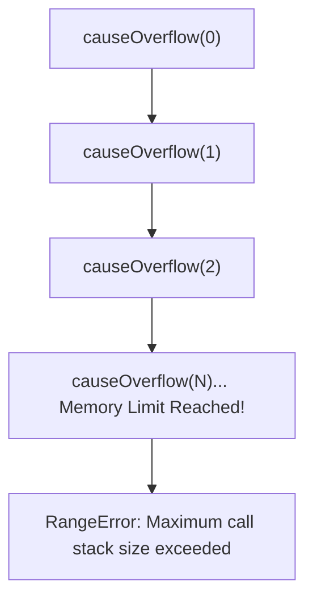

# File 05: Call Stack Deep Dive

## Overview
The **Call Stack** is a fundamental **LIFO (Last-In, First-Out)** data structure maintained by the JavaScript engine to keep track of active function invocations. Because JavaScript is single-threaded, only the function execution frame at the top of the stack is actively executed at any given instant.

---

## 1. How the Call Stack Operates

```mermaid
graph BT
    subgraph Call Stack Structure (LIFO)
        Frame3["applyDiscount()  <-- TOP: Currently Executing"]
        Frame2["calculateFare()  <-- Waiting"]
        Frame1["validateUser()   <-- Waiting"]
        GlobalFrame["Global Execution Frame  <-- BOTTOM"]
    end
```

### Stack Frame Contents
Each stack frame contains:
1. **Function Reference & Return Address** (where CPU should return after execution).
2. **Arguments & Parameters** passed into the call.
3. **Local Variables** declared within the function.
4. **Execution Context Reference** (Lexical Environment & Scope Chain pointers).

```javascript
function validateUser(userId) {
    console.log("  [PUSH] validateUser frame");
    const isValid = checkSeat(userId);
    console.log("  [POP]  validateUser frame");
    return isValid;
}

function checkSeat(userId) {
    console.log("  [PUSH] checkSeat frame");
    const fare = calculateFare("2A", 42);
    console.log("  [POP]  checkSeat frame");
    return fare > 0;
}

function calculateFare(coach, seat) {
    console.log("  [PUSH] calculateFare frame");
    const result = 500 * 0.9;
    console.log("  [POP]  calculateFare returns:", result);
    return result;
}

validateUser("USR-101");
```

---

## 2. Inspecting the Call Stack
Developers can inspect the active call stack programmatically using `console.trace()` or capturing an `Error().stack` property.

```javascript
function processOrder() { calculateTotal(); }
function calculateTotal() { addTax(); }
function addTax() {
    console.trace("Execution Trace inside addTax");
    const stack = new Error().stack;
    console.log("\nError.stack trace snippet:\n" + stack.split('\n').slice(0, 4).join('\n'));
}

processOrder();
```

---

## 3. Stack Overflow
When recursive function calls push stack frames continuously without reaching a base case, the engine exhausts its allocated memory limit for the call stack, throwing a `RangeError: Maximum call stack size exceeded`.



```javascript
function measureStackDepth(depth) {
    try { 
        return measureStackDepth(depth + 1); 
    } catch (e) { 
        return depth; 
    }
}

console.log(`Max Stack Depth Limit: ~${measureStackDepth(0)} frames`);
// Typical limit in V8 / Node.js: ~10,000 to 25,000 frames
```

---

## 4. Tail Call Optimization (TCO)
In **Tail Call Optimization**, if the final return statement of a function is another function call (**Tail Position**), the engine can discard the current stack frame and reuse its memory space.

```javascript
// Tail-recursive: Final operation IS the call itself (TCO eligible)
function factorialTail(n, acc = 1) {
    if (n <= 1) return acc;
    return factorialTail(n - 1, n * acc); // Tail position
}

// Non-Tail recursive: Multiplication occurs AFTER recursion returns
function factorialNonTail(n) {
    if (n <= 1) return 1;
    return n * factorialNonTail(n - 1); // NOT tail position
}
```

> **Note**: TCO is specified in ES6, but currently implemented **only by Safari (JavaScriptCore)**. V8 and SpiderMonkey do not support TCO due to debugging and call trace complexities.

---

## 5. Converting Recursion to Iteration & Trampolining

To safely process deep recursive workloads in engines without TCO, refactor code to use **Iteration** or a **Trampoline Pattern**.

### Iterative Flattening with Manual Array Stack
```javascript
function flattenIterative(root) {
    const result = [];
    const stack = [root]; // Heap-allocated array replacing Call Stack
    while (stack.length > 0) {
        const node = stack.pop();
        result.push(node.name);
        if (node.children) {
            for (let i = node.children.length - 1; i >= 0; i--) {
                stack.push(node.children[i]);
            }
        }
    }
    return result;
}
```

### Trampoline Pattern
A trampoline wraps recursive steps in thunk functions (`() => fn()`), allowing a simple `while` loop to execute them sequentially while keeping stack depth capped at **1**.

```javascript
function trampoline(fn) {
    let result = fn;
    while (typeof result === 'function') {
        result = result();
    }
    return result;
}

function trampolinedFactorial(n, acc = 1) {
    if (n <= 1) return acc;
    return () => trampolinedFactorial(n - 1, n * acc); // Returns thunk function
}

const result = trampoline(() => trampolinedFactorial(100));
console.log("Safe trampolined result computed without stack overflow!");
```

---

## 6. Asynchronous Execution and Stack Isolation
Asynchronous callbacks (such as `setTimeout` or `Promise.then`) **never run on the call stack of the function that registered them**. They are offloaded to host APIs and placed into callback queues. When invoked by the Event Loop, they execute on a **completely fresh Call Stack**.

```mermaid
sequenceDiagram
    participant Stack as Call Stack
    participant Host as Web API / libuv
    participant Queue as Callback Queue
    participant Loop as Event Loop

    Stack->>Host: setTimeout(cb, 100)
    Note over Stack: Function returns & stack empties completely!
    Host->>Queue: 100ms elapses -> Queue cb
    Loop->>Stack: Stack is empty -> Push cb onto stack
    Note over Stack: Callback executes on FRESH Call Stack
```

```javascript
function syncFlow() {
    console.log("Sync Step 1");
    console.log("Sync Step 2 (Same Call Stack)");
}

function asyncFlow() {
    console.log("Async Step 1");
    setTimeout(() => {
        console.log("Async Step 3 (Executes on a NEW fresh Call Stack)");
    }, 0);
    console.log("Async Step 2 (Stack unwinds)");
}
```

---

## Key Takeaways
1. The **Call Stack** manages execution order via LIFO stack frames.
2. Exhausting call stack memory causes a `RangeError: Maximum call stack size exceeded`.
3. **Tail Call Optimization (TCO)** reuses frames for tail calls, but is supported only in WebKit/Safari.
4. Use **iterative algorithms** or **trampolining** to prevent stack overflows on deep datasets.
5. Asynchronous callbacks execute on a **fresh Call Stack** after the main synchronous stack empties.
