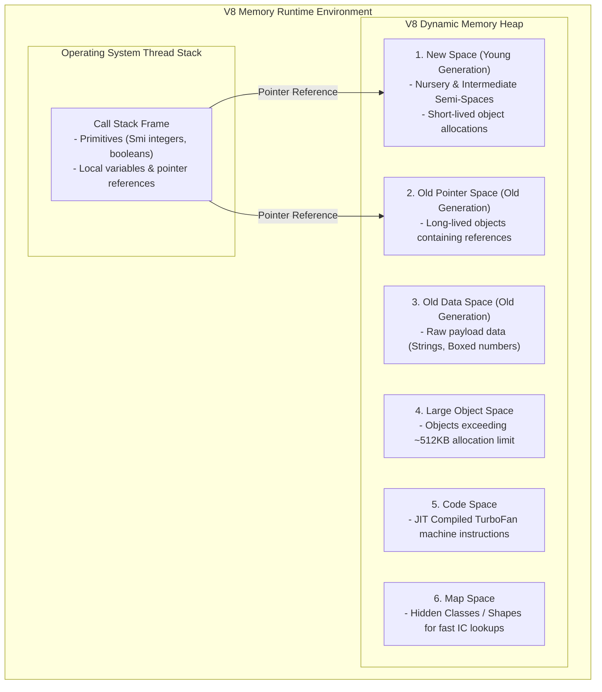

# Module 06: V8 Memory Model Architecture — Stack vs. Heap Spaces and Object Cloning

## Overview

The JavaScript engine partitions memory into two primary allocation spaces: the **Call Stack** (fast, fixed-size OS memory for execution frames and primitive values) and the **Memory Heap** (large, dynamic memory pool for objects, arrays, closures, and functions).

Understanding how V8 structures its **Heap Memory Spaces** (New Space, Old Space, Large Object Space, Code Space, Map Space), how **SMI (Small Integer) Tagging** operates, and how **Pass-by-Reference** mechanics impact Object Cloning is essential for writing memory-efficient applications.

---

## 1. V8 Memory Architecture: Call Stack vs. Heap Spaces



### Breakdown of V8 Memory Heap Spaces

1. **New Space (Young Generation)**: Allocated for fresh objects. Divided into two equal **Semi-Spaces** (From-Space and To-Space). Managed by the fast **Scavenger (Cheney's) Garbage Collector**.
2. **Old Pointer Space**: Stores objects that survived multiple Scavenger GC cycles and contain references to other heap objects.
3. **Old Data Space**: Stores raw bytes (raw text strings, raw byte buffers) that survived GC.
4. **Large Object Space**: Stores large allocation objects that exceed the New Space capacity limit. Promoted directly to avoid expensive GC copying overhead.
5. **Code Space**: Holds executable assembly code generated by TurboFan and Sparkplug JIT compilers.
6. **Map Space**: Contains V8 **Maps (Hidden Classes / Shapes)** that define property offsets for objects across the application.

---

## 2. V8 Smi (Small Integer) Tagging vs. Heap Pointers

In 64-bit V8 architectures, values stored in CPU registers and stack slots use a low-level optimization called **Pointer Tagging**:

```mermaid
graph LR
    subgraph Pointer Tagging Representation (64-Bit Memory Word)
        SmiWord["Smi (Small 31-bit Integer)<br/>[32-bit Payload Data | 31 Zeros | Bit 0 = 0]"]
        PtrWord["Heap Pointer Reference<br/>[63-bit Memory Address Pointer | Bit 0 = 1]"]
    end
```

- **Smi (Small Integer)**: If the Least Significant Bit (LSB) is `0`, V8 treats the word directly as a 31-bit signed integer stored in-place on the stack! Zero memory heap allocation required.
- **Heap Pointer**: If the Least Significant Bit (LSB) is `1`, V8 treats the word as a memory reference address pointing to an object in the Heap Space.

---

## 3. Pass-by-Value vs. Pass-by-Reference-Value

- **Primitives** (`number`, `string`, `boolean`, `symbol`, `bigint`, `null`, `undefined`) are immutable and copied by **Value**.
- **Objects & Arrays** are copied by **Reference Value** (the memory pointer address on the stack is copied, pointing to the same underlying heap object).

```mermaid
flowchart TD
    subgraph Shallow Copy Pointer Aliasing ({...obj})
        StackVarA["Original Var (Ref: 0x7F001)"] --> HeapObj["Heap Object at 0x7F001<br/>{ user: 'Amit', settings: { theme: 'dark' } }"]
        StackVarB["Shallow Copy (Ref: 0x7F002)"] --> ShallowObj["Heap Object at 0x7F002<br/>{ user: 'Amit', settings: Pointer 0x999 }"]
        ShallowObj -->|Nested Property Aliased!| NestedObj["Nested Settings Object at 0x999<br/>{ theme: 'dark' }"]
        HeapObj -->|Shares Identical Memory Pointer!| NestedObj
    end
```

---

## 4. Object Cloning Comparison Matrix

| Cloning Strategy | Method Syntax | Handles Nested Objects | Copies Functions / Symbols | Solves Circular References | Performance Overhead |
| :--- | :--- | :--- | :--- | :--- | :--- |
| **Reference Copy** | `const b = a;` | No (Shared Pointer) | Yes | N/A | Instant ($\mathcal{O}(1)$) |
| **Shallow Copy** | `{ ...a }` / `Object.assign()` | **No** (Top-level only) | Yes | N/A | Fast ($\mathcal{O}(K)$) |
| **JSON Serialization**| `JSON.parse(JSON.stringify(a))` | Yes | **No** (Strips `undefined`/functions) | **Fails** (Throws Error) | Slow ($\mathcal{O}(N)$ text conversion) |
| **Native Deep Clone** | `structuredClone(a)` | **Yes (Full Deep Copy)** | No functions / Yes Symbols | **Yes (Handles cycles)** | Optimized ($\mathcal{O}(N)$ native C++) |

---

## 5. Production Demonstrations: Memory Pointer Mutations & `structuredClone()`

```javascript
// 1. Primitive Pass-by-Value vs Object Pass-by-Reference
let a = 10;
let b = a; // Independent Primitive Copy
b = 20;
console.log("Primitive 'a' unchanged:", a); // 10

const obj1 = { name: "Bengaluru", details: { status: "Active" } };
const obj2 = obj1; // Reference Copy
obj2.name = "Mumbai";
console.log("Mutated Shared Heap Object 'obj1.name':", obj1.name); // "Mumbai"

// 2. Shallow Copy ({...spread}) Danger Demonstration
const shallowCopy = { ...obj1 };
shallowCopy.details.status = "Suspended"; // Mutates shared nested object reference!
console.log("Original Nested Object Mutated via Shallow Copy:", obj1.details.status); // "Suspended"

// 3. Safe Deep Copy using native structuredClone()
const originalCart = {
  cartId: "CART-99",
  items: [{ id: 101, name: "Keyboard", price: 2500 }],
  createdAt: new Date()
};

const deepClonedCart = structuredClone(originalCart);
deepClonedCart.items[0].price = 3000;

console.log("Original Item Price Unchanged :", originalCart.items[0].price); // 2500
console.log("Deep Cloned Item Price Updated:", deepClonedCart.items[0].price); // 3000
```

---

## Key Production Takeaways

1. **Use `structuredClone()` for Safe Deep Copies**: Rely on the native ECMAScript `structuredClone()` method for deep object cloning. It handles nested structures, arrays, Dates, Maps, Sets, and circular references cleanly without data loss.
2. **Avoid `JSON.parse(JSON.stringify())` for Complex Objects**: JSON serialization strips `undefined` values, functions, `RegExp`, `Map`, `Set`, and throws errors on circular object structures.
3. **Understand Smi Tagging for Number Storage**: Small integers (Smis) are stored inline on the stack without heap allocation overhead, making integer counters faster than floating-point `HeapNumber` allocations.
4. **Be Wary of Nested Pointer Mutations**: Remember that `{...spread}` and `Object.assign()` perform shallow copies. Modifying nested properties on a shallow copy silently mutates the original object in the Memory Heap.

