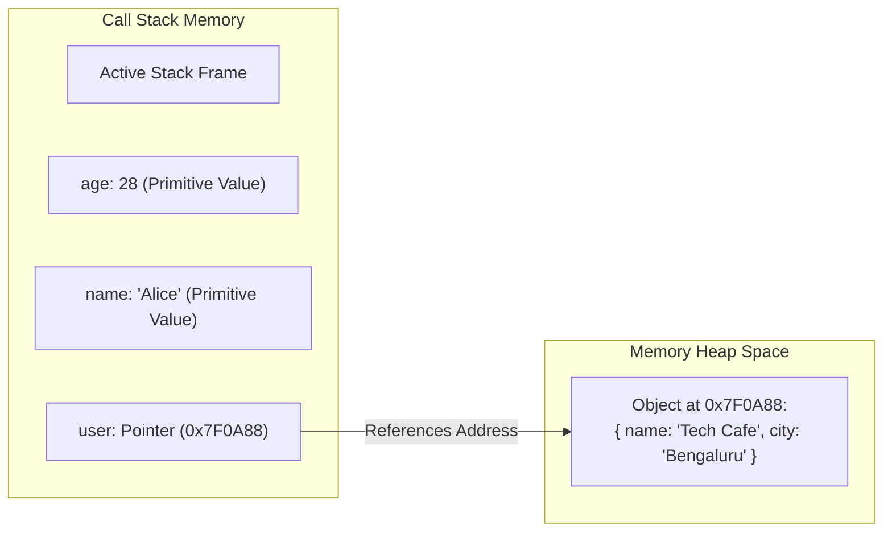
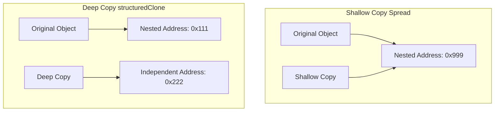

# File 06: Memory Model (Stack vs Heap)

## Overview
Understanding JavaScript's memory structure is essential for writing bug-free code. V8 splits memory allocation into two primary areas: the **Call Stack** (fast, fixed-size memory for primitives and call frames) and the **Memory Heap** (large, dynamic memory for reference objects).

---

## 1. Stack vs Heap Architecture



### Key Differences

| Feature | Call Stack Memory | Memory Heap Space |
| :--- | :--- | :--- |
| **Data Stored** | Primitives (`number`, `string`, `boolean`, `undefined`, `null`, `symbol`, `bigint`) and Heap Pointers | Objects, Arrays, Functions, Closures |
| **Allocation Speed**| Extremely fast (managed by hardware stack pointer) | Slower (dynamic memory search & allocation) |
| **Size Limit** | Fixed and small (~1MB-2MB per thread) | Large, configurable (up to 4GB+ in Node) |
| **Deallocation** | Instant when execution frame pops | Automated via Garbage Collection (GC) |

---

## 2. Primitive Values (Pass-by-Value)
Primitives are **immutable** and stored directly inline in execution stack slots. Copying a primitive copies the literal underlying value.

```javascript
let scoreA = 100;
let scoreB = scoreA; // Independent copy created on stack
scoreB = 200;

console.log(scoreA); // 100 (Unchanged!)
console.log(scoreB); // 200
```

---

## 3. Reference Types (Pass-by-Reference-Value)
Objects, Arrays, and Functions are stored in the **Heap**. Variable identifiers on the stack store a **memory reference (address pointer)** pointing to that heap location.

```javascript
let user1 = { name: "Alice", role: "Developer" };
let user2 = user1; // Copies memory reference pointer, NOT the object!

user2.role = "Lead"; // Mutates shared object in Heap
console.log(user1.role); // "Lead" (Mutated!)
console.log(user1 === user2); // true (Same heap memory address)

// Two objects with identical contents have DIFFERENT heap references
let objA = { x: 1 };
let objB = { x: 1 };
console.log(objA === objB); // false
```

---

## 4. Shallow Copy vs Deep Copy



### Shallow Copy (`{...obj}`, `Object.assign()`)
Copies top-level properties by value, but leaves nested objects sharing identical heap references.

### Deep Copy (`structuredClone()`)
Recursively duplicates the object tree, creating completely independent memory allocations in the heap.

```javascript
const merchant = {
    name: "Tech Cafe",
    address: { city: "Bengaluru", pin: "560001" },
    plans: ["basic", "premium"],
};

// SHALLOW COPY: Nested address property remains shared!
const shallow = { ...merchant };
shallow.address.city = "Mumbai";
console.log(merchant.address.city); // "Mumbai" (Mutated original!)

// DEEP COPY: Fully independent heap allocation
merchant.address.city = "Bengaluru"; // Reset
const deep = structuredClone(merchant);
deep.address.city = "Chennai";

console.log(merchant.address.city); // "Bengaluru" (Safe)
console.log(deep.address.city);     // "Chennai"
```

---

## 5. Copy Methods Matrix

```javascript
// Assignment: =                 -> Shares same reference (No copy)
// Spread operator: { ...obj }   -> Shallow copy (Top-level only)
// Object.assign({}, obj)        -> Shallow copy (Top-level only)
// JSON.parse(JSON.stringify())  -> Deep copy (Fails on functions, undefined, Map/Set)
// structuredClone(obj)          -> Modern Deep Copy (Recommended in modern JS)
```

---

## Key Takeaways
1. **Primitives** live directly on the **Call Stack** and are copied by value.
2. **Objects & Arrays** live in the **Memory Heap**; variables on the stack hold reference pointers.
3. Mutations through reference copies mutate the underlying shared object in the Heap.
4. **Shallow copies** (`{...spread}`) copy top-level keys only; nested objects remain linked.
5. Use `structuredClone()` for safe **deep copies** of nested objects.
