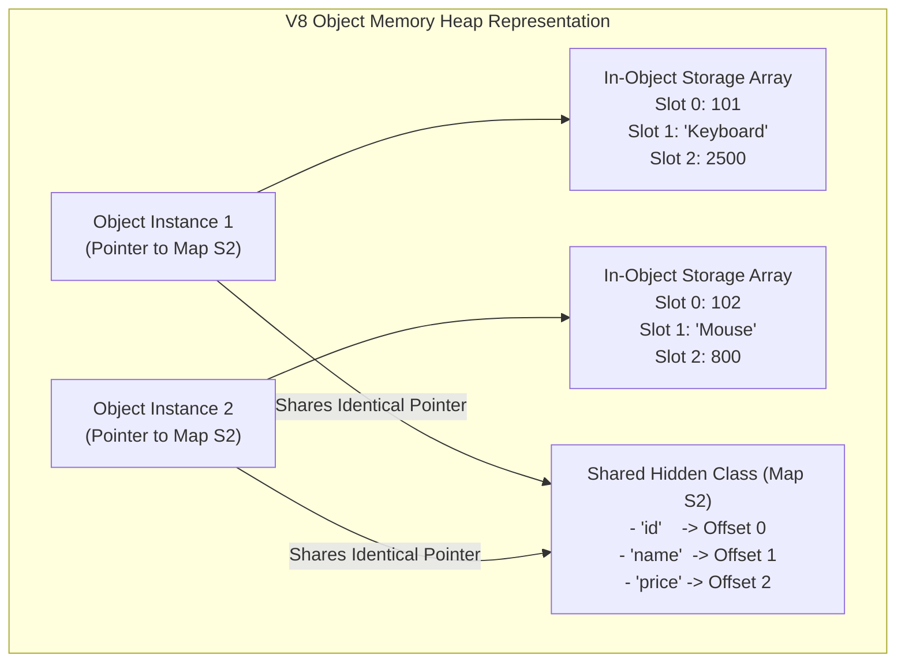
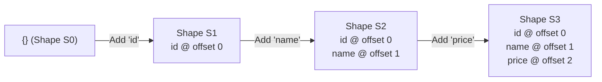
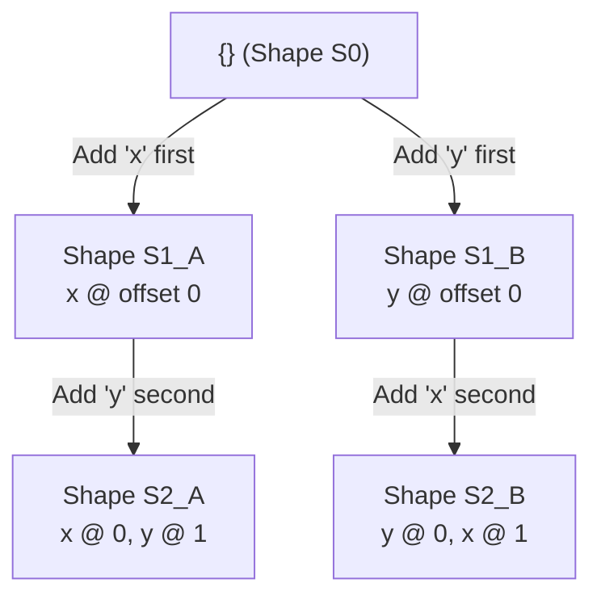
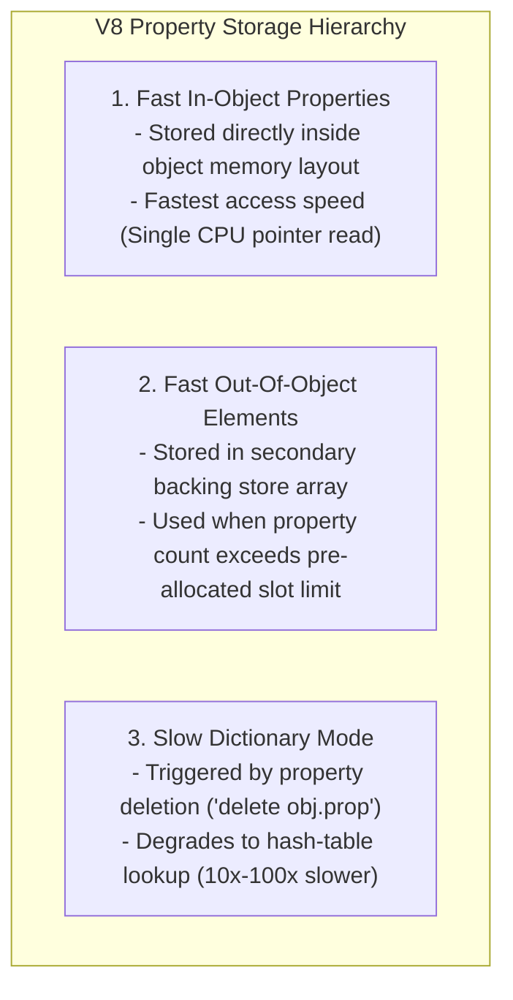

# Module 07: Hidden Classes, Shapes, and Property Storage Optimization

## Overview

Unlike statically typed languages (such as C++ or Rust) where struct memory offsets are determined at compile time, JavaScript objects are dynamic dictionaries whose properties can be added or deleted at runtime.

To achieve C++-like property access speed without dynamic hash table overhead, Google V8 creates implicit internal blueprints called **Hidden Classes** (also referred to as **Maps** or **Shapes**).

Understanding **Shape Transition Trees**, **In-Object Properties**, **Fast vs. Dictionary Modes**, and **Inline Cache (IC)** optimization allows engineers to write code that accesses object properties at native memory speed.

---

## 1. What is a V8 Hidden Class (Shape / Map)?

A **Hidden Class (Map)** is an internal C++ data structure instantiated by V8 to describe an object's memory structure.

Instead of storing property names repeatedly inside every object instance, the object stores a pointer to a shared Hidden Class Map containing property names, field types, and fixed numerical memory offsets:



---

## 2. Hidden Class Transition Trees

When an object is instantiated, it starts with an empty Shape (`S0`). As properties are added sequentially, V8 constructs a **Transition Tree**:



### Divergent Transition Trees (Property Order Anti-Pattern)

Adding identical properties in **different insertion orders** forces V8 to construct separate, divergent hidden class branches:



```javascript
// 1. Order A: Creates Shape Branch S2_A
function createPointA(x, y) {
  const p = {};
  p.x = x; // Adds 'x' first
  p.y = y;
  return p;
}

// 2. Order B: Creates Divergent Shape Branch S2_B!
function createPointB(x, y) {
  const p = {};
  p.y = y; // Adds 'y' first (Divergent shape created!)
  p.x = x;
  return p;
}

const pt1 = createPointA(10, 20);
const pt2 = createPointB(10, 20);
// pt1 and pt2 DO NOT share a hidden class! Inline Caches degrade to Polymorphic/Megamorphic.
```

---

## 3. Fast Properties (In-Object) vs. Slow Dictionary Properties

V8 uses three distinct internal storage modes for object properties:



| Storage Mode | Property Access Mechanism | Performance Speed | Trigger Conditions |
| :--- | :--- | :--- | :--- |
| **Fast In-Object** | Direct memory offset read from Hidden Class. | **$1.0\times$ (Fastest)** | Upfront property initialization. |
| **Fast Out-Of-Object**| Offset read from secondary backing store array. | $1.2\times$ overhead | Adding more than ~10-32 properties dynamically. |
| **Slow Dictionary** | Full hash-table key lookup on every access. | **$10\times – 100\times$ slower** | Using `delete obj.prop` or dynamic property insertion. |

---

## 4. The Performance Hazard of the `delete` Operator

Calling `delete obj.prop` removes a property from the middle of an object structure. Because V8 cannot adjust established memory offsets for other instances sharing the map, it **discards the Hidden Class Map** and forces the object into **Slow Dictionary Mode**:

```javascript
// BAD: Using 'delete' forces object into Slow Dictionary Mode!
function badCleanup(user) {
  delete user.tempToken; // Destroys Hidden Class! Degrades to dictionary hash table.
}

// GOOD: Assign 'undefined' or 'null' to preserve Hidden Class Map!
function goodCleanup(user) {
  user.tempToken = undefined; // Preserves Fast In-Object Hidden Class Map!
}
```

---

## 5. ES6 Classes Ensure Hidden Class Stability

ES6 classes enforce consistent property assignment inside `constructor` functions, guaranteeing that every instantiated instance shares the exact same V8 Hidden Class:

```javascript
class UserAccount {
  constructor(userId, username, email) {
    // Properties initialized in strict deterministic order
    this.userId = userId;
    this.username = username;
    this.email = email;
    this.status = "active"; // Upfront default value
  }
}

const user1 = new UserAccount(101, "Alice", "alice@example.com");
const user2 = new UserAccount(102, "Bob", "bob@example.com");
// Both user1 and user2 automatically share the exact same V8 Hidden Class Map!
```

---

## 6. Benchmark Demonstrating Shape Stability Impact

```javascript
function benchmarkShapeStability() {
  const iterations = 10_000_000;

  // Case 1: Monomorphic Array (Identical Shapes & Property Orders)
  const monomorphicArray = [];
  for (let i = 0; i < iterations; i++) {
    monomorphicArray.push({ id: i, score: i * 2, active: true });
  }

  const startMono = process.hrtime.bigint();
  let monoSum = 0;
  for (let i = 0; i < iterations; i++) {
    monoSum += monomorphicArray[i].score;
  }
  const endMono = process.hrtime.bigint();

  // Case 2: Megamorphic Array (Divergent Property Insertion Orders & Shapes)
  const megamorphicArray = [];
  for (let i = 0; i < iterations; i++) {
    const mode = i % 3;
    if (mode === 0) {
      megamorphicArray.push({ id: i, score: i * 2, active: true });
    } else if (mode === 1) {
      megamorphicArray.push({ score: i * 2, id: i, active: true }); // Swapped order
    } else {
      megamorphicArray.push({ active: true, id: i, score: i * 2 }); // Swapped order
    }
  }

  const startMega = process.hrtime.bigint();
  let megaSum = 0;
  for (let i = 0; i < iterations; i++) {
    megaSum += megamorphicArray[i].score;
  }
  const endMega = process.hrtime.bigint();

  console.log(`Monomorphic Same-Shape Execution : ${Number(endMono - startMono) / 1_000_000} ms`);
  console.log(`Megamorphic Divergent-Shape Time: ${Number(endMega - startMega) / 1_000_000} ms`);
}

benchmarkShapeStability();
```

---

## Key Production Takeaways

1. **Initialize Properties Upfront in Constructors**: Always declare all object properties upfront inside constructor functions or factory routines to avoid shape transition branches.
2. **Never Use `delete` in High-Frequency Paths**: Assign `undefined` or `null` instead of deleting properties to keep objects in Fast In-Object Property Mode.
3. **Use ES6 Classes for Deterministic Shapes**: ES6 class constructors enforce consistent property assignment order across all object instances.
4. **Maintain Consistent Property Insertion Orders**: When creating raw object literals (`{ x, y }`), ensure key order remains strictly uniform across the application to maximize Inline Cache hits.

