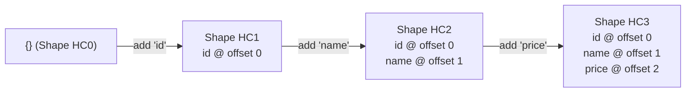
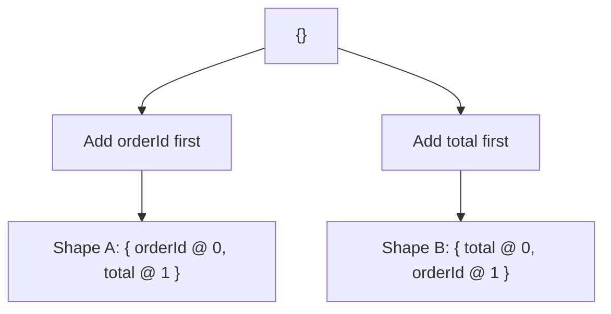

# File 07: Hidden Classes and Shapes

## Overview
Unlike languages like C++ or Java, JavaScript is dynamically typed, allowing properties to be added or removed from objects on the fly. To achieve C++-like property access speed, V8 creates internal, implicit hidden blueprints called **Hidden Classes (or Shapes / Maps)** that store property names, insertion order, and memory offsets.

---

## 1. What is a Hidden Class?
Instead of performing a hash table lookup every time an object property is accessed, V8 creates a **Hidden Class Transition Tree**.



```javascript
function createProduct(id, name, price) {
    const product = {};
    product.id = id;       // Transition: HC0 -> HC1
    product.name = name;   // Transition: HC1 -> HC2
    product.price = price; // Transition: HC2 -> HC3
    return product;
}

const product1 = createProduct(1, "iPhone 15", 79999);
const product2 = createProduct(2, "Samsung S24", 69999);
// Both instances share Shape HC3! V8 accesses product2.price instantly at offset 2.
```

---

## 2. Why Property Order Matters
Adding identical properties in **different orders** creates divergent hidden class chains, preventing V8 from reusing the same shape.



```javascript
function createOrderA(orderId, total) {
    const order = {};
    order.orderId = orderId; // orderId added first
    order.total = total;
    return order;
}

function createOrderB(orderId, total) {
    const order = {};
    order.total = total;     // total added first (Different order!)
    order.orderId = orderId;
    return order;
}

const orderA = createOrderA("ORD001", 450);
const orderB = createOrderB("ORD002", 799);
// orderA and orderB have DIFFERENT shapes! Double memory overhead and slower IC hits.
```

---

## 3. Inline Caching (IC) Mechanics
An **Inline Cache (IC)** stores property offset locations directly at the code site where property access occurs.

```javascript
function getBalance(wallet) {
    return wallet.balance; // IC site: Remembers 'balance' offset for wallet shape
}
```

### Inline Cache States

| IC State | # Shapes Observed | Execution Speed | Engine Behavior |
| :--- | :--- | :--- | :--- |
| **Monomorphic** | 1 Shape | **Fastest** | Direct CPU offset fetch |
| **Polymorphic** | 2 - 4 Shapes | **Fast** | Small switch statement checking shapes |
| **Megamorphic** | 5+ Shapes | **Slow** | Generic dictionary hash lookup |

```javascript
// Megamorphic IC Example (Slow Path)
function getName(obj) { return obj.name; }

const shapes = [
    { name: "Alice" },
    { name: "Bob", age: 25 },
    { name: "Charlie", city: "Delhi" },
    { name: "Diana", role: "admin" },
    { name: "Eve", score: 95 },
    { name: "Frank", x: 1, y: 2 },
];
shapes.forEach(obj => getName(obj)); // 6 shapes -> Megamorphic IC fallback!
```

---

## 4. The Danger of the `delete` Operator
Using `delete` removes a property from an object, which breaks the established shape transition chain and forces V8 to degrade the object into a **Slow Hash-Table Dictionary Mode**.

```javascript
// BAD: Using delete destroys Hidden Class fast mode
const orderBad = { id: 1, item: "Biryani", notes: "" };
delete orderBad.notes; // Object degraded to slow dictionary mode!

// GOOD: Set to undefined instead to preserve Shape
const orderGood = { id: 2, item: "Dosa", notes: "" };
orderGood.notes = undefined; // Preserves Hidden Class fast mode!
```

---

## 5. Best Practice: Upfront Property Initialization
Avoid conditionally adding properties to objects. Always declare all expected properties in the constructor or factory function upfront.

```javascript
// BAD: Conditional addition creates multiple hidden classes
function createItemBad(name, price, discount) {
    const item = { name, price };
    if (discount) item.discount = discount; // Divergent shapes created!
    return item;
}

// GOOD: Initialize all keys upfront with default values
function createItemGood(name, price, discount) {
    return {
        name,
        price,
        discount: discount || 0, // Uniform shape guaranteed!
    };
}
```

---

## 6. ES6 Classes are Shape-Friendly
ES6 classes automatically guarantee that every instance initializes properties in the exact same order inside the `constructor`.

```javascript
class Reward {
    constructor(userId, points, tier) {
        this.userId = userId;
        this.points = points;
        this.tier = tier;
        this.redeemed = false; // Guaranteed property order
    }
}

const r1 = new Reward("U100", 5000, "Gold");
const r2 = new Reward("U200", 12000, "Platinum");
// Both r1 and r2 share identical V8 hidden classes automatically!
```

---

## 7. Performance Benchmark
```javascript
function benchmarkSameShape() {
    const arr = [];
    for (let i = 0; i < 100000; i++) {
        arr.push({ id: i, name: "P" + i, price: i * 10 });
    }
    const start = process.hrtime.bigint();
    let total = 0;
    for (let i = 0; i < arr.length; i++) total += arr[i].price;
    const end = process.hrtime.bigint();
    return Number(end - start) / 1_000_000;
}

function benchmarkDifferentShapes() {
    const arr = [];
    for (let i = 0; i < 100000; i++) {
        const obj = {};
        if (i % 3 === 0) { obj.price = i * 10; obj.name = "P" + i; obj.id = i; }
        else if (i % 3 === 1) { obj.id = i; obj.price = i * 10; obj.name = "P" + i; }
        else { obj.name = "P" + i; obj.id = i; obj.price = i * 10; obj.extra = true; }
        arr.push(obj);
    }
    const start = process.hrtime.bigint();
    let total = 0;
    for (let i = 0; i < arr.length; i++) total += arr[i].price;
    const end = process.hrtime.bigint();
    return Number(end - start) / 1_000_000;
}

console.log(`Same Shape Time:      ${benchmarkSameShape().toFixed(2)} ms`);
console.log(`Different Shapes Time: ${benchmarkDifferentShapes().toFixed(2)} ms (Measurably Slower!)`);
```

---

## Key Takeaways
1. V8 creates internal **Hidden Classes (Shapes)** to store object property offsets for fast memory access.
2. Objects must add properties in the **exact same order** to share hidden classes.
3. **Inline Caches (ICs)** store property offsets; keep ICs **monomorphic** by passing consistent shapes.
4. **Never use `delete`** on hot objects; set values to `undefined` instead.
5. Use **ES6 classes** or initialize all properties in factory functions upfront.
