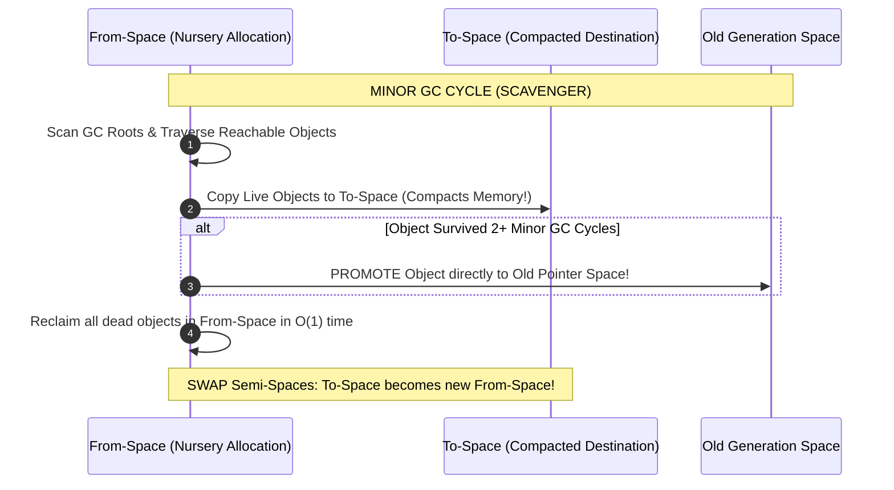
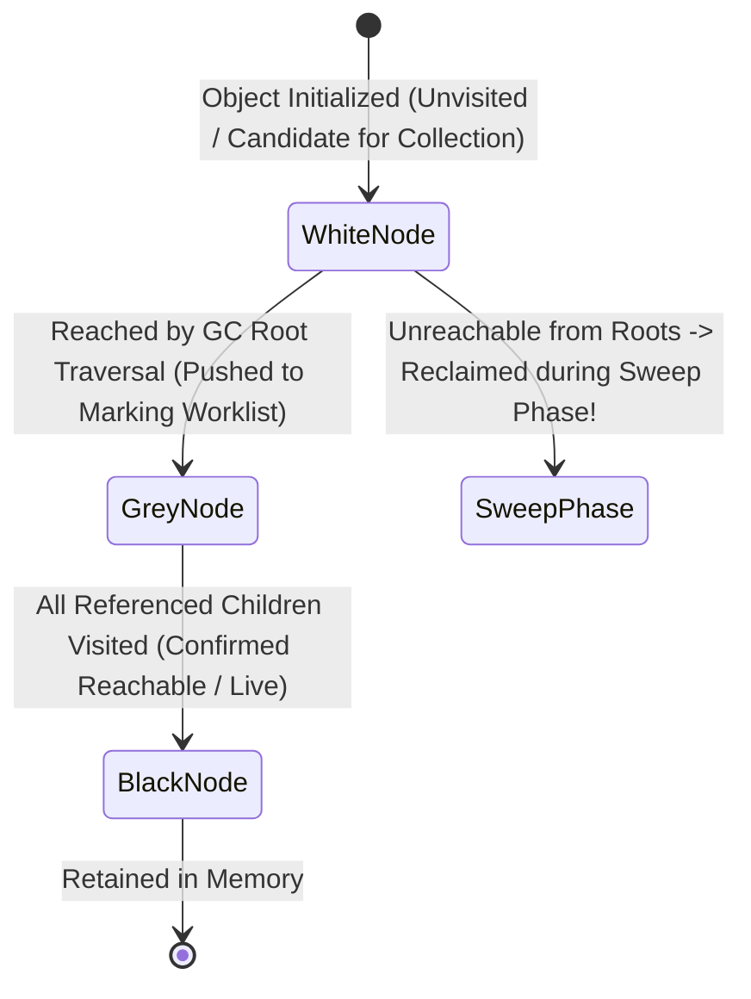

# Module 08: V8 Garbage Collection Architecture — Scavenger, Major GC, and Tri-Color Marking

## Overview

JavaScript features automated memory management. The V8 **Garbage Collector (GC)** runs continuously behind the scenes to discover unreachable heap allocations and reclaim memory without explicit manual `free()` operations.

Understanding V8 Garbage Collection internals—including the **Weak Generational Hypothesis**, **Cheney's Scavenger Algorithm**, **Mark-Sweep-Compact**, **Tri-Color Marking**, and **Write Barriers**—is essential for minimizing **Stop-The-World (STW)** execution pauses and eliminating Out-Of-Memory (OOM) backend crashes.

---

## 1. The Generational Hypothesis & V8 Heap Partitioning

V8 structures its Memory Heap based on the empirical **Weak Generational Hypothesis**: *The vast majority of objects die shortly after allocation (temporary loop variables, promises, local stack scope objects).*

```mermaid
flowchart TD
    subgraph V8 Generational Memory Architecture
        subgraph Young Generation (New Space ~1MB - 64MB)
            Nursery["Nursery Semi-Space (From-Space)<br/>- Fresh Object Allocations"]
            Intermediate["Intermediate Semi-Space (To-Space)<br/>- Survived 1 Scavenger Cycle"]
        end

        subgraph Old Generation (Old Space ~Hundreds of MBs)
            OldPointer["Old Pointer Space<br/>- Survived 2 Scavenger GC Cycles"]
            OldData["Old Data Space<br/>- Raw Byte Payloads (Strings/Buffers)"]
            LargeObj["Large Object Space<br/>- Allocations > ~512KB"]
        end
    end

    Nursery -->|Scavenger Cycle 1| Intermediate
    Intermediate -->|Scavenger Cycle 2 Promotion| OldPointer
```

---

## 2. Young Generation: Cheney's Scavenger Copying Algorithm

New objects are allocated in the **New Space Nursery**. When the Nursery fills up, V8 triggers a **Minor GC (Scavenger)** using **Cheney's Copying Algorithm**:



### Key Advantages of Scavenger
- **Fast $\mathcal{O}(\text{Live Objects})$ Runtime**: Scavenger only visits surviving objects. Dead objects are discarded instantly when semi-spaces swap.
- **Zero Memory Fragmentation**: Copying objects sequentially into To-Space naturally compacts memory addresses.

---

## 3. Old Generation: Major GC & Tri-Color Marking Model

When the Old Space reaches dynamic memory thresholds, V8 triggers a **Major GC (Mark-Sweep-Compact)** using the **Tri-Color Marking Model**:



### Tri-Color Marking Node States

- **White Nodes**: Unvisited objects. At the end of the marking phase, all remaining White objects are unreachable and swept.
- **Grey Nodes**: Objects visited by GC, but whose referenced child objects have not yet been evaluated.
- **Black Nodes**: Confirmed live objects whose child references have all been fully inspected.

---

## 4. Concurrent Marking, Parallel Sweeping, and Write Barriers

Traditional Garbage Collectors caused disruptive **Stop-The-World (STW)** pauses ($\sim 100\text{ms+}$) that froze UI animations and API response threads.

Modern V8 uses **Concurrent & Parallel Garbage Collection**:

```mermaid
gantt
    title V8 Concurrent & Parallel GC Execution Timeline
    dateFormat ss
    section Main Execution Thread
    JavaScript Execution Loop :a1, 00, 08s
    Minor STW Pause (Marking Finish) :a2, after a1, 01s
    JavaScript Execution Resumes :a3, after a2, 05s

    section Background GC Worker Threads
    Concurrent Tri-Color Marking :crit, b1, 00, 08s
    Parallel Sweeping & Compaction :crit, b2, after a2, 06s
```



### The Write Barrier Safeguard

Because JavaScript code executes concurrently while background threads mark objects, application code might attach a new White object to an already marked Black object.

V8 enforces a C++ **Write Barrier**: whenever an object property is mutated during concurrent marking, the Write Barrier intercepts the assignment and turns the assigned object **Grey**, preventing valid objects from being accidentally collected!

---

## 5. Monitoring Heap Memory & Managing Limits

Node.js developers can inspect memory usage programmatically and configure V8 limits:

```javascript
// Programmatic Heap Inspection
function logHeapMetrics(label) {
  const mem = process.memoryUsage();
  console.log(`--- [${label}] ---`);
  console.log(`  rss          : ${(mem.rss / 1024 / 1024).toFixed(2)} MB (Resident Set Size)`);
  console.log(`  heapTotal    : ${(mem.heapTotal / 1024 / 1024).toFixed(2)} MB (Allocated V8 Heap)`);
  console.log(`  heapUsed     : ${(mem.heapUsed / 1024 / 1024).toFixed(2)} MB (Active Live Objects)`);
  console.log(`  external     : ${(mem.external / 1024 / 1024).toFixed(2)} MB (C++ Buffer Memory)`);
}

logHeapMetrics("Initial Memory State");

// Allocate 500,000 objects
const dataStore = [];
for (let i = 0; i < 500000; i++) {
  dataStore.push({ id: i, payload: "V8_GC_Demo_String" });
}

logHeapMetrics("Post Allocation State");

// Release memory reference
dataStore.length = 0; // Eligible for next Scavenger/Major GC cycle!
```

### Essential CLI Flags for Production Tuning

```bash
# Expand max heap space to 4GB for memory-intensive Node.js services
node --max-old-space-size=4096 server.js

# Trace every V8 GC pause to stdout
node --trace-gc server.js

# Expose manual GC trigger function global.gc() for benchmarking
node --expose-gc benchmark.js
```

---

## Key Production Takeaways

1. **Understand Generational Promotion**: Short-lived objects are handled by fast Scavenger collection. Avoid retaining short-lived objects in global arrays, which promotes them to Old Space and increases Major GC pause overhead.
2. **Reuse Objects via Pooling**: Implement **Object Pools** for ultra-high-frequency operations (e.g. WebSocket messages, game loop vectors) to eliminate GC allocation spikes.
3. **Use TypedArrays for Large Numeric Payload Processing**: Store large numerical datasets in `Float64Array` or `Int32Array` buffers to avoid object wrapper boxing and GC overhead.
4. **Monitor Heap Growth in CI/CD**: Track `heapUsed` growth using `--trace-gc` or APM agents (NewRelic, Datadog) to catch memory retention bugs before deploying to production.

