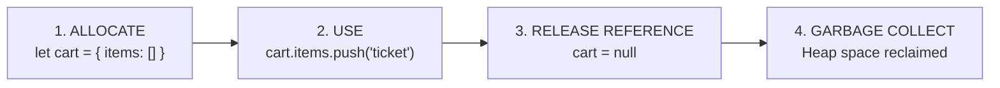

# File 08: Garbage Collection

## Overview
JavaScript features automatic memory management. The V8 **Garbage Collector (GC)** runs continuously behind the scenes to discover unreachable heap memory allocations and reclaim them. Understanding GC internals helps developers minimize execution pauses, prevent memory leaks, and prevent Out-Of-Memory (OOM) crashes.

---

## 1. The Memory Lifecycle
Every heap allocation follows a 4-step lifecycle:



```javascript
let cart = { userId: "U001", items: ["IPL Final Ticket"], total: 5000 };
cart = null; // Reference broken -> eligible for GC collection
```

---

## 2. Reachability vs Reference Counting

V8 determines memory eligibility for GC based on **Reachability from Roots**, rather than simplistic reference counting.

```mermaid
graph TD
    subgraph GC Roots (Always Reachable)
        Global[Global Object globalThis]
        Stack[Call Stack Local Variables]
        Closures[Active Closures]
        Timers[Active Timers / Promises]
    end

    Global --> ObjA[Object A]
    ObjA --> ObjB[Object B]
    
    SubGraphUnreachable[Isolated Subgraph] --> Circ1[Circular Obj 1]
    Circ1 <--> Circ2[Circular Obj 2]
    
    style SubGraphUnreachable fill:#ff9999,stroke:#333,stroke-width:2px
```

- **Reachable Objects**: Any value that can be reached by traversing references starting from a **GC Root**.
- **Unreachable Objects**: Objects that cannot be reached from any root (even if they reference each other in a circular loop).

```javascript
// Circular reference example: Handled correctly by Reachability GC
let objA = { name: "A" };
let objB = { name: "B" };
objA.ref = objB;
objB.ref = objA;

objA = null;
objB = null;
// Both objects are unreachable from roots -> Mark-and-Sweep collects both!
```

---

## 3. Mark-and-Sweep Algorithm
Mark-and-Sweep operates in two distinct phases:

1. **Mark Phase**: The GC starts from all GC roots, traverses the reference graph, and tags every reachable object with a live bit.
2. **Sweep Phase**: The GC scans the entire heap space, freeing memory addresses of all untagged (unreachable) objects and compacting remaining memory.

---

## 4. Generational Garbage Collection

V8 structures memory according to the **Generational Hypothesis**: *Most objects die young (temporary variables, loop iterations, short-lived promises).*

```mermaid
graph LR
    subgraph V8 Heap Allocation Space
        subgraph Young Generation (~1MB - 8MB)
            FromSpace[From-Space: New Allocations]
            ToSpace[To-Space: Copy Target]
        end
        
        subgraph Old Generation (~Hundreds of MBs)
            OldSpace[Old Space: Survived 2+ GC cycles]
            MapSpace[Map Space: Shapes / Hidden Classes]
            CodeSpace[Code Space: JIT Compiled Machine Code]
        end
    end
    
    FromSpace -- "Scavenger Copy" --> ToSpace
    ToSpace -- "Promoted after 2 Cycles" --> OldSpace
```

### Young Generation (Scavenger Collector)
- **Size**: Small (typically 1MB - 8MB).
- **Algorithm**: Cheney's Copying Algorithm (**Scavenger**).
- **Mechanism**: Splits space into From-Space and To-Space. Copies live objects to To-Space, then swaps spaces. Fast execution (~1ms).

### Old Generation (Major GC / Mark-Compact)
- Stores long-lived objects (surviving 2+ Scavenger cycles, global singletons, configurations).
- Uses **Mark-Sweep-Compact** to prevent memory fragmentation.

---

## 5. Incremental & Concurrent Marking
Traditional Garbage Collection caused long **Stop-The-World (STW)** pauses (~100ms+), freezing UI responsiveness. Modern V8 uses **Incremental and Concurrent Marking**:

```mermaid
gantt
    title V8 Execution Pauses vs Concurrent GC
    dateFormat  ss
    section Traditional STW
    JavaScript Execution  :a1, 00, 05s
    Full GC Pause (100ms) :a2, after a1, 02s
    section Modern V8 Concurrent
    JavaScript Thread     :b1, 00, 07s
    Background Thread GC  :crit, b2, 01, 06s
```



- **Incremental Marking**: Breaks up marking work into tiny ~5ms chunks interleaved with JS execution.
- **Concurrent Marking**: Moves marking tasks completely off the main thread onto background worker threads.

---

## 6. Monitoring Heap Memory Usage
You can monitor node runtime heap allocation programmatically using `process.memoryUsage()`.

```javascript
function printMemory(label) {
    const mem = process.memoryUsage();
    console.log(`[${label}]`);
    console.log(`  heapUsed:  ${(mem.heapUsed / 1024 / 1024).toFixed(2)} MB`);
    console.log(`  heapTotal: ${(mem.heapTotal / 1024 / 1024).toFixed(2)} MB`);
}

printMemory("Baseline");

const bigArray = [];
for (let i = 0; i < 100000; i++) {
    bigArray.push({ id: i, data: "x".repeat(100) });
}
printMemory("After Allocating 100K Objects");

bigArray.length = 0; // Eligible for GC
```

---

## 7. Node.js Memory Configurations & CLI Flags
```bash
# Increase default Node.js heap limit to 4GB
node --max-old-space-size=4096 server.js

# Useful Debug Flags
node --expose-gc script.js     # Exposes global.gc() for manual GC triggering
node --trace-gc script.js      # Logs every GC cycle details to stdout
```

---

## 8. Strategies to Reduce Garbage Collection Pressure
1. **Object Pooling**: Reuse objects in high-frequency loops instead of instantiating new ones.
2. **TypedArrays**: Use `Float64Array` or `Int32Array` for numeric datasets (avoids object boxing overhead).
3. **Pre-size Arrays**: Instantiate arrays with fixed capacity (`new Array(1000)`) to avoid repeated heap reallocation.
4. **Avoid Closures in Hot Loops**: Replace inline `.forEach()` or `.map()` callbacks with standard `for` loops in performance-critical code.

```javascript
// Strategy 1: Simple Object Pool
class DriverMatchPool {
    constructor(size) {
        this.pool = Array.from({ length: size }, () => ({ driverId: null, eta: 0 }));
        this.index = 0;
    }
    acquire() {
        if (this.index >= this.pool.length) this.index = 0;
        return this.pool[this.index++];
    }
}
```

---

## Key Takeaways
1. V8 reclaims memory based on **Reachability from Roots**, correctly handling circular references.
2. **Young Generation** (Scavenger) handles short-lived objects via fast semi-space copying.
3. **Old Generation** (Major GC) uses Mark-Sweep-Compact for long-lived data structures.
4. **Concurrent and Incremental marking** eliminate long Stop-The-World UI thread freezes.
5. Reduce GC pressure using **Object Pools**, **TypedArrays**, and **pre-sized arrays**.
