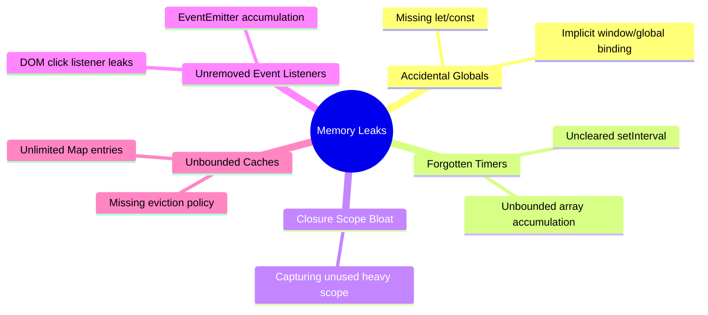

# File 09: Memory Leaks

## Overview
A **Memory Leak** occurs when memory that is no longer needed by an application remains referenced by a GC root, preventing the Garbage Collector from freeing it. Over time, leaks accumulate, resulting in performance degradation, frequent GC pauses, and eventually Out-Of-Memory (OOM) fatal crashes.

---

## 1. Top Causes of JavaScript Memory Leaks



---

## 2. Leak Category 1: Accidental Globals
Variables declared without `let`, `const`, or `var` automatically attach to the **Global Object** (`window` or `globalThis`), living permanently as GC roots.

```javascript
// BAD: Accidental global leak
function processStudentData() {
    // leakedData = "x".repeat(1000); // Attaches to globalThis!
}

// FIX: Always use strict mode and explicit variable declarations
function processStudentDataFixed() {
    "use strict";
    const localData = "x".repeat(1000); // Scoped local variable, safely GC'd
    return localData.length;
}
```

---

## 3. Leak Category 2: Forgotten Timers & Intervals
`setInterval` callbacks keep all referenced scope variables alive until `clearInterval` is invoked.

```javascript
// BAD: Interval runs indefinitely, array grows forever
function startTrackingBad() {
    const data = { history: [] };
    setInterval(() => {
        data.history.push({ time: Date.now() }); // Array grows without bound!
    }, 1000);
}

// FIX: Cap growth limit and provide cleanup returning function
function startTrackingGood() {
    const data = { history: [] };
    const id = setInterval(() => {
        data.history.push({ time: Date.now() });
        if (data.history.length > 100) data.history = data.history.slice(-50); // Cap size
    }, 1000);

    return function stop() {
        clearInterval(id); // Stop timer
        data.history = []; // Clear reference
    };
}
```

---

## 4. Leak Category 3: Closures Capturing Large Scopes
Functions retain references to their **outer Lexical Environment**. If an unused large object exists in the shared outer scope, it remains retained in memory.

```javascript
// BAD: Closure captures entire scope containing heavy object
function createLoggerBad() {
    const hugeConfig = { rules: new Array(100000).fill("data") };
    const userId = "U001";
    return function log(msg) { 
        console.log(`[${userId}] ${msg}`); 
    }; // hugeConfig stays alive in memory!
}

// FIX: Extract values directly and null out heavy variables
function createLoggerGood() {
    let hugeConfig = { rules: new Array(100000).fill("data") };
    const userId = hugeConfig.rules.length > 0 ? "U001" : "unknown";
    hugeConfig = null; // Explicitly release reference
    return function log(msg) { 
        console.log(`[${userId}] ${msg}`); 
    };
}
```

---

## 5. Leak Category 4: Event Listeners Not Removed
Adding event listeners repeatedly without removing them causes handler functions and their enclosed variables to accumulate indefinitely.

```javascript
const EventEmitter = require("events");
const paymentBus = new EventEmitter();

function setupListener(sessionId) {
    paymentBus.on("payment", (data) => {
        console.log(`[${sessionId}] Payment processed:`, data.amount);
    });
}

setupListener("S001");
setupListener("S002");
console.log(`Active Listeners: ${paymentBus.listenerCount("payment")}`); // 2

// FIX: Always clean up listeners
paymentBus.removeAllListeners("payment");
```

---

## 6. Leak Category 5: Unbounded Caches & LRU Eviction
Storing entries inside standard `Map` or `Set` objects without an eviction policy leads to unbounded memory growth.

```javascript
// GOOD: Implementation of an LRU (Least Recently Used) Cache
class LRUCache {
    constructor(maxSize) {
        this.maxSize = maxSize;
        this.cache = new Map();
    }
    get(key) {
        if (!this.cache.has(key)) return undefined;
        const val = this.cache.get(key);
        this.cache.delete(key);
        this.cache.set(key, val); // Move to end (most recently used)
        return val;
    }
    set(key, value) {
        if (this.cache.has(key)) this.cache.delete(key);
        else if (this.cache.size >= this.maxSize) {
            this.cache.delete(this.cache.keys().next().value); // Evict oldest key
        }
        this.cache.set(key, value);
    }
}

const cache = new LRUCache(1000); // Memory usage remains strictly bounded!
```

---

## 7. Weak References: `WeakMap`, `WeakRef`, `FinalizationRegistry`

```javascript
// 1. WeakMap: Keys are held weakly; auto-removed when object key is GC'd
const metadataCache = new WeakMap();
let merchant = { id: "M001" };
metadataCache.set(merchant, { tier: "enterprise" });
merchant = null; // Entry automatically collected from WeakMap!

// 2. WeakRef: Dereferences target object without preventing GC
let bigData = { id: "DATA" };
const weakRef = new WeakRef(bigData);
console.log(weakRef.deref()?.id); // "DATA"
bigData = null; // Once GC runs, weakRef.deref() returns undefined

// 3. FinalizationRegistry: Cleanup callback invoked after GC collection
const registry = new FinalizationRegistry((heldValue) => {
    console.log(`Cleaned up object tagged: ${heldValue}`);
});
let tempObj = { name: "Temp" };
registry.register(tempObj, "temp-tag");
tempObj = null;
```

---

## 8. Detecting Memory Leaks

### Diagnostic Methods
1. **Memory Trend Tracking**: Monitor `process.memoryUsage().heapUsed` over time. Steady linear upward growth indicates a leak.
2. **Chrome DevTools Heap Snapshots**:
   - Run Node with inspect flag: `node --inspect script.js`
   - Connect Chrome DevTools -> **Memory** tab -> Take multiple **Heap Snapshots**.
   - Compare snapshots using **"Objects allocated between Snapshot 1 and 2"**.

```javascript
// Programmatic Memory Profiler Tool
function monitorMemoryTrend() {
    const snapshots = [];
    setInterval(() => {
        const heapMB = (process.memoryUsage().heapUsed / 1024 / 1024).toFixed(2);
        snapshots.push(heapMB);
        console.log(`Heap Usage Trend: ${snapshots.join(" MB -> ")} MB`);
    }, 2000);
}
```

---

## Key Takeaways
1. Memory leaks occur when unreachable business logic remains **reachable from GC roots**.
2. Avoid **accidental globals**, **uncleared timers**, and **unbound event listeners**.
3. Use **LRU Caches** or **WeakMaps** to avoid holding infinite key/value allocations.
4. Use `WeakRef` for temporary object caches where auto-garbage collection is desired.
5. Profile memory using `process.memoryUsage()` trends and **Chrome DevTools Heap Snapshots**.
