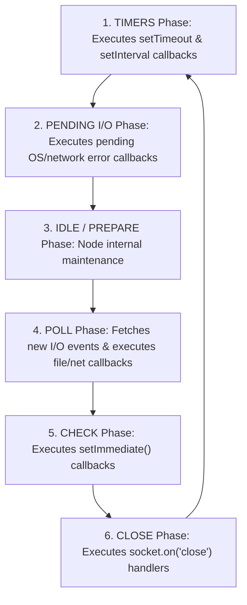
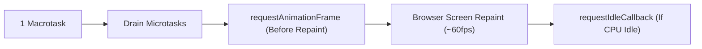

# File 10: Event Loop Internals

## Overview
JavaScript runs on a **single-threaded** runtime model, yet efficiently handles tens of thousands of concurrent operations. The **Event Loop** is the mechanism that orchestrates asynchronous execution by offloading tasks to background host environments (Browser APIs or Node.js libuv thread pool) and scheduling their completed callbacks onto the main call stack.

---

## 1. The Architecture of the Event Loop

```mermaid
flowchart TD
    Stack["Call Stack (LIFO)<br/>Executes Sync JavaScript Code"]
    Host["Host APIs / libuv Thread Pool<br/>Handles I/O, Timers, Network Async Tasks"]
    
    subgraph Priority Queues
        NextTick["process.nextTick Queue (Highest Priority)"]
        Micro["Microtask Queue (Promises, queueMicrotask)"]
        Macro["Macrotask Queue (setTimeout, I/O, setImmediate)"]
    end
    
    Stack -- "Offload Async Task" --> Host
    Host -- "Task Completed" --> Priority Queues
    
    Loop["Event Loop Coordinator"]
    Loop -- "1. Stack Empty? Check nextTick -> Microtasks (Drain All)" --> Stack
    Loop -- "2. Drain Microtasks? Move ONE Macrotask" --> Stack
```

---

## 2. Microtasks vs Macrotasks
Understanding queue priority is essential to preventing race conditions and unexpected async ordering bugs.

### Task Priority Hierarchy
$$\text{Synchronous Code} > \text{process.nextTick} > \text{Microtasks (Promise/queueMicrotask)} > \text{Macrotasks (setTimeout/I/O)}$$

- **Microtasks**: High priority. **The engine drains the ENTIRE microtask queue completely** before yielding execution to any macrotask or browser rendering pass.
  - Examples: `Promise.then()`, `.catch()`, `.finally()`, `queueMicrotask()`, `process.nextTick()` (Node-specific top tier).
- **Macrotasks**: Standard priority. **Only ONE macrotask is processed per event loop iteration**.
  - Examples: `setTimeout`, `setInterval`, `setImmediate`, I/O operations, network events.

```javascript
setTimeout(() => console.log("4. Macrotask (setTimeout)"), 0);
Promise.resolve().then(() => console.log("3. Microtask (Promise)"));
console.log("1. Synchronous Code");
console.log("2. Synchronous Code");

// Output Order:
// 1. Synchronous Code
// 2. Synchronous Code
// 3. Microtask (Promise)
// 4. Macrotask (setTimeout)
```

---

## 3. Node.js Event Loop Phases
Node.js (via `libuv`) structures its loop into 6 distinct execution phases:



> **Critical Rule**: Between **every phase transition**, Node.js immediately drains the `process.nextTick` queue followed by the standard Microtask queue before proceeding to the next phase!

---

## 4. `setTimeout(0)` vs `setImmediate()`

```javascript
// Case A: Called from Main Module (Order is NON-DETERMINISTIC due to timer binding lag)
setTimeout(() => console.log("setTimeout main"), 0);
setImmediate(() => console.log("setImmediate main"));

// Case B: Called inside an I/O Callback (setImmediate is ALWAYS FIRST!)
const fs = require("fs");
fs.readFile(__filename, () => {
    setTimeout(() => console.log("setTimeout inside I/O"), 0);
    setImmediate(() => console.log("setImmediate inside I/O (Guaranteed First!)"));
});
```

- In Case B, execution is currently inside the **POLL Phase** (I/O). The next phase in the loop is the **CHECK Phase** (`setImmediate`). The **TIMERS Phase** (`setTimeout`) requires looping all the way around, guaranteeing `setImmediate` executes first.

---

## 5. Microtask Starvation & Solutions
Because the microtask queue must be completely drained before any macrotask runs, recursively queuing microtasks will freeze the event loop, blocking I/O and UI rendering (**Microtask Starvation**).

```javascript
// BAD: Starves the event loop (Never yields to macrotasks or UI)
function infiniteMicrotasks() {
    Promise.resolve().then(infiniteMicrotasks);
}

// GOOD: Yield control back to the Event Loop using setImmediate or setTimeout
function processQueueSafely(items, index) {
    if (index >= items.length) return;
    // Process item...
    setImmediate(() => processQueueSafely(items, index + 1)); // Yields to loop
}
```

---

## 6. Output Order Puzzle Walkthrough

```javascript
console.log("A");
setTimeout(() => console.log("B"), 0);
Promise.resolve().then(() => console.log("C"));
console.log("D");

// Execution Trace:
// 1. Sync: Prints "A"
// 2. setTimeout scheduled -> Macrotask Queue [B]
// 3. Promise resolved -> Microtask Queue [C]
// 4. Sync: Prints "D"
// 5. Sync stack empty -> Drain Microtasks -> Prints "C"
// 6. Microtasks empty -> Process 1 Macrotask -> Prints "B"
// Output: A, D, C, B
```

---

## 7. Browser Event Loop vs Node.js
In browser environments, the rendering pipeline integrates directly with the event loop:



- `requestAnimationFrame (rAF)`: Fires immediately before screen repaints (~60Hz / 120Hz). Use for UI animations.
- `requestIdleCallback (rIC)`: Fires during CPU idle periods. Use for background telemetry or non-critical calculations.

---

## Key Takeaways
1. The **Event Loop** allows single-threaded JS to process non-blocking async I/O.
2. Priority: **Sync Code > `process.nextTick` > Microtasks (`Promise`) > Macrotasks (`setTimeout`)**.
3. **Microtask Queue** drains completely between macrotasks; recursive microtasks cause **starvation**.
4. Inside I/O callbacks, `setImmediate` is guaranteed to execute before `setTimeout(0)`.
5. In browsers, **`requestAnimationFrame`** runs before repaints, while **`requestIdleCallback`** runs during idle CPU time.
