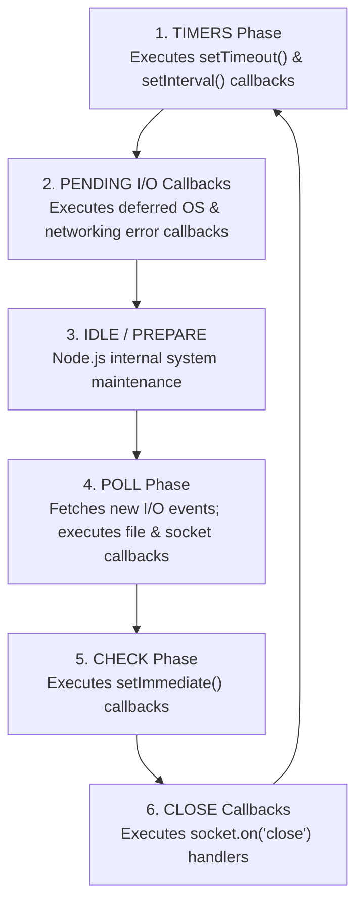
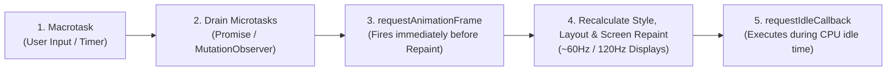

# Module 10: Event Loop Internals — Libuv 6-Phase Loop, Microtask Priority Queues, and Browser Rendering

## Overview

JavaScript operates on a **single-threaded non-blocking I/O event model**. While synchronous code executes strictly on the Call Stack, asynchronous tasks (file I/O, network requests, timers) are offloaded to host environments (Browser Web APIs or the C++ Node.js `libuv` thread pool).

The **Event Loop** is the core orchestration loop that continuously checks whether the Call Stack is empty and moves queued asynchronous callbacks into the Call Stack for execution.

---

## 1. Event Loop Architecture & Task Priority Hierarchy

```mermaid
flowchart TD
    Stack["1. Call Stack (LIFO)<br/>- Synchronous JavaScript Execution"]
    Host["2. Host System / libuv Thread Pool<br/>- Asynchronous I/O, Timers, Network Streams"]
    
    subgraph Priority Microtask Queues (Drained COMPLETELY on Stack Empty)
        NextTick["process.nextTick Queue (Node Tier 0)"]
        Micro["Microtask Queue (Promises, queueMicrotask, MutationObserver)"]
    end

    subgraph Macrotask Queues (Processed 1 Task Per Iteration)
        Macro["Macrotask Queue (setTimeout, setInterval, setImmediate, I/O)"]
    end
    
    Stack -- "Offload Async Operations" --> Host
    Host -- "Operation Complete" --> Priority Microtask Queues
    Host -- "Operation Complete" --> Macrotask Queues

    Loop["Event Loop Coordinator"]
    Loop -- "1. Stack Empty? Drain nextTick & Microtasks" --> Stack
    Loop -- "2. Microtasks Empty? Process ONE Macrotask" --> Stack
```

### Execution Priority Hierarchy Formula

$$\text{Synchronous Code} \longrightarrow \text{process.nextTick()} \longrightarrow \text{Microtasks (Promises)} \longrightarrow \text{Macrotasks (Timers/I/O)}$$

- **Microtasks**: High-priority tasks. The Event Loop **drains the ENTIRE microtask queue completely** before proceeding to the next macrotask or browser screen repaint.
- **Macrotasks**: Standard-priority tasks. The Event Loop **processes only ONE macrotask** per iteration cycle, then re-checks microtask queues.

---

## 2. Node.js Libuv 6-Phase Event Loop Cycle

Node.js structures its event loop around **Libuv's 6 Execution Phases**:



> [!IMPORTANT]
> **Microtask Drain Rule**: Between **every phase transition** in `libuv`, Node.js immediately pauses to drain the `process.nextTick` queue followed by the standard Promise Microtask queue before entering the next loop phase!

---

## 3. `setImmediate()` vs. `setTimeout(fn, 0)` Determinism

The relative order between `setTimeout(fn, 0)` and `setImmediate(fn)` depends on the phase from which they are scheduled:

```javascript
// CASE A: Scheduled from Main Module (Non-Deterministic Order)
setTimeout(() => console.log("Timer (setTimeout)"), 0);
setImmediate(() => console.log("Check (setImmediate)"));
// Output order depends on process startup CPU clock latency (0ms vs 1ms threshold)

// CASE B: Scheduled inside an I/O Callback (DETERMINISTIC: setImmediate ALWAYS RUNS FIRST!)
const fs = require("fs");
fs.readFile(__filename, () => {
  setTimeout(() => console.log("1. setTimeout inside I/O"), 0);
  setImmediate(() => console.log("2. setImmediate inside I/O (GUARANTEED FIRST!)"));
});
```

### Why `setImmediate` Wins Inside I/O Callbacks
When `fs.readFile` completes, execution is currently inside the **POLL Phase** (Phase 4). Moving forward, the next phase in the loop is the **CHECK Phase** (Phase 5: `setImmediate`). The **TIMERS Phase** (Phase 1: `setTimeout`) is 2 phases away, guaranteeing `setImmediate` executes first!

---

## 4. Microtask Queue Starvation & Mitigation

Because V8 drains the microtask queue *completely* before processing macrotasks or UI rendering, recursively queuing microtasks causes **Microtask Starvation**, freezing the runtime:

```javascript
// BAD: Microtask Starvation (Freezes Event Loop & Blocks I/O / UI Rendering!)
function starveEventLoop() {
  Promise.resolve().then(starveEventLoop); // Continuously fills Microtask Queue!
}

// GOOD: Yield Control Back to Event Loop using setImmediate() or setTimeout()
function processLargeDatasetSafely(items, index = 0) {
  if (index >= items.length) return;

  // Process a chunk of 1,000 items synchronously
  const chunkSize = 1000;
  for (let i = index; i < Math.min(index + chunkSize, items.length); i++) {
    // Perform item processing...
  }

  // Yield control back to Macrotask Queue to allow I/O & Timers to execute!
  setImmediate(() => processLargeDatasetSafely(items, index + chunkSize));
}
```

---

## 5. Browser Event Loop vs. Node.js Event Loop

In web browsers, the Event Loop integrates directly with the **Browser Rendering Pipeline**:



- **`requestAnimationFrame(rAF)`**: Fires right before the browser recalculates style and layout for screen repaint. Ideal for smooth UI animations.
- **`requestIdleCallback(rIC)`**: Fires during periods when the browser thread is completely idle. Ideal for low-priority telemetry logging.

---

## 6. Comprehensive Async Execution Ordering Challenge

```javascript
console.log("1. Sync Main Start");

setTimeout(() => console.log("2. Macrotask setTimeout (0ms)"), 0);

Promise.resolve().then(() => {
  console.log("3. Microtask Promise 1");
  return Promise.resolve();
}).then(() => {
  console.log("4. Microtask Promise 2");
});

process.nextTick(() => console.log("5. Priority Tier 0 nextTick"));

console.log("6. Sync Main End");

// Output Order:
// 1. Sync Main Start
// 6. Sync Main End
// 5. Priority Tier 0 nextTick (Drained first before standard microtasks)
// 3. Microtask Promise 1
// 4. Microtask Promise 2
// 2. Macrotask setTimeout (0ms)
```

---

## Key Production Takeaways

1. **Never Block the Event Loop Thread**: Avoid heavy synchronous calculations (`while(true)`, CPU-bound crypto loops) on the main thread; offload them to Worker Threads or break them into chunks using `setImmediate()`.
2. **Master Priority Tiers**: Remember that `process.nextTick()` executes before Promise microtasks, and Promise microtasks drain *completely* before the next macrotask runs.
3. **Use `setImmediate()` for I/O Yielding in Node.js**: Use `setImmediate()` to yield execution back to the loop after heavy processing chunks to prevent I/O starvation.
4. **Use `requestAnimationFrame()` for Browser UI Updates**: Always schedule DOM measurements and visual state mutations using `requestAnimationFrame()` to sync cleanly with display refresh rates.

