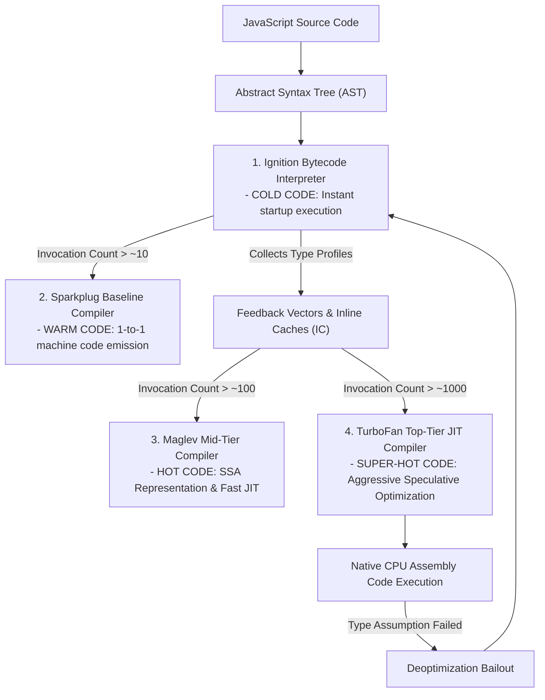
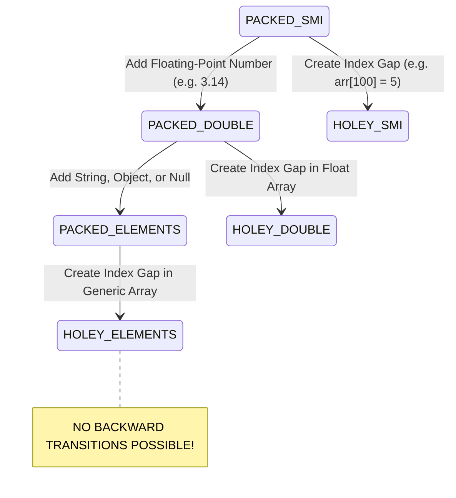

# Module 11: Just-In-Time (JIT) Compilation Optimization — Inlining, Escape Analysis, and Element Kinds

## Overview

JavaScript engines do not rely solely on pure interpretation or static ahead-of-time (AOT) compilation. Instead, modern V8 employs a **hybrid Just-In-Time (JIT) Compilation Pipeline**.

By profiling code execution at runtime, V8 identifies "hot functions", performs **Function Inlining**, applies **Escape Analysis** to eliminate heap allocations, and generates optimized CPU machine code via **TurboFan**.

Understanding how JIT optimizations work—and how to avoid deoptimization bailouts—allows software engineers to write code that runs at near-native execution speed.

---

## 1. V8 Multi-Tier JIT Compiler Architecture & Heat Tiers

V8 tracks function invocation counters to classify code into **Heat Tiers**:



### Code Heat Tiers Summary

- **Cold Code (Interpreted)**: Executed once or twice (e.g. startup initialization script). Left in Ignition bytecode to save memory.
- **Warm Code (Baseline JIT)**: Invoked multiple times. Sparkplug compiles bytecode 1-to-1 into baseline assembly to skip interpreter loop overhead.
- **Hot Code (Mid-Tier JIT)**: Frequently called functions. Maglev builds an SSA IR graph and performs fast, low-latency optimizations.
- **Super-Hot Code (Top-Tier JIT)**: Algorithmically heavy loops. TurboFan applies full speculative optimization, emitting highly tuned assembly.

---

## 2. Advanced JIT Optimizations: Function Inlining & Escape Analysis

### Function Inlining

Calling a function incurs overhead: setting up stack frames, passing arguments, and jumping CPU instruction pointers.

TurboFan performs **Function Inlining**: it replaces the callee function call site directly with the body of the function, eliminating invocation overhead entirely:

```mermaid
flowchart LR
    subgraph Original Code with Invocation Overhead
        Caller["sumOfSquares(a, b)"] -->|Stack Frame Jump| Callee["square(x) { return x * x }"]
    end

    subgraph TurboFan Inlined Assembly (Zero Call Overhead)
        InlinedCode["sumOfSquares(a, b)<br/>Result = (a * a) + (b * b)"]
    end
```

```javascript
// Function eligible for Inlining (Small, Monomorphic, High Frequency)
function addTax(amount) {
  return amount * 1.18; // TurboFan copies 'amount * 1.18' directly into caller site!
}

function processTotal(price) {
  return addTax(price); // Zero function call overhead after TurboFan Inlining!
}
```

### Escape Analysis & Scalar Replacement

If an object created inside a function does not "escape" (i.e. is not returned, passed to external calls, or assigned to global variables), TurboFan performs **Scalar Replacement of Aggregates (SRA)**.

It decomposes the object and stores its properties directly in **CPU Registers**, completely bypassing Memory Heap Allocation and Garbage Collection!

```javascript
function calculateDistance(x1, y1, x2, y2) {
  // Point object DOES NOT ESCAPE calculateDistance scope
  const point = { dx: x2 - x1, dy: y2 - y1 };
  
  // TurboFan Escape Analysis eliminates heap allocation for 'point'!
  // Fields 'dx' and 'dy' are placed directly inside CPU registers.
  return Math.sqrt(point.dx * point.dx + point.dy * point.dy);
}
```

---

## 3. V8 Array Element Kinds Lattice (One-Way Transitions)

V8 tracks array element types using **Element Kinds**. Arrays transition along a **One-Way Transition Lattice** from fast, compact representations to slow, generic forms:



### Element Kinds Performance Comparison

| Element Kind | Internal Storage Representation | Element Access Speed | Notes |
| :--- | :--- | :--- | :--- |
| **`PACKED_SMI`** | Direct 31-bit integers in contiguous memory. | **$1.0\times$ (Fastest)** | Dense array of integers. |
| **`PACKED_DOUBLE`** | Unboxed IEEE 754 64-bit float array. | $1.2\times$ overhead | Dense array containing floating point numbers. |
| **`PACKED_ELEMENTS`**| Array of tagged object pointers. | $2.5\times$ overhead | Mixed objects, strings, booleans. |
| **`HOLEY_*`** | Array with missing index slots ("holes"). | **$5\times – 10\times$ slower** | Must traverse prototype chain for missing keys! |

```javascript
// Demonstrating One-Way Element Kind Transitions
const numbers = [1, 2, 3];        // Kind: PACKED_SMI (Fastest)
numbers.push(4.5);                 // Transitions permanently to PACKED_DOUBLE!
numbers.push("text");              // Transitions permanently to PACKED_ELEMENTS!

numbers.pop();                     // Removing string DOES NOT transition back to PACKED_DOUBLE!
numbers[100] = 99;                 // Creates a hole -> Transitions permanently to HOLEY_ELEMENTS!
```

---

## 4. Top Deoptimization Bailout Triggers

When TurboFan's type assumptions are violated, V8 discards the compiled assembly and falls back to Ignition bytecode execution via a **Deoptimization (Deopt)**:

1. **Type Contamination**: Passing mixed types (`number` vs `string`) to a function previously optimized for numbers.
2. **Hidden Class Shifts**: Passing objects with identical properties added in different order.
3. **Array Hole Access**: Accessing uninitialized index slots in arrays (`arr[index] === undefined`), forcing V8 to search prototype chains.
4. **Optimizing Blockers**: Using `eval()`, `with()`, or leaky `arguments` references inside functions.

---

## 5. Production Benchmark: JIT-Friendly vs. JIT-Hostile Code

```javascript
// 1. JIT-Friendly Code (Type Stable, Monomorphic, Dense Array)
function benchmarkJITFriendly() {
  function multiply(a, b) { return a * b; }

  const iterations = 10_000_000;
  const numbers = new Array(iterations);
  for (let i = 0; i < iterations; i++) numbers[i] = i; // PACKED_SMI Array

  // Warmup to trigger TurboFan optimization
  for (let i = 0; i < 10000; i++) multiply(i, i + 1);

  const start = process.hrtime.bigint();
  let total = 0;
  for (let i = 0; i < iterations; i++) {
    total += multiply(numbers[i], 2);
  }
  const end = process.hrtime.bigint();

  return Number(end - start) / 1_000_000;
}

// 2. JIT-Hostile Code (Mixed Types, Deoptimizations, Holey Array)
function benchmarkJITHostile() {
  function multiply(a, b) { return a * b; }

  const iterations = 10_000_000;
  const mixed = new Array(iterations);
  for (let i = 0; i < iterations; i++) {
    mixed[i] = (i % 2 === 0) ? i : String(i); // Type Contamination!
  }

  const start = process.hrtime.bigint();
  let total = 0;
  for (let i = 0; i < iterations; i++) {
    total += multiply(mixed[i], 2); // Triggers Deopt Bailouts!
  }
  const end = process.hrtime.bigint();

  return Number(end - start) / 1_000_000;
}

console.log(`JIT-Friendly Time : ${benchmarkJITFriendly().toFixed(2)} ms`);
console.log(`JIT-Hostile Time  : ${benchmarkJITHostile().toFixed(2)} ms (Slower due to deopts!)`);
```

---

## Key Production Takeaways

1. **Keep Functions Small to Enable Inlining**: Write small, single-responsibility functions ($< 600$ AST nodes). Small functions are automatically inlined by TurboFan, eliminating call stack overhead.
2. **Keep Arrays Homogeneous & Dense**: Allocate arrays cleanly without leaving index gaps (`arr[100] = x`). Avoid mixing numbers and objects in the same array to preserve fast `PACKED_SMI` element kinds.
3. **Avoid Parameter Type Contamination**: Pass consistent parameter types to hot functions to maintain monomorphic feedback slots and prevent TurboFan deoptimizations.
4. **Use V8 Diagnostics Flags for Deopt Profiling**: Run `node --trace-deopt --trace-opt script.js` to detect functions triggering deoptimization bailouts in high-throughput microservices.

