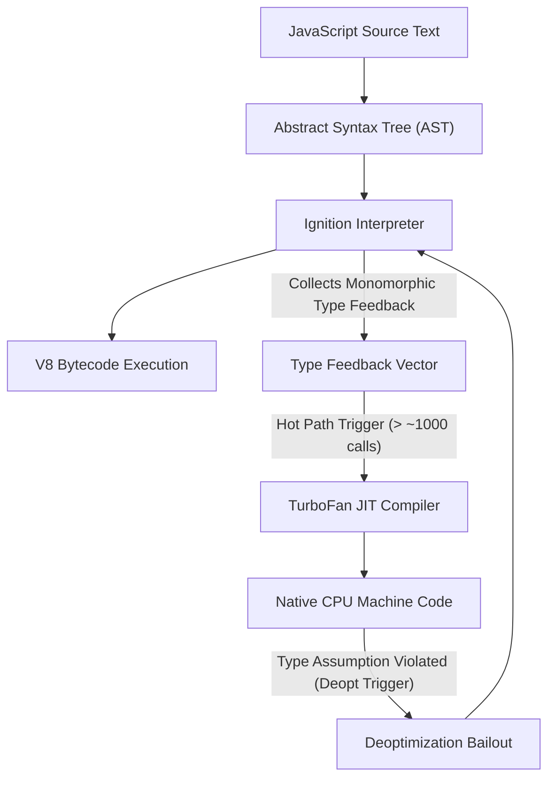
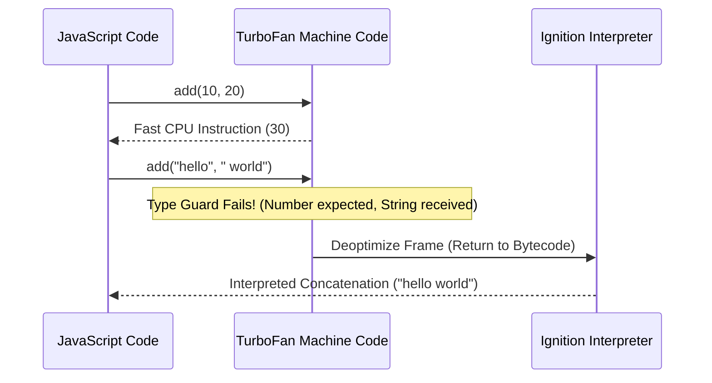
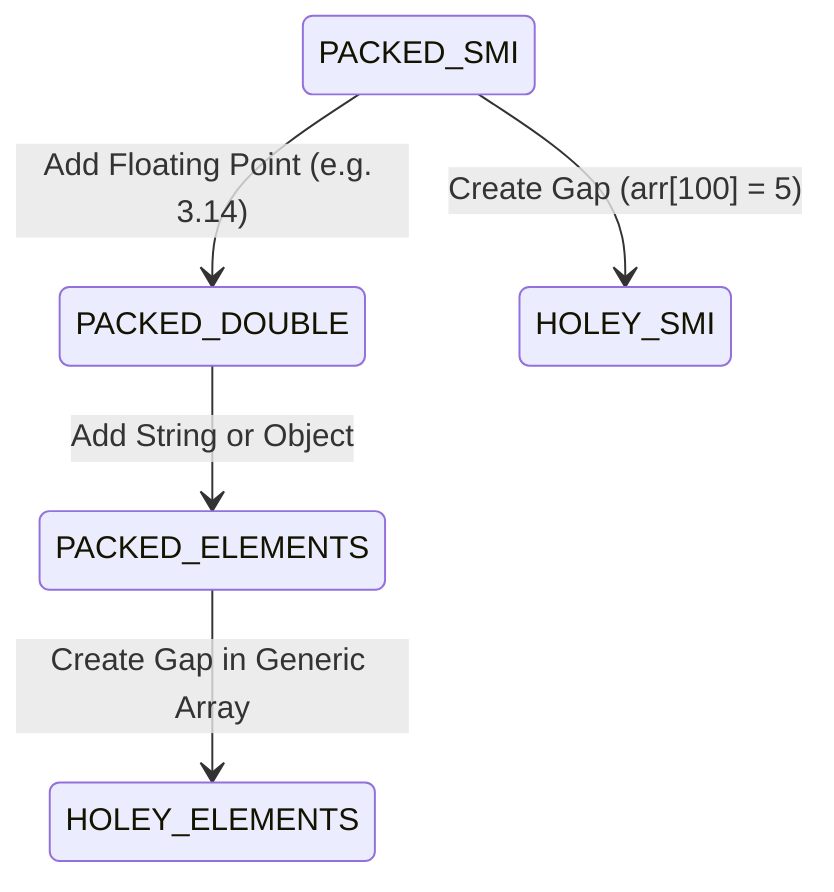

# File 11: JIT Optimization

## Overview
JavaScript is compiled at runtime using a **Just-In-Time (JIT)** compilation pipeline. V8 starts execution instantly using the **Ignition Interpreter** while collecting runtime type profile data. Once a function becomes "hot" (frequently executed), **TurboFan** compiles it into highly optimized native machine code.

---

## 1. The V8 JIT Compilation Pipeline



---

## 2. Function Heat Levels
V8 dynamically classifies functions into heat tiers to determine optimization priority:

- **Cold Functions**: Functions executed once or twice (e.g., initialization logic). Left in bytecode interpreter mode to conserve CPU and memory.
- **Warm Functions**: Functions invoked multiple times. Ignition begins tracking type profile data in feedback vectors.
- **Hot Functions**: High-frequency loops or algorithm calculations. TurboFan compiles them into direct CPU assembly instructions.

```javascript
function calculateSIPReturns(monthly, rate, months) {
    let total = 0;
    const monthlyRate = rate / 12 / 100;
    for (let i = 0; i < months; i++) {
        total = (total + monthly) * (1 + monthlyRate); // Hot loop -> TurboFan optimized!
    }
    return total;
}
```

---

## 3. Speculative Optimization & Deoptimization
TurboFan optimizes code by **speculating** that variable types observed during interpretation will remain constant.



```javascript
function add(a, b) { return a + b; }

// Ignition observes: (number, number) -> Monomorphic
for (let i = 0; i < 100; i++) add(i, i + 1); // Triggers TurboFan compilation

// Type violation: String passed -> Triggers Deopt Bailout
add("hello", " world"); // Machine code discarded, execution returns to Ignition!
```

---

## 4. Primary Deoptimization Triggers
1. **Type Shifts**: Changing variable types passed to optimized functions (e.g., passing strings to integer math).
2. **Hidden Class Shifts**: Passing objects with identical properties added in different orders.
3. **Out-of-Bounds Array Access**: Accessing `arr[arr.length]` returns `undefined`, breaking numeric assumptions.
4. **Optimizing Blockers**: Invoking `eval()`, `with`, or leaking the legacy `arguments` object.

---

## 5. Optimization Techniques: Inlining & Escape Analysis

### Function Inlining
TurboFan copies small function bodies directly into the calling location, eliminating call stack frame creation overhead.

```javascript
function square(x) { return x * x; }

function sumOfSquares(n) {
    let total = 0;
    for (let i = 0; i < n; i++) {
        total += square(i); // TurboFan Inlines: total += i * i (Zero call overhead!)
    }
    return total;
}
```

### Escape Analysis
If an object created inside a function does not "escape" (is not returned or stored globally), V8 allocates it directly on the **Stack** or scalar-replaces it with primitive registers, eliminating heap GC pressure.

```javascript
function calculateDistance(x1, y1, x2, y2) {
    const point = { dx: x2 - x1, dy: y2 - y1 }; // Point object does not escape!
    return Math.sqrt(point.dx * point.dx + point.dy * point.dy); // V8 eliminates heap object
}
```

---

## 6. Array Element Kinds (One-Way Transitions)
V8 categorizes arrays into element kinds. Array transitions are **one-way transitions** from fast/dense to generic/holey.



```javascript
const arr1 = [1, 2, 3];           // PACKED_SMI_ELEMENTS (Fastest)
arr1.push(3.14);                  // Transition to PACKED_DOUBLE_ELEMENTS
arr1.push("hello");               // Transition to PACKED_ELEMENTS (Generic/Slowest)
// Note: Arrays NEVER transition backwards to faster kinds!
```

---

## 7. Performance Benchmark: JIT-Friendly vs Hostile

```javascript
function benchFriendly() {
    function addNums(a, b) { return a + b; }
    const start = process.hrtime.bigint();
    let total = 0;
    for (let i = 0; i < 1_000_000; i++) total += addNums(i, i + 1);
    return Number(process.hrtime.bigint() - start) / 1_000_000;
}

function benchHostile() {
    function addAny(a, b) { return a + b; }
    const start = process.hrtime.bigint();
    let total = 0;
    for (let i = 0; i < 1_000_000; i++) {
        if (i % 2 === 0) total += addAny(i, i + 1);
        else addAny("str_" + i, i);
    }
    return Number(process.hrtime.bigint() - start) / 1_000_000;
}

console.log(`Type-Stable Time: ${benchFriendly().toFixed(2)} ms`);
console.log(`Mixed-Type Time:  ${benchHostile().toFixed(2)} ms (Slower due to deopts!)`);
```

---

## Key Takeaways
1. V8 interprets code via **Ignition** and compiles hot paths to machine code via **TurboFan**.
2. **Type stability** is critical; type shifts break assumptions and trigger expensive **deoptimizations**.
3. Small functions are **inlined** by TurboFan to eliminate invocation overhead.
4. **Escape Analysis** scalar-replaces non-escaping objects, bypassing heap allocations.
5. Keep arrays **dense and homogeneous** to preserve fast SMI element kinds.
