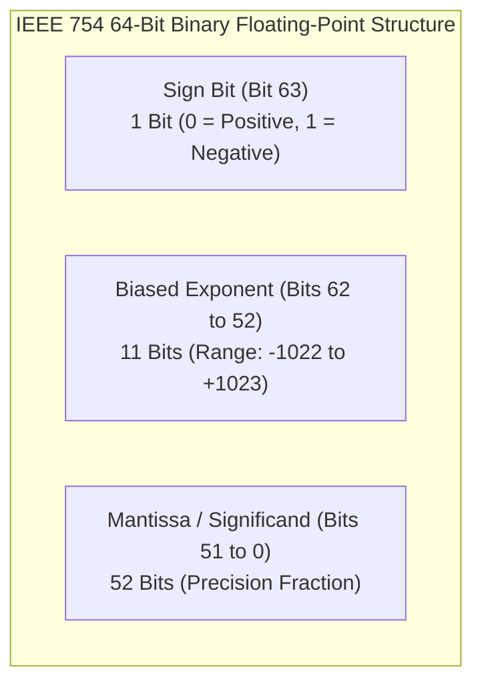
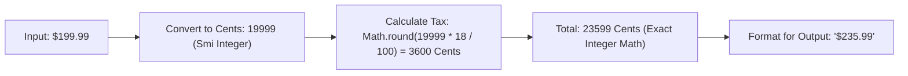

# Module 12: Numbers Internals — IEEE 754 Floating-Point, V8 Smi vs. HeapNumber, and BigInt

## Overview

In JavaScript, all standard numbers are represented internally as **IEEE 754 Double-Precision 64-bit Binary Floating-Point Numbers**.

Understanding how 64-bit floats are stored at the bit level, how V8 optimizes 31-bit integers using **Smi (Small Integer) Tagging**, why floating-point arithmetic causes precision loss (`0.1 + 0.2 !== 0.3`), and when to use **BigInt** is essential for building accurate financial software and high-performance algorithms.

---

## 1. The IEEE 754 64-Bit Binary Float Structure

According to the IEEE 754 specification, every JavaScript `Number` is allocated across **64 bits** of memory:



### Mathematical Formula

$$\text{Value} = (-1)^{\text{sign}} \times 2^{\text{exponent} - 1023} \times \left(1 + \sum_{i=1}^{52} b_{52-i} 2^{-i}\right)$$

---

## 2. Floating-Point Binary Imprecision (`0.1 + 0.2 !== 0.3`)

Decimals like `0.1` and `0.2` cannot be expressed exactly as finite binary fractions. When converted into binary bits, `0.1` becomes an infinite repeating fraction:

$$0.1_{10} = 0.000110011001100110011001100110011001100..._2$$

Because the mantissa is truncated to 52 bits, rounding errors accumulate during binary arithmetic:

```javascript
console.log(0.1 + 0.2);             // Output: 0.30000000000000004
console.log(0.1 + 0.2 === 0.3);     // false!

// Production Fix: Compare floating-point values using Number.EPSILON threshold
function numbersNearlyEqual(num1, num2) {
  return Math.abs(num1 - num2) < Number.EPSILON;
}

console.log(numbersNearlyEqual(0.1 + 0.2, 0.3)); // true
```

---

## 3. Safe Integer Bounds ($2^{53} - 1$)

Because the IEEE 754 mantissa provides **52 bits of explicit precision** (plus 1 implicit leading bit), JavaScript can represent exact integers only up to $2^{53} - 1$:

$$\text{Number.MAX\_SAFE\_INTEGER} = 2^{53} - 1 = 9,007,199,254,740,991$$

```javascript
const maxSafe = Number.MAX_SAFE_INTEGER; // 9007199254740991

console.log(maxSafe + 1); // 9007199254740992 (Safe)
console.log(maxSafe + 2); // 9007199254740992 (Precision loss! Same as maxSafe + 1)

console.log(Number.isSafeInteger(maxSafe + 2)); // false
```

---

## 4. V8 Numeric Architecture: Smi vs. HeapNumber

To avoid allocating expensive heap objects for basic counters and loop indices, V8 uses a **Two-Tier Numeric Representation**:

```mermaid
flowchart TD
    JSNumber[JavaScript Numeric Allocation] --> RangeCheck{Is integer in 31-bit signed range?<br/>(-2³⁰ to +2³⁰ - 1)}

    RangeCheck -- Yes --> Smi["1. Smi (Small Integer)<br/>- Bit 0 = 0 (Pointer Tagged)<br/>- Stored IN-PLACE in register/stack<br/>- ZERO Heap Allocation & ZERO GC overhead!"]

    RangeCheck -- No --> HeapNumber["2. HeapNumber<br/>- Bit 0 = 1 (Heap Pointer)<br/>- Boxed 64-bit IEEE float allocated in Heap<br/>- Incurs GC & pointer dereference overhead"]
```

```javascript
// Benchmark Demonstrating V8 Smi vs. HeapNumber Overhead
function benchmarkSmiVsHeapNumber() {
  const iterations = 10_000_000;

  // Case 1: Smi Integer Arithmetic (Zero Heap Allocation)
  const startSmi = process.hrtime.bigint();
  let smiTotal = 0;
  for (let i = 0; i < iterations; i++) {
    smiTotal += i;
  }
  const endSmi = process.hrtime.bigint();

  // Case 2: HeapNumber Floating Point Arithmetic (Boxed Float Heap Access)
  const startFloat = process.hrtime.bigint();
  let floatTotal = 0.5;
  for (let i = 0; i < iterations; i++) {
    floatTotal += i + 0.25;
  }
  const endFloat = process.hrtime.bigint();

  console.log(`Smi Integer Loop Time : ${Number(endSmi - startSmi) / 1_000_000} ms`);
  console.log(`HeapNumber Float Time  : ${Number(endFloat - startFloat) / 1_000_000} ms`);
}

benchmarkSmiVsHeapNumber();
```

---

## 5. Financial Systems Design Pattern: "Work in Smallest Integer Units"

Never use floating-point numbers for currency calculations. Always perform financial calculations using **Small Integers (Smis)** representing the smallest subunit of currency (e.g., Cents, Paise):



```javascript
// BAD: Floating-Point Financial Calculation
const badPrice = 199.99;
const badTax = badPrice * 0.18; // 35.998200000000004

// GOOD: Integer Calculation in Cents/Paise
function calculateOrderTotal(priceUnits, taxPercent) {
  const priceSubunits = Math.round(priceUnits * 100); // Convert $199.99 -> 19999 Cents
  const taxSubunits = Math.round((priceSubunits * taxPercent) / 100); // 3600 Cents
  const totalSubunits = priceSubunits + taxSubunits; // 23599 Cents (Exact Smi Integer!)
  
  return (totalSubunits / 100).toFixed(2); // Formatted string output: "235.99"
}

console.log("Calculated Order Total:", calculateOrderTotal(199.99, 18));
```

---

## 6. Arbitrary-Precision Integers: `BigInt`

For 64-bit database identifiers, cryptographic hashes, or integers exceeding $2^{53} - 1$, ES2020 introduced **`BigInt`**:

```javascript
// BigInt Literals end with 'n'
const bigId = 9007199254740993n;
console.log(bigId + 1n); // Output: 9007199254740994n (Exact!)

console.log(typeof bigId); // "bigint"

// Note: BigInt cannot be mixed directly with regular Numbers without explicit casting!
// const invalid = bigId + 10; // Throws TypeError: Cannot mix BigInt and other types
const valid = bigId + BigInt(10);
```

---

## 7. Special Numeric Values & Equality Quirks

- **`NaN` (Not-a-Number)**: Represents an undefined or unrepresentable numeric result. `NaN !== NaN` is always true. Use `Number.isNaN(val)` to check for `NaN`.
- **`-0` (Negative Zero)**: Result of negative underflow operations. `Object.is(-0, +0)` evaluates to `false`.

```javascript
console.log(NaN === NaN);          // false
console.log(Number.isNaN(NaN));    // true
console.log(Object.is(-0, +0));    // false
console.log(1 / -0);               // -Infinity
```

---

## Key Production Takeaways

1. **Perform Financial Math in Integer Subunits**: Always represent monetary amounts as integer subunits (cents, paise) to avoid binary floating-point rounding errors.
2. **Use `Number.EPSILON` for Float Comparisons**: Never compare floating-point calculation results using `===`. Use `Math.abs(a - b) < Number.EPSILON`.
3. **Keep Loop Indexes as Small Integers (Smis)**: Ensure loop counters remain within 31-bit signed integer bounds to take advantage of fast inline V8 `Smi` register execution.
4. **Use `BigInt` for 64-Bit Database Identifiers**: Use `BigInt` for database IDs (such as PostgreSQL 64-bit `BIGINT` or Twitter Snowflake IDs) that exceed $2^{53} - 1$.

