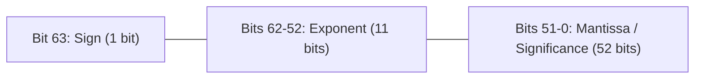
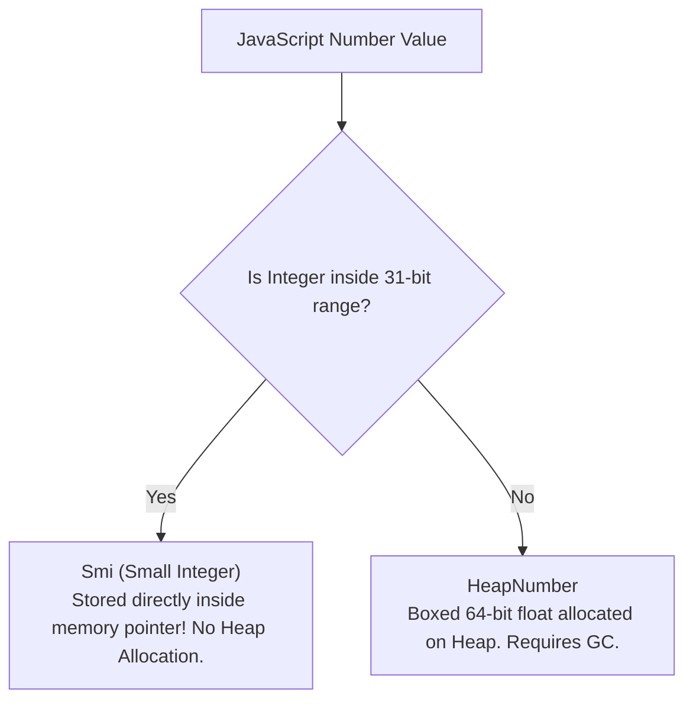

# File 12: Numbers Internals

## Overview
JavaScript has a single primitive numeric type: **IEEE 754 Double-Precision 64-bit Binary Floating-Point**. Understanding binary precision limits, V8's internal optimization representation (`Smi` vs `HeapNumber`), and `BigInt` prevents critical calculation bugs in financial applications.

---

## 1. The IEEE 754 Standard & Floating-Point Imprecision

In IEEE 754 double precision, numbers are allocated across **64 bits**:



### The `0.1 + 0.2 !== 0.3` Phenomenon
Decimals like `0.1` and `0.2` cannot be represented exactly in binary floating-point, resulting in infinite repeating binary fractions.

```javascript
console.log(0.1 + 0.2);              // 0.30000000000000004
console.log(0.1 + 0.2 === 0.3);      // false

// Safe Comparison using EPSILON
function nearlyEqual(a, b) {
    return Math.abs(a - b) < Number.EPSILON;
}
console.log(nearlyEqual(0.1 + 0.2, 0.3)); // true
```

---

## 2. Safe Integers & `Number.MAX_SAFE_INTEGER`
Because the mantissa is capped at 52 bits (53 bits with implicit leading bit), JavaScript can safely represent exact integers only up to $2^{53} - 1$.

$$\text{MAX\_SAFE\_INTEGER} = 2^{53} - 1 = 9007199254740991$$

```javascript
const max = Number.MAX_SAFE_INTEGER; // 9007199254740991
console.log(max + 1); // 9007199254740992
console.log(max + 2); // 9007199254740992 (Precision loss! Same as max + 1)
console.log(Number.isSafeInteger(max + 2)); // false
```

---

## 3. V8 Representation: Smi vs HeapNumber

To avoid heap allocations for every numeric calculation, V8 uses two internal numeric representations:



- **Smi (Small Integer)**: Stored directly in pointer tagged registers (31-bit integer range: $-2^{30}$ to $2^{30}-1$). Fast integer math without GC overhead.
- **HeapNumber**: Allocated on heap for non-integers, floats, or integers exceeding Smi bounds.

```javascript
// Performance difference: Smi vs HeapNumber
function benchSmi() {
    let total = 0;
    const start = process.hrtime.bigint();
    for (let i = 0; i < 1_000_000; i++) total += i; // Smi arithmetic
    return Number(process.hrtime.bigint() - start) / 1_000_000;
}

function benchFloat() {
    let total = 0.1;
    const start = process.hrtime.bigint();
    for (let i = 0; i < 1_000_000; i++) total += i + 0.1; // HeapNumber arithmetic
    return Number(process.hrtime.bigint() - start) / 1_000_000;
}

console.log(`Smi Time:   ${benchSmi().toFixed(2)} ms`);
console.log(`Float Time: ${benchFloat().toFixed(2)} ms (Slower!)`);
```

---

## 4. Financial Calculations: "Work in Smallest Currency Unit" Pattern
Never perform monetary operations using floating-point numbers. Always compute in **integers representing the smallest unit** (e.g., paise, cents).

```javascript
// BAD: Imprecise floating point calculation
const badTotal = 199.99 * 0.18; // 35.998200000000004

// GOOD: Integer calculation in Paise
const pricePaise = 19999;                             // Rs 199.99
const taxPaise = Math.round(pricePaise * 18 / 100);    // 3600 paise
const totalPaise = pricePaise + taxPaise;              // 23599 paise exact!

function formatRupees(paise) { return `Rs. ${(paise / 100).toFixed(2)}`; }
console.log(formatRupees(totalPaise)); // "Rs. 235.99"
```

---

## 5. Arbitrary-Precision Integers: `BigInt`
For IDs or values exceeding $2^{53}-1$, `BigInt` provides arbitrary precision integer math.

```javascript
const bigId = 9007199254740993n; // Suffix 'n' denotes BigInt
console.log(bigId + 1n);         // 9007199254740994n (Exact!)
console.log(typeof bigId);        // "bigint"

// Note: BigInt cannot be mixed directly with regular Numbers without explicit casting!
```

---

## 6. Special Values & Comparison Quirks
- **`NaN`**: Represents invalid numeric calculations. `NaN !== NaN` is always `true`. Use `Number.isNaN(val)`.
- **`-0`**: Signed zero resulting from underflow calculations. `Object.is(-0, 0)` returns `false`.

```javascript
console.log(NaN === NaN);             // false
console.log(Number.isNaN(NaN));       // true
console.log(Object.is(-0, 0));        // false
console.log(1 / 0);                   // Infinity
```

---

## Key Takeaways
1. All JS numbers are **64-bit IEEE 754 floats**. Use `Number.EPSILON` for float comparisons.
2. Integers are safe only up to **`Number.MAX_SAFE_INTEGER` ($2^{53}-1$)**.
3. V8 stores small integers as **Smi** inside pointers, making integer math significantly faster than floating-point math.
4. **Work in integer units** (e.g., paise / cents) for all financial systems.
5. Use **`BigInt`** for arbitrary-precision integers exceeding safe bounds.
