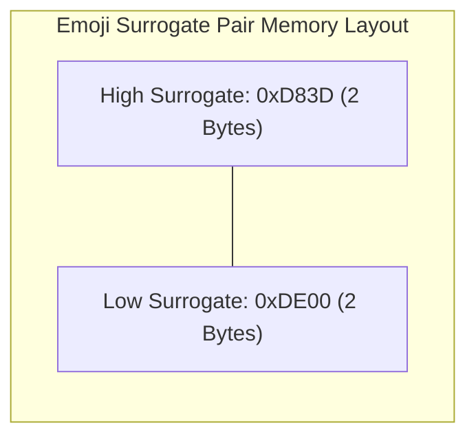
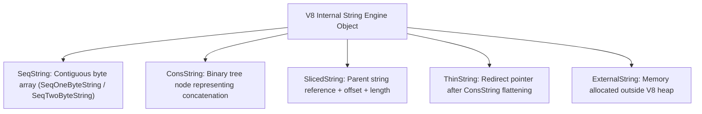

# File 13: String Internals in V8

## Overview
JavaScript strings are immutable sequences of UTF-16 code units. V8 uses 5+ internal string representations to defer byte copying, optimize memory usage, and achieve $O(1)$ operations for string concatenations and substrings.

---

## 1. UTF-16 Code Units vs Surrogate Pairs
JavaScript strings store 16-bit code units. Characters outside the Basic Multilingual Plane (like Emojis or rare symbols) are represented using **Surrogate Pairs** (2 code units / 4 bytes).

```javascript
const emoji = "😀";
console.log(emoji.length); // 2 (Code units, NOT characters!)
console.log([...emoji].length); // 1 (Iterating by Unicode Code Points)
```



---

## 2. V8 Internal String Representation Types

To optimize memory usage, V8 uses several specialized internal string representations:



### Representation Breakdown
1. **SeqOneByteString**: Used for ASCII strings. Stores 1 byte per character, cutting memory usage by 50% compared to standard 2-byte UTF-16.
2. **ConsString**: Represents string concatenation (`a + b`) as a binary tree of references. Concatenation is $O(1)$ without copying characters.
3. **SlicedString**: Created when `.substring()` or `.slice()` is called. Holds a pointer to the original parent string with offset and length pointers ($O(1)$ execution time).

---

## 3. String Interning (The String Table)
V8 maintains a global **String Table** containing canonicalized string literals. Identical short strings share a single memory address, making equality checks (`===`) an $O(1)$ pointer comparison.

```javascript
const str1 = "biryani";
const str2 = "biryani"; // Reuses exact same String Table pointer as str1!
console.log(str1 === str2); // true (Instant O(1) pointer comparison)
```

---

## 4. Hidden Costs: ConsString Flattening & SlicedString Retaining Memory

### ConsString Flattening
While concatenating strings creates a `ConsString` in $O(1)$ time, accessing a character or passing the string to a native C++ API forces V8 to **flatten** the binary tree into a contiguous `SeqString` ($O(n)$ character copy cost).

```javascript
let text = "";
for (let i = 0; i < 100; i++) {
    text += "part_" + i; // Creates nested ConsString binary tree
}
const firstChar = text[0]; // Accessing character forces O(n) full string flattening!
```

### SlicedString Retaining Parent Memory
`SlicedString` keeps a reference to its parent string. If a tiny slice is taken from a huge string, the entire parent string is **retained in memory**, preventing Garbage Collection!

```javascript
function getCity() {
    const hugePayload = "X".repeat(1_000_000) + "Bengaluru";
    return hugePayload.substring(1_000_000); // SlicedString retains 1MB parent!
}

// FIX: Force copy to create independent SeqString
function getCityFixed() {
    const hugePayload = "X".repeat(1_000_000) + "Bengaluru";
    return (" " + hugePayload.substring(1_000_000)).slice(1); // Un-slices string
}
```

---

## 5. Performance Comparison: Concatenation vs Array `.join()`

```javascript
const iterations = 10000;

console.time("Concat (+=");
let res1 = "";
for (let i = 0; i < iterations; i++) res1 += "item_" + i + ", ";
console.timeEnd("Concat (+=");

console.time("Array.join");
const arr = [];
for (let i = 0; i < iterations; i++) arr.push("item_" + i);
const res2 = arr.join(", ");
console.timeEnd("Array.join");
```

---

## Key Takeaways
1. JS strings are UTF-16 code units; Emojis occupy **2 code units** (`.length === 2`).
2. V8 uses **ConsString** for $O(1)$ concatenation and **SlicedString** for $O(1)$ substrings.
3. String interning allows **$O(1)$ equality comparisons** (`===`) by matching memory pointers.
4. Accessing characters inside a `ConsString` forces an $O(n)$ **flattening operation**.
5. Small substrings can unintentionally **retain massive parent strings** in memory; force a copy if parent payload is large.
