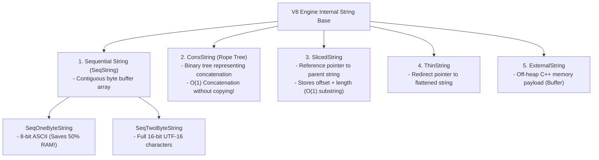
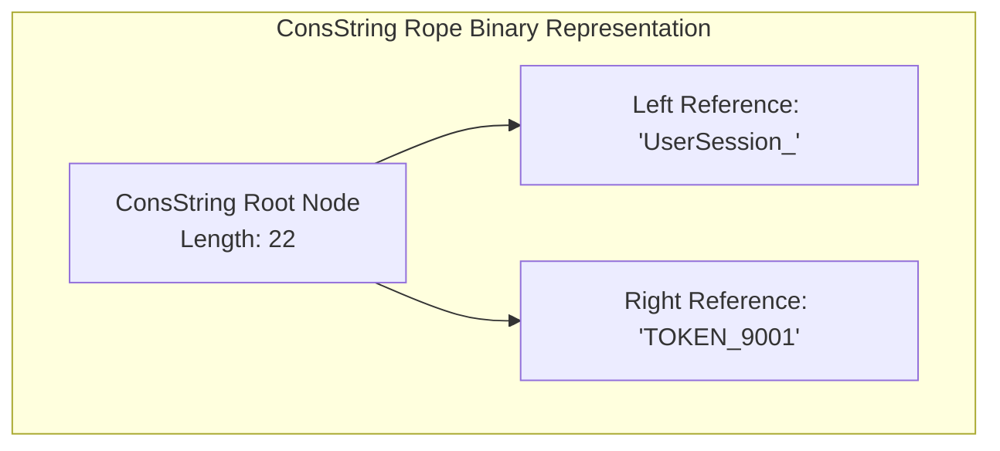

# Module 13: String Internals in V8 — ConsString Ropes, SlicedString Leaks, and String Interning

## Overview

In JavaScript, strings are immutable sequences of UTF-16 code units. However, storing every string as a contiguous array of 16-bit characters would create enormous memory overhead and cause severe performance degradation during string operations.

To optimize memory consumption and runtime performance, Google V8 employs **5+ Specialized Internal String Representations**: `SeqOneByteString`, `SeqTwoByteString`, `ConsString` (Ropes), `SlicedString`, `ThinString`, and `ExternalString`.

Understanding how V8 structures strings internally, how **String Interning** enables $\mathcal{O}(1)$ string equality checks, and how **SlicedStrings** can cause hidden memory leaks is essential for building high-throughput systems.

---

## 1. UTF-16 Code Units vs. Unicode Code Points

JavaScript strings are indexed by 16-bit **UTF-16 Code Units**:

- **Basic Multilingual Plane (BMP)**: Standard characters (ASCII, Latin, Cyrillic, Devanagari) fit inside a single 16-bit code unit (`length === 1`).
- **Supplementary Planes (Emojis & Rare Symbols)**: Characters above `0xFFFF` are encoded using **Surrogate Pairs** (two 16-bit code units: High Surrogate `0xD800–0xDBFF` + Low Surrogate `0xDC00–0xDFFF`), resulting in `length === 2`.

```javascript
const textASCII = "Hello";
console.log(textASCII.length); // 5 Code Units

const emojiSymbol = "🚀";
console.log(emojiSymbol.length);       // 2 Code Units (Surrogate Pair!)
console.log([...emojiSymbol].length);  // 1 Unicode Code Point (Spread iterator handles surrogate pairs)
```

---

## 2. V8 Internal String Representation Taxonomy



### Key V8 String Types Breakdown

1. **`SeqOneByteString` (Latin-1 / ASCII Optimization)**: If a string contains only 8-bit ASCII characters, V8 stores it using 1 byte per character instead of 2 bytes, reducing string RAM footprint by **50%**.
2. **`ConsString` (Rope Binary Tree)**: Concatenating strings (`a + b`) does not copy bytes. V8 creates a binary tree node pointing to `a` and `b`, executing `+` concatenation in **$\mathcal{O}(1)$ Constant Time**!
3. **`SlicedString`**: Calling `.slice()` or `.substring()` does not allocate a new string buffer. V8 creates a pointer to the original parent string with a starting offset and length, executing in **$\mathcal{O}(1)$ Constant Time**!

---

## 3. ConsString Binary Tree vs. SlicedString Memory Leak Hazard

### ConsString Binary Tree Architecture



> [!WARNING]
> **ConsString Flattening Cost**: While `+` concatenation is $\mathcal{O}(1)$, inspecting individual characters (`str[i]`), running Regular Expressions, or passing the string to C++ native bindings forces V8 to **flatten** the binary tree into a single contiguous `SeqString`, incurring an $\mathcal{O}(N)$ byte copy cost!

---

### SlicedString Memory Leak Hazard

Because a `SlicedString` retains a reference pointer to its parent string, taking a 5-character slice of a 10MB payload **retains the entire 10MB parent payload in memory**, preventing Garbage Collection:

```mermaid
flowchart TD
    subgraph SlicedString Memory Retention Risk
        ParentPayload["Parent Payload String (10 MB Memory Heap)"] <-- Retained by Pointer Pointer -- SlicedResult["SlicedString ('ID-42')<br/>Offset: 10000000 | Length: 5"]
        GC["Garbage Collector"] -.->|CANNOT Reclaim 10MB Payload!| ParentPayload
    end
```

```javascript
// MEMORY LEAK HAZARD: Retaining 10MB parent string via SlicedString
let globalHeader = null;

function processLargePayload() {
  const hugePayload = "X".repeat(10_000_000) + "_HEADER_ID_99";
  
  // Creates a SlicedString! Retains the entire 10MB hugePayload in RAM!
  globalHeader = hugePayload.substring(10_000_000); 
}

processLargePayload(); // 10MB stays leaked in memory because globalHeader points to it!

// PRODUCTION FIX: Force V8 to detach SlicedString and create an independent SeqString
function processLargePayloadFixed() {
  const hugePayload = "X".repeat(10_000_000) + "_HEADER_ID_99";
  
  const slice = hugePayload.substring(10_000_000);
  
  // Appending empty space or forcing string mutation breaks the SlicedString link!
  globalHeader = (" " + slice).slice(1); 
}

processLargePayloadFixed(); // 10MB parent payload is safely Garbage Collected!
```

---

## 4. String Interning & The V8 Symbol Table

V8 maintains an internal **String Table** containing canonicalized string literals. Short string literals share identical memory addresses in the V8 heap:

```javascript
const strA = "hello_world";
const strB = "hello_world"; // Shares exact same String Table pointer as strA!

// String equality comparison is an O(1) Pointer Address Check!
console.log(strA === strB); // true (Instant O(1) pointer match)
```

---

## Key Production Takeaways

1. **Beware of Substring Memory Leaks**: When extracting small substrings from massive text payloads (e.g. parsing headers out of a 50MB HTTP response), force string copying (`(" " + slice).slice(1)`) to detach the `SlicedString` reference and allow the parent string to be Garbage Collected.
2. **Understand ConsString Flattening Overhead**: High-frequency string concatenation (`+=`) inside loops builds deep `ConsString` trees. Accessing characters or passing the string to Regex engines flattens the tree in an $\mathcal{O}(N)$ pass. Use array `.join("")` for massive string assembly.
3. **Exploit String Interning for Pointer Equality**: Standard fixed string keys (e.g. enum values or JSON object keys) are interned in V8's Symbol Table, making `strA === strB` checks as fast as integer pointer comparisons.
4. **Use `CodePointAt` / `Array.from()` for Emoji Handling**: Standard `.length` counts 16-bit code units. Use `Array.from(str)` or `for...of` loops to iterate correctly over multi-byte Unicode surrogate pairs (Emojis).

