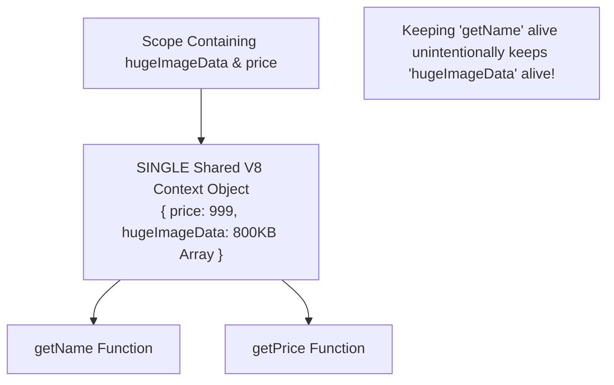

# File 14: Closures Internals in V8

## Overview
A **Closure** is the combination of a function bundled together with references to its surrounding state (**Lexical Environment**). In V8, when an inner function references outer variables, V8 allocates a heap-based **Context Object** that outlives the execution stack frame.

---

## 1. What is a Closure at the Engine Level?

```mermaid
graph LR
    subgraph Execution Stack Frame (Pops Off)
        FnFrame[createProductHandler Frame]
    end

    subgraph Memory Heap (Survives Stack Return)
        ContextObj["V8 Context Object:<br/>{ productId: 'SHIRT-001', price: 999 }"]
        InnerFn["addToCart() Function Object<br/>[[Environment]] Slot"]
    end

    InnerFn -->|[[Environment]] Slot Pointers To| ContextObj
```

```javascript
function createProductHandler(productId, price) {
    // V8 allocates a heap Context object: { productId, price }
    return function addToCart() {
        // Inner function holds an internal [[Environment]] slot pointing to the Context
        console.log(`Adding product ${productId} (Rs.${price}) to cart`);
    };
}

const handler = createProductHandler("SHIRT-001", 999);
handler(); // Retains access to productId and price long after createProductHandler returned!
```

---

## 2. Stack vs Heap Context Allocation
- **Non-Captured Local Variables**: Stored on the **Call Stack** and immediately discarded when the parent function returns.
- **Captured Variables**: V8's escape analysis moves captured variables to a **Heap Context Object**, keeping them alive as long as the closure function exists.

---

## 3. The Shared Context Problem (Accidental Memory Leak Source)
V8 creates **ONE shared Context object per lexical scope**. Every inner function defined in that scope points to the exact same Context object, retaining ALL captured variables in that scope—even variables unused by a specific inner function!



```javascript
// BAD: Shared Context keeps heavy data alive unintentionally
function createProductCard(product) {
    const name = product.name;
    const price = product.price;
    const hugeImageData = new Array(100000).fill(0); // 800KB+ Payload

    function getName() { return name; }
    function getPrice() { return price; }

    // Both functions share ONE Context: { name, price, hugeImageData }
    // Retaining getName() retains hugeImageData in memory!
    return { getName, getPrice };
}
```

### The Fix: Separate Scopes
```javascript
// GOOD: Isolate heavy data into a separate scope so it can be GC'd
function createProductCardFixed(product) {
    const name = product.name;
    const price = product.price;

    (() => {
        const hugeImageData = new Array(100000).fill(0);
        // Process image data in isolated IIFE scope...
    })(); // hugeImageData is garbage collected here!

    return {
        getName: () => name,
        getPrice: () => price,
    };
}
```

---

## 4. `eval()` Disables Scope Optimization
Using `eval()` inside a function forces V8 to capture **EVERY variable** in scope into the Context object because `eval()` could dynamically execute code referencing any variable name.

```javascript
function evalClosure() {
    const a = 1, b = 2, hugeData = new Array(10000);
    return function(code) { return eval(code); }; // Disables escape analysis! ALL variables captured.
}
```

---

## 5. Arrow Functions & Lexical `this`
Arrow functions do not possess their own `this` binding. Instead, they capture `this` from the enclosing execution context via the **Context Object**, just like any standard variable.

```javascript
class ProductCard {
    constructor(name, price) { this.name = name; this.price = price; }
    setupHandlers() {
        const arrowH = () => console.log(`Arrow: ${this.name}`); // Captures 'this' in Context
        const regularH = function() { console.log(`Regular: ${this?.name}`); };
        return { arrowH, regularH };
    }
}
```

---

## 6. Closure vs ES6 Class Memory Efficiency

```javascript
// Closure Factory: Creates distinct function objects per instance (Higher Memory Usage)
function createCounterClosure() {
    let count = 0;
    return { inc() { count++; }, get() { return count; } };
}

// Class Instance: Methods exist ONCE on prototype (Lower Memory Usage)
class CounterClass {
    #count = 0;
    inc() { this.#count++; }
    get() { return this.#count; }
}
```

---

## Key Takeaways
1. A **Closure** consists of a function object plus a heap-allocated **V8 Context Object**.
2. V8 creates **ONE shared Context per scope**; holding any closure retains all variables in that shared Context.
3. Isolate heavy datasets into separate scopes or IIFEs to avoid **accidental capture memory leaks**.
4. Avoid `eval()`, which forces V8 to capture all variables in scope into the Context.
5. **ES6 Classes** are more memory-efficient than closures when instantiating thousands of objects because class methods share prototype memory.
